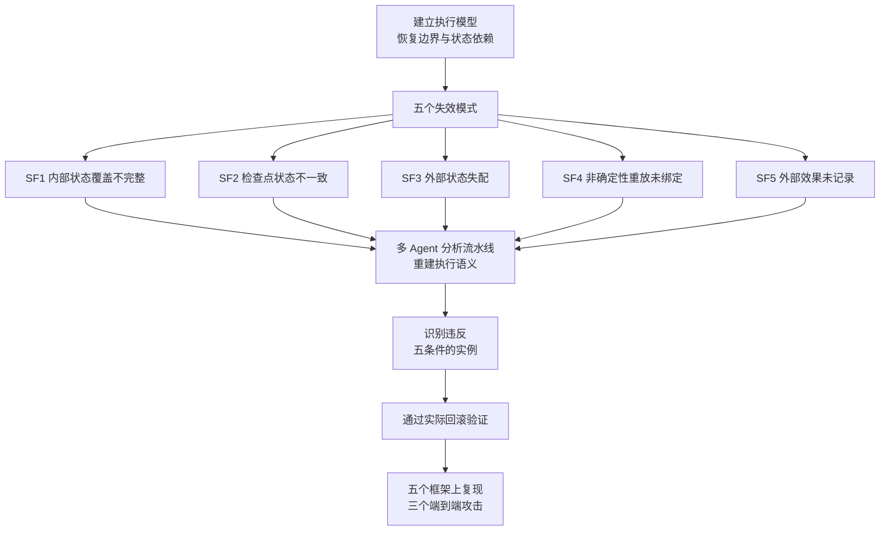

# Safe to Resume? Breaking Execution Continuity of Agent Execution via Rollback

## 基本信息

| 项 | 内容 |
|---|---|
| 链接 | https://arxiv.org/abs/2608.29381 |
| 代码 | 未明确提供，评测覆盖五个代表性框架 |
| 作者 | 未明确标注机构 |
| 发布时间 | 2026-08-29 |
| 一句话总结 | 首个系统研究 Agent 检查点与回滚安全性的工作，指出正确回滚不等于安全恢复，给出五类失效模式并在五个框架上复现 |

## 置信度评估

| 维度 | 评估 |
|---|---|
| 发表场所 | 预印本，含执行模型、威胁模型与端到端攻击演示 |
| 引用影响 | 新近工作，2026-08 发布，暂无引用数据 |
| 代码可用 | 未明确提供 |
| 来源机构 | 未明确标注 |
| 综合置信度 | 中高。失效模式有分类学支撑，在五个框架上验证了复现性，并用三个端到端攻击演示实际影响 |
| 需谨慎点 | 视角是**安全**而非版本质量。三例攻击（恶意软件验证绕过、未授权邮件转发、重复支付）与知识文档场景距离较远，需要抽象到机制层才用得上 |

## 它解决了什么问题

Agent 正在走向持久化、有状态的执行，累积执行状态与外部效果。检查点与回滚成为恢复的必要手段，但论文指出**其安全含义基本未被研究**。

论文的核心观察：**正确回滚不等于安全恢复**。一个忠实恢复的检查点，可能恢复出一个「其状态、假设与外部效果在任何合法历史中都从未共存过」的执行。

## 方法核心

先建立执行模型刻画恢复边界与状态依赖，再从这个模型推出失效模式，然后用多 Agent 分析流水线在真实框架上验证。

### 五个失效模式

| 编号 | 名称 | 含义 |
|---|---|---|
| SF1 | 内部状态覆盖不完整 | 恢复的状态缺一部分 |
| SF2 | 检查点状态不一致 | 检查点内部各部分不属于同一时刻 |
| SF3 | 外部状态失配 | 检查点内的状态与其依赖的外部资源不匹配 |
| SF4 | 非确定性重放未绑定 | 重放时非确定性因素未固定，恢复出的执行与原来不同 |
| SF5 | 外部效果未记录 | 回滚只撤销内部状态，外部副作用仍在 |

### 关键判断

论文的结论是一句话：这五类失效**跨异构的检查点与回滚设计反复出现**，且**源于同一个缺口**，即「检查点恢复出的状态」与「安全继续所需依赖」之间的不一致。

## 实验结果

- 在五个代表性框架上评测，失效在异构设计里反复出现
- 三个端到端攻击：恶意软件验证绕过、未授权邮件转发、重复支付
- 论文开发了多 Agent 分析流水线，能重建执行语义、识别五个失效条件的违反、并通过实际回滚验证

## 局限与注意

- **视角是安全**。论文关心的是「恢复出的执行能不能被利用」，不是「恢复出的版本质量对不对」。两者有交集但不重合
- 三例攻击的场景（邮件、支付、恶意软件验证）与知识文档管理距离较远，**机制要抽象才用得上**
- 论文没有讨论「该回滚到哪一版」这个选择问题，它假设回滚目标已给定
- 未提供代码

## 对我们项目的启发 ⭐

### 解决哪个环节的什么问题

对应项目自己记录的两个缺口：「保留历史最佳和关键回归回滚已有目标要求」但「回退实现细节仍需落实」。项目已经识别出回滚通道存在（`ROLLING_BACK` 状态与迁移边），缺的是决策逻辑与实现细节。这篇给出的是回滚**执行后**的风险分类，正是「实现细节」里最容易漏掉的一块。

具体对应三个方面：版本存档时的状态一致性（SF2）、版本与源码/测试集的依赖匹配（SF3）、版本固化与生效时间的对应（SF4）。

### 方案要点

回滚之后要验证「恢复出的状态在当下是否还有效」，这一步不能省。

知识版本在一个源码版本下通过验收，但源码演进之后，这个版本的状态与其依赖已经失配。回滚到它，得到的是一个曾经有效、现在未必有效的状态。所以回滚之后必须重新走检查与评测，不能直接信任存档里的验收结论。

版本存档时记录它依赖什么外部对象（源码版本、测试集、接口约定）。恢复时先核对依赖是否还匹配，不匹配就说明这个版本已经不满足继续执行的条件。这与「回滚可靠性属于准入条件而非事后补救」的判断一致，是同一件事在恢复侧的表达。

存档点要记录足够的内部状态，避免「部分恢复」：一个恢复出一半状态的版本，其内部矛盾可能在任何历史里都不存在。

### 提供了什么思路

「正确回滚不等于安全恢复」这个区分值得记下来。它纠正一个直觉：回滚天然是回到一个已知的好状态，所以不需要额外检查。论文说明这个直觉在状态依赖外部资源时会失效。

五类失效模式可以当作**回滚功能的测试清单**。项目实现回退时，逐条问「这类失效在我们的设计里怎么发生、怎么防」，比从零设计检查项更系统。

### 需要注意的

这篇**不回答「回滚到哪一版」**，它假设目标已给定。所以它不能替代父代选择机制，两者的关系是：父代选择决定去哪里，这篇说明到达之后要验证什么。

「未记录的外部效果」在本项目里有一个具体对应：知识版本发布后可能已经影响了实际的代码生成任务。回滚知识版本并不能撤销那些已经基于它产生的输出。这类效果的清单需要在设计回退时明确。

安全视角带来的偏离也要注意。论文关心的是「恢复出的执行能否被利用来绕过验证」，本项目更关心「恢复出的知识是否正确」。前者的威胁模型（攻击者）在本项目里不一定存在，但失效模式的**机制**是共通的。

## 关联

- 对应环节：`workflow_router` 的回滚决策、`evaluation` 回滚后的重新评测、`review` 的存档验收
- 对应缺口：项目自认「保留历史最佳和关键回归回滚已有目标要求」「回退实现细节仍需落实」
- 相关论文：Governed Capability Evolution `2604.08059`（回滚可靠性作为准入条件，与本文的恢复后验证互补）、ChronoMem `2607.27773`（回滚后会截断后续版本，需注意与本项目的保留历史取向冲突）、Resume Contract `2608.03836`（resume 语义的一致性契约）
- 本项目代码路径与验收命令：
  - `docs/specs/domainFunction/knowledge/Knowledge.md`：版本状态语义与「当前不自动选择历史最优并回滚」的说明
  - `docs/specs/domainFunction/evaluation/Evaluation.md`：「保留历史最佳、关键回归回滚」的目标要求与「回退实现细节仍需落实」的记录
  - `docs/specs/schemas/KnowledgeLineage.schema.json`：版本依赖关系的表示位置
