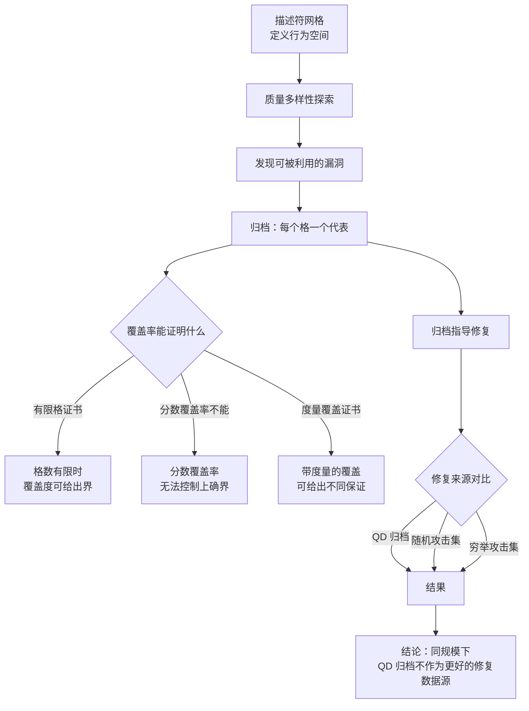

# Quality-Diversity Stress Tests for Process Reward Models: What Archive Coverage Can and Cannot Certify

## 基本信息

| 项 | 内容 |
|---|---|
| 链接 | https://arxiv.org/abs/2608.08008 |
| 代码 | 未明确提供，实验细节完整（含附录证明） |
| 作者 | 未明确标注机构 |
| 发布时间 | 2026-08-08 |
| 一句话总结 | 系统检验质量多样性归档的覆盖度能证明什么，结论是它主要带来可审计性，而非搜索或修复上的优越性 |

## 置信度评估

| 维度 | 评估 |
|---|---|
| 发表场所 | 预印本，含四条定理的完整证明与配对协议 |
| 引用影响 | 新近工作，2026-08 发布，暂无引用数据 |
| 代码可用 | 未明确提供 |
| 来源机构 | 未明确标注 |
| 综合置信度 | 中高。理论部分有证明，实验部分有配对协议与分层自助法；且**主动报告了对自己不利的发现** |
| 需谨慎点 | 实验规模小（每个基准 1 到 2 条轨迹），论文自己承认这不构成强度结论 |

## 它解决了什么问题

过程奖励模型给推理的中间步骤打分，被广泛用于搜索、排序和训练。论文指出这带来的风险：优化会**利用**这个学到的代理指标，在提高奖励的同时把正确推理变成错误推理。

论文用质量多样性方法去发现这类漏洞，然后检验一个更根本的问题：**归档的覆盖度能作为什么结论的证据**。

## 方法核心

两段：用质量多样性探索发现漏洞，再用归档指导修复，同时给出覆盖率能证明与不能证明什么的边界。

### 关键设计一：区分覆盖率能证明什么

论文给出证书条件：在格数有限时，覆盖度可以给出一个界；但**分数覆盖率无法控制上确界**（附录有专门证明）。度量覆盖则给出另一种保证。

这个区分的意义是：把「归档覆盖了 90% 的格」当成「已经覆盖了 90% 的问题空间」是**错误的推论**。覆盖率的证明力取决于描述符空间的结构。

### 关键设计二：配对修复协议

论文用配对协议比较不同修复数据来源：QD 归档、随机攻击集、穷举攻击集，在同等预算下对比。配对设计让比较更可靠。

## 实验结果

论文的报告方式本身值得注意，它主动列出了对自己不利的发现：

- **QD 归档作为修复数据源，在这里的规模上并不比随机或穷举攻击集更好**。论文的原话是「质量多样性的主张关乎可审计的归档，而非搜索或修复上的优越性」
- 严格阈值对小差异敏感
- 修复后最严重的攻击仍保留了原始最大收益的约三分之二
- Brier 分数在修复后略降（干净与受损轨迹上都有分数膨胀）
- 未见措辞分支提供的信息很弱，真正开放式的攻击生成器未执行
- 所有漏洞都来自同一个算子族，跨族修复泛化未测量

## 局限与注意

- **规模小**。每个基准只有 1 到 2 条轨迹，论文自己承认这不支持强度结论
- 描述符网格是手工设计的，网格能证明什么与描述符的选择紧密耦合
- 论文明确说真实归档的证书数字是**插值诊断，不是已认证的界**
- 单一算子族意味着跨族泛化未测量
- 场景是过程奖励模型的漏洞修复，与知识版本管理**没有直接关系**。它的价值在于给「质量多样性归档」这个方向提供了一份诚实的边界说明

## 对我们项目的启发 ⭐

### 解决哪个环节的什么问题

对应本目录正在评估的一个决策：**要不要引入质量多样性归档来做父代选择**。这篇提供的是反面的边界条件，回答「上了归档之后能指望什么」。

项目的语境是：如果打算按能力分格保留多样化版本（见 README 的 Option C），需要先知道归档能够与不能够保证什么。

### 方案要点

把归档的价值定位在**可审计与覆盖可见**，而不是「更好的选择质量」。也就是说，引入按能力区域保留版本这件事，理由是能回答「我们已经覆盖了哪些能力方向、哪些方向是空白」，而不是「这样选出来的父代一定更好」。

如果期望的是选择质量提升，那需要另外的机制，不能把归档当成现成答案。项目可以两条分开做：归档解决覆盖度可见性，父代选择机制单独设计。

覆盖率的解释要小心。「覆盖了多少格」不等于「覆盖了多少问题空间」。如果项目要给归档覆盖率一个含义，需要说清描述符空间的结构。

### 提供了什么思路

论文主动报告不利发现的做法值得记住。在自进化与归档这类方向上，很多工作的结论偏乐观；这篇把「归档不比随机更好」明确写出来，反而让「归档带来可审计性」这个剩余主张更可信。

对项目的启示是：评估父代选择机制时，**需要一个随机基线**。如果新机制比不上「随机挑一个版本」，那改进就是幻觉。这个基线成本很低，但缺少它就无法判断机制是否有效。

### 需要注意的

这篇不支持「质量多样性归档能提升选择质量」这个假设。如果项目的 Option C 的唯一理由是「选得更好」，需要重新考虑理由。

规模问题也适用：论文的实验规模小到论文自己都承认结论有限。项目如果只有少量版本，任何关于覆盖率的说法都会同样脆弱。

## 关联

- 对应环节：`candidate_knowledge` 归档策略、`evaluation` 的覆盖度评估
- 对应缺口：「多版本存储的物理组织」「避免只保存最终版本导致局部最优」两项的对立面：保留多样化版本能带来什么、不能带来什么
- 相关论文：Diverse Prompts `2504.14367`（质量多样性归档的正面做法）、Multi-Objective QD `2202.03057`、QD for LLM Safety `2606.00801`、QD through AI Feedback `2310.13032`
- 本项目代码路径与验收命令：
  - `docs/specs/domainFunction/knowledge/Knowledge.md`：版本保留与清理策略，归档覆盖度评估的对象
  - `docs/specs/domainFunction/evaluation/Evaluation.md`：评测事实来源
