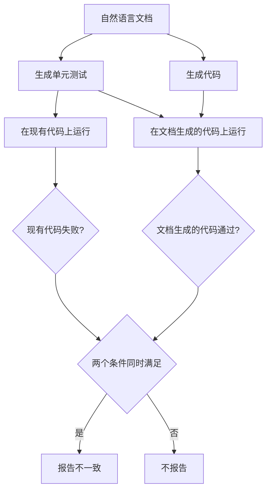

# CASCADE 用测试生成交叉检查（Detecting Inconsistencies between Code and Documentation with Automatic Test Generation）

## 基本信息

| 项目 | 内容 |
|------|------|
| **链接** | https://arxiv.org/abs/2604.19400 |
| **代码** | 论文未提供公开实现（属工具论文，方法描述完整） |
| **作者** | Tobias Kiecker, Jan Arne Sparka, Martin Reuter, Albert Ziegler, Lars Grunske（柏林洪堡大学、XBOW） |
| **发布时间** | 2026-04-21 |
| **一句话总结** | 从文档生成单元测试，只有当现有代码跑不过而由文档生成的代码跑得过同一个测试时才判定不一致，用执行结果而非模型判断来压误报 |

---

## 置信度评估

| 信号 | 评估 |
|------|------|
| 发表场所 | arXiv 预印本（2026-04） |
| 引用/影响 | 低（新发布） |
| 代码可用 | 未提供公开仓，方法与判定条件描述完整 |
| 实验规模 | 中（71 组不一致加 814 组一致的新数据集，另在 Java、C#、Rust 仓上实测） |
| **综合置信度** | **🟡 中** |
| 需谨慎点 | 数据集规模有限；未见与其他工具的同条件横向对比 |

## 它解决了什么问题

检测代码与文档不一致的工具都会产出需要人工确认的报告，所以**误报的代价很直接：浪费开发者时间，并让工具被弃用**。作者把降误报当成首要设计目标，而不是先追求召回。

作者的具体切入点是：文档描述的是**行为**，行为可以被测试验证。那就用文档生成测试，让执行结果说话。

## 方法核心

判定条件是双重的，这是全篇最关键的机制。

两条路径的分工：

- **从文档生成测试**：测试承载了文档所声明的行为。若现有代码跑不过，说明实际行为与文档所说不符
- **从文档生成代码**：用来交叉检查测试本身是否合格。若由文档生成的代码都跑不过这个测试，说明问题出在测试或文档表述上，而不是现有代码

**只有两条件同时成立才报错**：现有代码失败，且文档生成的代码通过。第二个条件把「测试本身有问题」这一类误报挡在外面。

作者在真实仓库上应用时，用这种方法**发现了 13 处此前未知的不一致，其中 10 处随后被修复**。

## 关键数据

| 指标 | 数值 |
|---|---|
| 自建数据集 | 71 组不一致 + 814 组一致的 Java 代码文档对 |
| 额外实测语言 | Java、C#、Rust |
| 新发现的不一致 | 13 处 |
| 随后被修复 | 10 处 |

## 局限

- **未提供公开实现**，无法直接复用代码
- **数据集规模有限**（71 组正例），统计效力不高
- **未给出精确率与召回率的具体数字**，也没做与其他工具的同条件横向对比。论文以「发现的真实问题数」和「被修复数」作为有效性证据，这是工程有效性而非同条件对比
- 方法成立的前提是**文档描述的行为可以被单元测试表达**。对描述设计意图、架构决策、历史原因这类文档，生成测试的路子走不通
- 需要**由文档生成代码这一额外步骤**，成本高于纯静态检查

## 对本项目的启发

### 方案要点

**这是「经验污染治理」挑战里最值得借用的一条机制，因为它是靠执行结果而非模型判断来做决定。**

用户方案要求经验卡片「必须能对应到代码证据才能建立强关联」，还要求防止「优化过程让知识倒退」。这篇论文给的思路是：**把判定从「模型说有没有矛盾」换成「执行结果说有没有矛盾」**。执行结果可复现、可审计，正好符合项目对证据的要求。

### 三条可操作的结论

1. **双条件判定可以直接搬到关联校验上**。本项目的 TestGenAgent 已经有「只读原始源码和公开接口、不读取候选知识」的约束，被测代码与知识生成互相独立，恰好满足交叉检查的前提。**建议在关联建立或复核时，用「知识所述行为」生成测试，再要求候选知识与重建实现至少一方通过**。这与项目已有的「重建相似度」门禁是同一类信号
2. **「文档生成的代码也要通过测试」这一步是降误报的关键**，成本不高但效果显著。若只做前半步（现有代码跑不过就报错），会把测试自身的缺陷算到代码头上
3. **适用范围要显式限定**。用户方案里设计文档卡片与经验卡片的内容类型不同：设计文档多描述结构与流程，经验卡片多描述踩坑与规避。**只有可测试的行为类陈述适合这个方法**，其余需要用别的机制。这一条应当在卡片类型定义里体现

### 与项目已有机制的关系

这条路线与项目的门禁机制天然相容：项目已有「重建相似度」作为质量信号，CASCADE 的双条件判定本质上是把**测试执行结果**也纳入证据池。与 [DocPrism](DocPrism不一致检测的精度陷阱.md) 的提示词约束路线相比，本方法更贵但更可审计，**建议作为高价值关联的二次确认，而非全量流程**。

### 需要注意的边界

项目现有约束是「TestGen 只读原始源码与公开接口，不读候选知识或重建代码」，理由是「避免文档与测试用同一个错误答案」。**CASCADE 让文档生成代码再用它验证测试，形式上引入了文档影响测试的路径。** 这需要与项目既有约束对照后再定实现方式。若严格沿用现有隔离规则，CASCADE 这条路线需要改造，或者只在外层做交叉检查而不进入 TestGen 主流程。
