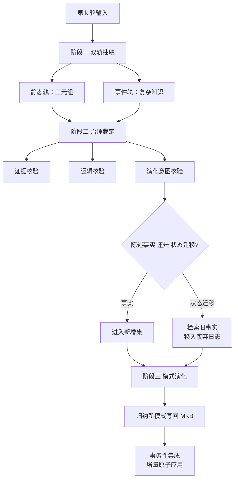

# DIAL-KG 增量知识图谱的演化意图（Schema-Free Incremental Knowledge Graph Construction via Dynamic Schema Induction and Evolution-Intent Assessment）

## 基本信息

| 项目 | 内容 |
|------|------|
| **链接** | https://arxiv.org/abs/2603.20059 |
| **代码** | 论文未提供公开实现 |
| **作者** | Weidong Bao, Yilin Wang, Ruyu Gao, Fangling Leng, Yubin Bao, Ge Yu（东北大学） |
| **发布时间** | 2026-03-20 |
| **一句话总结** | 用一个元知识库编排三阶段闭环做增量图谱构建，关键机制是区分「陈述事实」与「陈述状态迁移」，后者触发检索旧事实并记入废弃日志 |

---

## 置信度评估

| 信号 | 评估 |
|------|------|
| 发表场所 | arXiv 预印本（2026-03） |
| 引用/影响 | 低（新发布） |
| 代码可用 | 未提供 |
| 实验设计 | 中（自建评测，声称在构图质量与模式质量上达最先进） |
| **综合置信度** | **🟡 中** |
| 需谨慎点 | 无公开代码；「状态迁移判定」依赖 LLM 分类，其准确率未见单独报告 |

## 它解决了什么问题

常规知识图谱构建是静态的：一次从固定语料建好，模式预先定死。现实场景里数据持续到达，**新增信息就要整图重建，计算代价高**；预定义模式也限制了灵活性。

作者进一步指出一个更细的问题：**缺少增量生命周期机制，导致知识的增加、修改、废弃难以进行，同时保留可追溯性**。这句直接对应本项目的时效与污染治理两个挑战。

## 方法核心

框架由元知识库（Meta-Knowledge Base，MKB）编排，三阶段闭环，每轮产出一个增量并原子应用。

### 治理裁定的三个子过程

**证据核验**：每条抽取结果连同其证据片段提交给 LLM，要求**严格只依据所提供的文本判断，不使用外部知识**。判定规则是：**只有当证据直接与候选矛盾时才拒绝，否则保守接受**。这个偏置是刻意的。目的是保留语义正确但表述不完备的候选。

**逻辑核验**：分两层。通用一致性检查去除矛盾，例如自反关系（A 是 A 的祖先）与互逆关系同时成立（A 是 B 的一部分且 B 是 A 的一部分）。模式约束检查在已有模式时验证类型签名与角色，例如某关系要求主体是组织时，主体为个人就被拒绝。**冷启动阶段只做通用一致性检查**，未见过的新模式跳过约束检查、进入模式归纳。

**演化意图核验**：这是全篇最值得借用的一步。对齐通过前两步的事件，**LLM 判定两种意图之一**：

- **信息性（Informational）**：陈述一个事实
- **演化性（Evolutionary）**：指示历史知识发生了状态迁移

系统识别演化触发词，论文举例是「废弃」「移除」「替换」。信息性事件进入新增集；**演化性事件则去检索被它取代的旧事实，把旧事实移入废弃日志**。

### 事务性集成

每轮结束时把所有变更聚合成一个增量 ΔG =（新增实体、新增事实、废弃事实），**原子地应用到上一轮图上**。废弃日志是一等公民，与新增并列为增量的组成部分。

### 元知识库的角色

MKB 同时承担治理中枢与演化记忆两个职责，记录并索引模式、实体档案与事件索引。它让「可审计的增加、修改、废弃」成为可能，作者称这种机制为**「版本化记忆」，保存结论与来源、修订历史，包括触发更新的证据以及此前认知的边界**。

## 局限

- **未提供公开实现**，无法直接复用
- **演化意图判定的准确率没有单独报告**，而这是整个废弃机制的关键前提。若分类错误，旧事实会被错误废弃或漏废弃
- 评估以自身指标为主，**未与增量维护相关工作进行同条件对比**
- 场景是通用知识图谱构建，**不涉及代码符号与文档的关联**，迁移到本项目需要自行设计符号级映射
- 双轨抽取（三元组与事件轨）的选择逻辑依赖 LLM 判断，复杂度较高

## 对本项目的启发

### 方案要点

**这篇同时回答「知识编译」与「经验污染治理」两个挑战，核心贡献是给出了「旧关联自动失效」的可审计实现形态。**

用户方案第五条要求「来源更新即把旧关联标记为过期」，第三条要求「版本化加不可变历史」。论文的废弃日志机制把这两个要求落成了一个具体结构：**增量不只是新增，而是「新增 + 废弃」的二元组，废弃必须显式记录并原子提交**。这比「标记过期」更严格，因为它要求系统说清「那条被废弃的事实是什么」。

### 四条可操作的结论

1. **增量更新应当是二元组而非只增不减**。落到本项目：关联更新时，产出物应当同时包含「新建的关联」与「作废的关联记录」，且作废记录要保留原关联的内容而非只留一个标记位。现有 `AssociationLink` 只有 `factId`、`targetId`、`confidence`、`reason` 四个字段，**作废记录需要额外承载原链接内容或被链接指向的版本快照**
2. **「状态迁移」与「陈述事实」的区分是触发废弃的关键判据**。用户方案里经验卡片的内容会包含「以前要这样做，现在改成那样」这类表述。**这类卡片应当触发对旧卡的废弃检查，而纯陈述类卡片不应触发。** 论文的触发词思路（废弃、移除、替换）在本项目的中文语境下需要重新收集
3. **证据核验的保守偏置值得照搬**：**只在证据与候选直接矛盾时拒绝，否则接受**。这与 [DocPrism](DocPrism不一致检测的精度陷阱.md) 的结论方向一致。宁可漏掉一些真实矛盾，也不要用误报把整个流程搞坏
4. **原子集成对应项目已有的事务要求**。`Knowledge.md` 记载「SQLite 实现事务、幂等和约束」，增量应用正好落在这个已有能力上

### 与既有设计的衔接

`KnowledgeVersion` 状态机已有 `SUPERSEDED`（被后继发布替代的版本保留历史），与论文的废弃日志思路一致。**但论文多走了一步：它记录废弃的理由与触发它的新事实**，而 `SUPERSEDED` 目前只是一个状态值。用户方案要求「旧关联自动失效」，若要可审计，**需要为失效记录补上触发来源**，这与本项目「每条结论附可点击证据」的一贯要求一致。

### 一个需要注意的代价

演化意图判定要额外过一次模型，且判错会直接污染废弃机制。**建议先只对带明确触发词的卡片做自动判定，其余留在人工治理清单里**，等判定准确率有实测数据后再放开。这与项目「先测量再实现压缩机制」的既有结论是同一思路。
