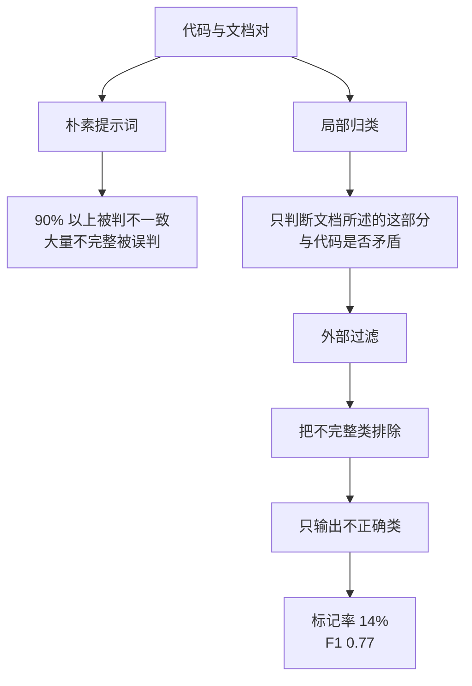

# DocPrism 不一致检测的精度陷阱（DocPrism: Multi-lingual Detection of Incorrectness Inconsistencies between Code and Documentation）

## 基本信息

| 项目 | 内容 |
|------|------|
| **链接** | https://arxiv.org/abs/2511.00215 |
| **代码** | 论文未提供完整工具仓，方法（局部归类与外部过滤）在论文内描述完整 |
| **作者** | Xiaomeng Xu, Zahin Wahab, Reid Holmes, Caroline Lemieux（不列颠哥伦比亚大学） |
| **发布时间** | 2025-11-01（v2 为 2026-07-29） |
| **一句话总结** | 直接用 LLM 判断代码与文档是否不一致会把九成以上函数判为有问题，根因是模型把「文档不完整」当成了「文档写错」，改用局部归类加外部过滤后误报率从 98% 降到 14% |

---

## 置信度评估

| 信号 | 评估 |
|------|------|
| 发表场所 | arXiv 预印本（2025-11，v2 2026-07） |
| 引用/影响 | 中 |
| 代码可用 | 未提供完整实现；消融实验给出可复现的方法描述 |
| 实验设计 | 好（四种语言、消融研究、合成数据集与真实数据集对照） |
| **综合置信度** | **🟢 高** |
| 需谨慎点 | 真实语料精确率 0.63，仍不足以无人值守使用 |

## 它解决了什么问题

代码与文档不一致会导致开发者误解并引入缺陷，所以希望自动检测。作者试了最直接的做法，让 LLM 看一段代码和它的文档，回答是否一致。结果**超过 90% 的函数被标记为不一致**。这个信号完全没有可用性。

作者找到了根因：**LLM 把「高层文档天然没有覆盖代码的全部细节」这种正常的信息缺口，当成了不一致**。论文把这两类区分开：

- **不正确（incorrectness）**：文档说的与代码实际行为矛盾
- **不完整（incompleteness）**：文档没提到某些细节，但说的部分没错

只有前者是缺陷。后者是文档的常态。

## 方法核心

核心思路是**不要用 LLM 的长期推理能力，改用它的局部补全能力**。方法名是局部归类与外部过滤（Local Categorization, External Filtering，LCEF）。

两阶段的职责划分：

- **局部归类**：让模型只在文档明确陈述的范围内做判断，不要求它评估「文档是否完整覆盖了代码」。这把任务从开放的完整性评估收敛成局部的矛盾检查
- **外部过滤**：把归类为「不完整」的候选在外面过滤掉，不进入报告

## 关键数据

| 指标 | 朴素提示词 | LCEF |
|---|---|---|
| 不一致标记率 | 98% | **14%** |
| F1 | 0.22 | **0.77** |

跨语言评测（Python、TypeScript、C++、Java）：

- **标记率 17%**，未做任何微调
- **精确率 0.63**
- 保守下界：**四种语言合计 11% 的代码文档对存在不一致错误**

与最先进方法对比：

- 在既有合成数据集上，精确率与最先进方法相当
- **在真实 Java 数据集上，精确率 0.47 到 0.67，最先进方法只有 0.05 到 0.14**

## 局限

- **精确率 0.63 仍意味着约三分之一的报告是误报**，作者因此把工具定位成辅助而非自动修复
- **未提供完整工具实现**，只给了方法描述，复现需要自己搭
- 评估单元是函数级文档与代码，**没有涉及跨文件或模块级的文档**
- 「11% 的代码文档对存在错误」是保守下界，作者用「conservative lower bound」措辞，真实比例应更高但无从确定
- 论文没有测「检测到之后修复的效果」，只做了检测

## 对本项目的启发

### 方案要点

**这篇是给「经验污染治理」与「时效」两个挑战的精度红线材料，也是一个直接的警告。**

用户的方案里，外部知识要挂到代码符号上形成强关联，经验卡片还要经过评测与门禁。这篇论文说明了一件容易被忽略的事：**让模型判断「外部知识与代码是否一致」这件事，朴素做法的产出率低到不可用**。九成的误报率意味着如果直接把这个信号接进关联判断，整个知识网络会被噪声塞满。

### 三条可操作的结论

1. **「不完整」与「不正确」必须分开处理**。用户方案里外部知识的空间很大，专家经验 wiki 天然不会覆盖代码的全部细节。**这类「没提到」绝不能触发关联失效或低置信降级**，否则几乎所有经验卡片都会被判为可疑。这条对「经验卡片默认低置信」有直接修正作用：低置信应当只针对「与代码矛盾」，不针对「覆盖不全」
2. **局部判断优于全局评估**。这是方法层面的核心。落到用户方案上：验证一张经验卡片时，**不要问模型「这张卡片与代码一致吗」，而要问「卡片里这条具体陈述与代码是否矛盾」**。前者会触发完整性评估，后者才是可控的
3. **真实语料的精确率远低于合成语料**。作者在真实 Java 数据集上精确率 0.47 到 0.67，而最先进方法只有 0.05 到 0.14，差距在真实数据上才暴露。**本项目自建评测集时必须用真实文档，不能用构造样本**，否则会严重高估效果

### 与 CASCADE 的互补

同批调研中的 [CASCADE](CASCADE用测试生成交叉检查.md) 用的是完全不同的一条降误报路线：不靠提示词约束，而靠**执行**。只有当现有代码跑不过某个测试、而由文档生成的代码能跑过同一个测试时才报错。**两者可以叠加**：局部归类把候选收敛，执行验证再把候选坐实。

### 与既有设计的衔接

`KnowledgeVersion` 状态机里有 `LOW_CONFIDENCE` 状态，其定义是「保留停止证据」。这篇论文支持把这个状态用在「与代码矛盾的外部知识」上，**同时提示不能用在「未覆盖某细节」上**。用户方案要求「经验必须能对应到代码证据才能建立强关联」，这条与论文的结论方向一致：**没有符号可挂的经验不应被当成不一致，只应不建强关联**。
