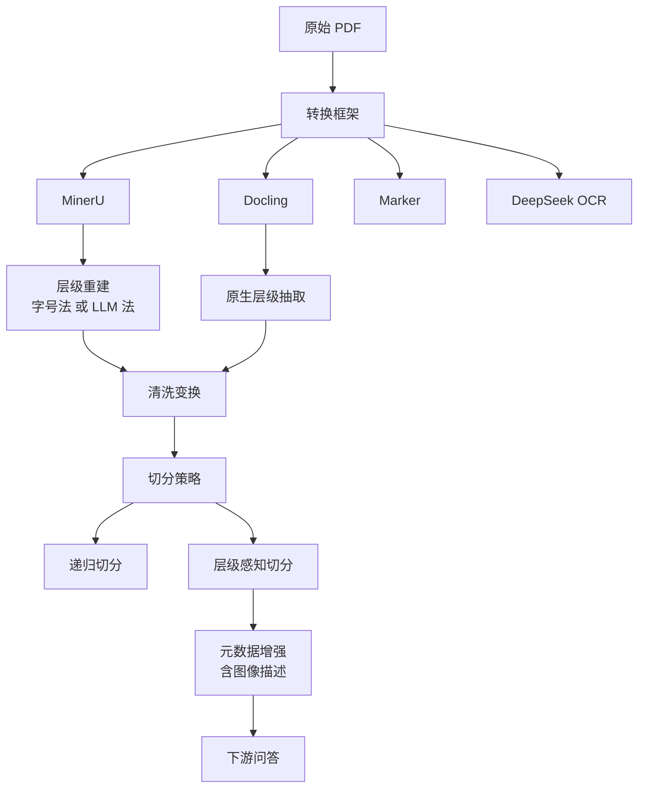

# Docling 与文档转换框架的实测对比（From PDF to RAG-Ready: Evaluating Document Conversion Frameworks for Domain-Specific Question Answering）

## 基本信息

| 项目 | 内容 |
|------|------|
| **链接** | https://arxiv.org/abs/2604.04948 |
| **代码** | 涉及四个开源框架：Docling、MinerU、Marker、DeepSeek OCR，均为开源工具 |
| **作者** | José Guilherme Marques dos Santos 等（波尔图大学、迈亚大学等） |
| **发布时间** | 2026-04-02 收稿，2026-05-19 发表（Applied Sciences） |
| **一句话总结** | 用 21 种流水线配置在真实行政文档语料上对比四个 PDF 转 Markdown 框架对下游问答准确率的影响，Docling 加层级切分加图像描述达 94.1%，超过人工整理的 91.3% |

---

## 置信度评估

| 信号 | 评估 |
|------|------|
| 发表场所 | Applied Sciences（MDPI），同行评审 |
| 引用/影响 | 低-中（新发表） |
| 代码可用 | 评测的四个框架均开源，论文的流水线配置可复现 |
| 实验设计 | 好（21 种配置、50 题基准、每配置 50 次独立运行、Wilcoxon 符号秩检验加 Cohen's d） |
| **综合置信度** | **🟢 高** |
| 需谨慎点 | 单一语种（葡萄牙语）、单一领域（军事人事行政文档），结论外推需验证 |

## 它解决了什么问题

RAG 系统的效果高度依赖文档预处理质量，但**既有研究几乎都假设输入文本已经是理想的**，很少评测 PDF 转文本这一步。作者指出的缺口是：多数研究把精力放在检索算法、重排序、切分方法和生成质量上，**而上游把原始文档转成机器可读格式这一步被当作已解决问题或纯工程细节**。

这种忽视的代价是：预处理阶段引入的错误（表格误读、层级丢失、字符或变音符号失真）会**直接从源头传播到检索与生成阶段**。

## 方法核心

作者搭了一个配置驱动的流水线，可以在不改代码的情况下替换转换框架、清洗变换、切分策略与元数据增强。

### 两个上界下界基线

作者设了三个参照点，这让结论有可比性：

- **朴素基线**：直接用 PDFLoader，86.2%
- **人工整理上界**：手工整理的 Markdown，91.3%
- **自动化最佳**：Docling 加层级切分加图像描述，**94.1% ± 1.6%**

自动化流水线**超过了人工整理的基线**，这是全篇最值得注意的结果。

### 层级感知切分是独立变量

作者把切分策略与转换框架分开测。**层级感知切分让分块以 Markdown 标题为边界**，因此一个落在某节里的块不会跨节。作者指出这种切分「目前只有 Docling 完整支持」。

## 关键数据

| 配置 | 准确率 |
|---|---|
| 人工整理 Markdown（上界） | 91.3% ± 1.2% |
| PDFLoader（朴素基线） | 86.2% |
| **Docling + 层级切分 + 图像描述** | **94.1% ± 1.6%** |
| MinerU 流水线 | 82.8% ± 1.3% |
| DeepSeek OCR 最佳配置 | 79.1% |
| 最差与最佳自动化配置的差距 | 约 **15 个百分点** |

其他发现：

- 所有成对差异**统计显著**（Wilcoxon 符号秩检验，p < 0.05）
- **表格相关问题是准确率差异的主要来源**，基础切分与层级切分之间差距达 **33 个百分点**
- **元数据增强与层级感知切分对准确率的贡献大于转换框架本身**
- **语言相关失真**：DeepSeek OCR 对葡萄牙语变音符号（如 ç）出现系统性误识别，Docling 无明显错误
- **GraphRAG 反例**：无领域本体引导的基础 GraphRAG 实现**大幅落后于基础 RAG**（82% 对 94.1%）

## 局限

- **单一语种与单一领域**：36 份葡萄牙语军事人事行政文档，1706 页，约 49 万字。结论对中文文档、技术文档是否成立需自测
- **Marker 被排除在定量对比之外**，因为其云版本涉及数据隐私，不符合使用方要求
- **GraphRAG 的负面结果不能外推**。作者明确指出这是「无领域本体引导」的实现，并在未来工作中计划用领域本体设计重做，**不应把这条当作「GraphRAG 不行」的证据**
- 未变动分块大小与重叠参数，作者列为未来工作
- 评估用 LLM 作为评判者，虽做了 50 次独立运行取统计，但评判者本身的偏差未单独分析

## 对本项目的启发

### 方案要点

**这是「模态转换」挑战最直接的实测答案，用户方案要求「保留标题、表格、代码块等结构」，这篇论文给出的数据说明这一步的框架选型能带来十个百分点以上的下游差距。**

用户方案第二条说模态转换是「外部知识进入系统的唯一入口」。论文的结论正好支持把这个入口当成关键环节而非工程细节：**预处理质量是 RAG 准确率最主导的因素，比优化检索或生成更值得先投入**。

### 四条可操作的结论

1. **优先选 Docling 这条路线，但要自测中文**。Docling 用专门模型做版面分析与表格识别，是唯一原生支持层级抽取的框架。论文的语言失真发现（DeepSeek OCR 对变音符号系统性误识别）说明**中文与欧美语言的失效模式不同，必须在本项目语料上重测**
2. **层级感知切分比转换框架本身更重要**。作者明确说元数据增强与层级感知切分「对准确率的贡献大于转换框架本身」。**本项目要把标题层级当作切分的硬边界**，这与用户方案「保留标题、表格、代码块等结构」的要求方向一致，但更进一步：结构不只是要保留，还要**参与切分决策**
3. **先把表格当重点**。表格相关问题贡献了 33 个百分点的差距，是所有问题类型里差异最大的。设计文档里的接口表、参数表、配置表正是这类内容，**建议单独建一批表格相关的问题来评测转换质量**
4. **四个候选框架可以并行试跑**。论文的做法是配置驱动、不改代码切换框架。本项目要处理的 Word、PDF、HTML、WIKI 四种格式，**建议沿用这种配置化设计**，让框架可替换、可比对

### 对 GraphRAG 的提醒

论文的 GraphRAG 反例容易被误读。**作者的原文结论是「无领域本体引导的 GraphRAG 大幅落后于基础 RAG」**，并明确把「用领域本体设计、引导式实体抽取、图稠密化」列为未来工作。对本项目的含义是：**知识网络的价值不会因为「连成图」自动出现，需要有本体的引导**。用户方案里「按业务定制卡片类型」恰好就是本体的雏形，**这条比简单地建关联更重要**。
