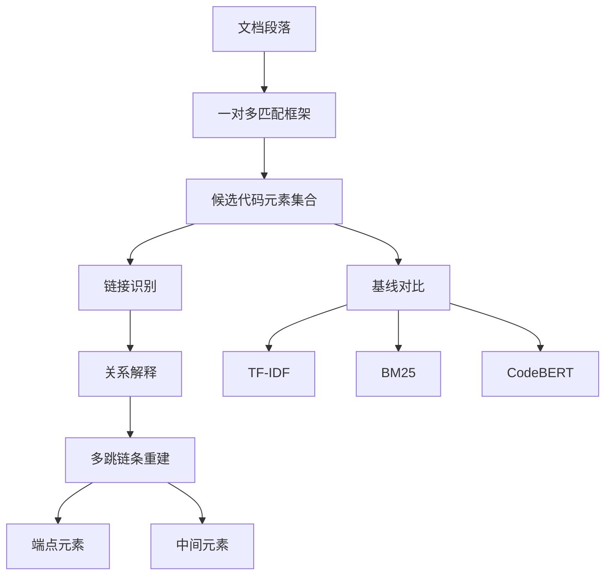

# LLM 文档到代码追溯评测（Evaluating the Use of LLMs for Documentation to Code Traceability）

## 基本信息

| 项目 | 内容 |
|------|------|
| **链接** | https://arxiv.org/abs/2506.16440 |
| **代码** | 论文构建了两个数据集（Unity Catalog、Crawl4AI），未提供完整工具实现 |
| **作者** | Ebube Alor, SayedHassan Khatoonabadi, Emad Shihab（康考迪亚大学） |
| **发布时间** | 2025-06-19 |
| **一句话总结** | 系统评测 LLM 建立文档到代码追溯链接的能力，最好的模型在两个数据集上 F1 为 79.4% 与 80.4%，但关系解释完全正确的只有四成到七成，错误集中在命名假设、幽灵链接与架构模式过度泛化 |

---

## 置信度评估

| 信号 | 评估 |
|------|------|
| 发表场所 | arXiv 预印本（2025-06），40 页完整评测 |
| 引用/影响 | 中-低（较新） |
| 代码可用 | 数据集有，工具实现未开源 |
| 实验设计 | 好（三个模型、两个自建数据集、三种基线、三类能力分别评测） |
| **综合置信度** | **🟢 高** |
| 需谨慎点 | 只两个项目，且都是特定技术栈；错误分类可迁移，绝对数值不宜外推 |

## 它解决了什么问题

文档与代码之间的追溯关系（哪个文档段落在讲哪段代码）通常靠人工维护，成本高且容易失效。信息检索方法（关键词、TF-IDF）早已用于这件事，但只能在词汇重叠时有效。LLM 理论上能跨过词汇鸿沟，但**能力边界没有被系统测过**：能不能找对链接、能不能说清为什么、能不能重建多跳链条。

作者建了两个新数据集来回答这三个问题，而不是只报一个准确率。

## 方法核心

三项能力分别评测，其中**任务框架的设计本身就是主要发现之一**。



### 一对多匹配是关键设计

作者明确指出，**让每个文档段落一次性匹配多个代码元素（one-to-many）而不是配对判定，对性能至关重要**。原因是「一个文档段落可能与多个分散的代码组件相关」，逐个配对会让模型误以为存在唯一答案。

这一点对用户方案有直接含义：用户方案说「外部知识提到公开符号就挂到对应卡片」，一段经验文字里出现多个符号是常态，**关联判断应当是「一对多」而非「一对一」**。

### 多跳链条的端点与中间段不对称

作者评测了模型能否重建依赖链，链条形如：

```
docs/config.md -> Crawler.__init__ -> Crawler.DEFAULT_CONCURRENCY
```

结果是一个极不对称的分布：**端点准确率很高（错误率低于 2%），但中间元素只有 13% 到 80% 被正确捕获**。也就是说模型知道「从哪来、到哪去」，但说不清中间经过什么。

## 关键数据

| 指标 | 结果 |
|---|---|
| 最佳 LLM F1（Unity Catalog） | 79.4% |
| 最佳 LLM F1（Crawl4AI） | 80.4% |
| 关系解释完全正确 | 42.9% 到 71.1% |
| 关系解释部分正确 | **超过 97%** |
| 多跳链条端点错误率 | 低于 2% |
| 多跳链条中间元素正确率 | 13% 到 80% |
| 基线 | TF-IDF、BM25、CodeBERT，均被显著超过 |

### 关系解释的「部分正确超 97%」需要正确理解

这个数字容易被误读成「LLM 解释得很好」。作者的解读是：**基本连接关系很少被完全漏掉，但把关系说准确很难**。对用户方案的含义是。「关联的理由」（`AssociationLink.reason`）字段可以要求模型产出，但**不能假定它准确**，理由本身应作为待核验材料而非依据。

### 三类错误来源

作者从错误分析中归纳出三类假阳性：

1. **基于命名的假设**：看到文档里的名字与代码里的名字像就判定相关
2. **幽灵链接**：报告了一个实际上不存在的链接
3. **架构模式的过度泛化**：因为某个模式通常这样组织，就假定这里也这样

这三类在用户方案里对应三个具体防线：命名假设对应「别名匹配需要额外证据」、幽灵链接对应「关联必须引用已提取事实」、模式泛化对应「低置信经验默认不发布」。

## 局限

- **只两个开源项目**（Unity Catalog、Crawl4AI），技术栈固定，绝对数值不宜外推
- **数据集由作者自建**，规模有限，训练或提示词调优的边界条件不明
- **未提供完整工具实现**，方法可读但不可直接运行
- 作者自己把结论定位成「LLM 是追溯发现的有力助手」，并明确指出**局限可能需要人在环路中**，而非全自动
- 中间元素 13% 到 80% 的宽区间说明结论对具体链条形态很敏感，论文没有给出区间的成因分析

## 对本项目的启发

### 方案要点

**这是给「关联与防孤岛」挑战建立实测基线的材料。**

用户方案要求「外部知识必须和代码知识库建立关联才能不成孤岛，关键锚点是代码符号」。这篇论文回答的是同一个问题的相邻版本（文档到代码），并且给出了可比的数字与错误分类，可以直接用来判断本项目自建方案的效果是否及格。

### 三条可操作的结论

1. **关联准确率的天花板不高，要按基线定预期**。F1 八成是当前最好水平，而这是「文档到代码」这个相对明确的场景。用户方案再加「必须挂到公开符号」的约束会更严格，命中率可能更低。**这意味着 coverage 指标的及格线不能定得太高**，否则机制会被误判为失败
2. **关系解释要单独度量，且不能作为判定依据**。完全正确只有四成到七成。`AssociationLink` 已经有 `confidence` 与 `reason` 两个字段，这篇论文说明**`reason` 的可信度显著低于链接本身**，二者应当分开评测
3. **一对多匹配是必要设计**。若本项目的关联判断被实现成「一个事实对一个目标」的逐条判定，性能会明显受损。现有契约里 `ExternalFact` 是主谓宾单条、`AssociationTarget` 是单条目标，**接口允许一对多，但判断策略必须显式支持**

### 关于多跳链条的建议

端点准、中间差这个不对称分布，对本项目的含义是：**如果知识网络需要支持「从经验卡片追到某个接口、再追到它依赖的模块」这种多跳检索，中间跳的可靠性是薄弱环节**。可行的做法是不要在检索时依赖多跳推理，而是**在关联建立时就物化好链条并逐条校验**，把不确定性提前到建立阶段。

### 与既有设计的衔接

`AssociationDomainService` 的校验规则（关联必须引用已提取事实与已提供目标）恰好能挡住作者列出的「幽灵链接」这一类错误。**这是现有契约的一个真实优势，值得保留为硬约束。**
