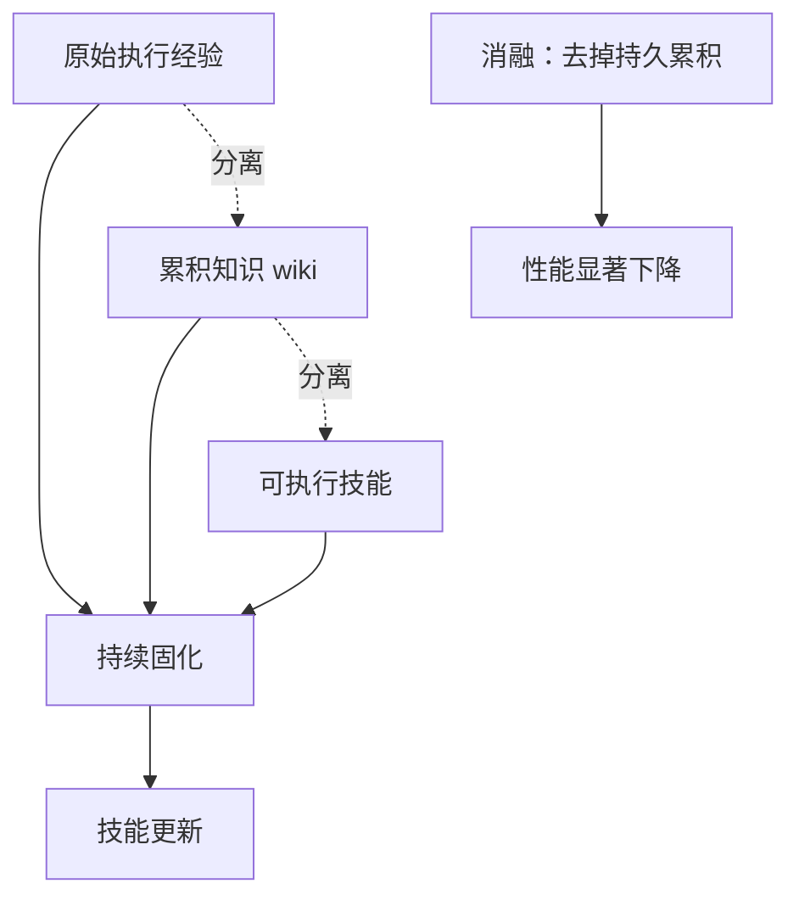

# WikiSkill 把智能体经验编译成持久知识（WikiSkill: Compiling Agent Experience into Persistent Knowledge for Skill Evolution）

## 基本信息

| 项目 | 内容 |
|------|------|
| **链接** | https://arxiv.org/abs/2608.27454 |
| **代码** | 论文未提供公开实现 |
| **作者** | Liyan Tang, Cyrus Rashtchian, Chun-Sung Ferng, Andrew Tomkins, Da-Cheng Juan, Tu Vu（Google Research、弗吉尼亚理工） |
| **发布时间** | 2026-08-27 |
| **一句话总结** | 把智能体的原始执行经验、累积知识、可执行技能分成三层，用持续把经验沉淀进 wiki 的方式让技能可复用，消融实验确认持久化的知识累积是关键 |

---

## 置信度评估

| 信号 | 评估 |
|------|------|
| 发表场所 | arXiv 预印本（2026-08），Google Research |
| 引用/影响 | 低（新发布） |
| 代码可用 | 未提供公开实现 |
| 实验设计 | 好（多基准多模型、含消融、跨模型迁移实验） |
| **综合置信度** | **🟡 中-高** |
| 需谨慎点 | 未开源；「wiki」的具体结构与检索方式描述较抽象 |

## 它解决了什么问题

智能体技能（把专门知识与工作流打包成可复用资源）近期有工作能自动从智能体经验中发现。作者指出的缺口是：**指导技能形成的那些洞察通常散落在优化历史中，限制了它们在迭代之间的系统性复用**。

也就是说，每次迭代都在重新发现同样的经验，因为没有地方把它沉淀下来。

## 方法核心

WikiSkill 的核心是**三层分离**，以及把经验持续固化进 wiki 的循环。

三层各自的职责：

- **原始执行经验**：智能体与环境交互产生的轨迹
- **累积知识（wiki）**：从经验中提炼、跨迭代持久的结论
- **可执行技能**：可被调用的具体能力

关键设计是把这三者**分开存放**，而不是把经验直接写进技能。WikiSkill 持续把执行经验固化成 wiki 内容，后续的技能更新以 wiki 为输入。

## 关键数据

- 在多个基准与模型上，**WikiSkill 持续超过最先进的技能演化方法**，并在多数「模型-基准」组合上超过无技能基线
- **技能演化与模型规模互补**：更大的模型通常从演化出的技能中获益更多
- **小模型加技能可以超过大得多的无技能模型**
- **跨模型迁移有效**：由其他模型演化出的技能，表现可以超过自己演化的技能
- **消融确认：wiki 中的持久知识累积对有效的技能演化是关键**

## 局限

- **未开源**，wiki 的具体数据结构、粒度、检索方式没有工程细节，无法直接复用
- 论文摘要把 wiki 的作用描述得较抽象（「持续把经验固化进 wiki」），**具体固化规则未在摘要层面给出**
- 评估集中在技能演化任务上，**不涉及代码知识库与设计文档的关联**
- 未报告 wiki 规模增长的控制机制，而知识持续累积必然带来膨胀问题
- 作者是 Google Research，实验环境可能依赖未公开的内部基础设施

## 对本项目的启发

### 方案要点

**这是「知识编译」与「经验污染治理」两个挑战的参照材料，主要价值在架构分层的思路上。**

用户方案的第三层是「专家经验 wiki」，属于动态知识，会持续更新也可能过时；第一条主线是「知识编译」，把不同格式文档统一转换再编译成 AI 友好的知识卡片。WikiSkill 做的正是「把经验编译成可复用知识」这件事，且它的三层分离**与用户方案的三层知识源有结构上的对应**：

- 原始执行经验 → 接近本项目飞轮运行过程中产生的过程资料
- 累积知识 wiki → 对应用户方案的经验 wiki 层
- 可执行技能 → 对应用户方案的知识卡片（可作为 Agent 生成、评测、修订时的输入）

### 三条可操作的结论

1. **分层存放是有效的，且消融证明它是关键**。用户方案里代码知识库、设计文档、经验 wiki 本身就是三层，**WikiSkill 的消融结果支持不要把三类知识混在同一层存储与发布**。这与用户方案「经验卡片默认低置信、不与代码卡片同级发布」的要求方向一致
2. **「经验不能直接用，要先编译」这条有实验支持**。把原始执行经验与可复用知识分开，中间加一层编译过程，效果优于直接使用经验。**这支持用户方案第一条主线（知识编译）作为独立环节存在**，而不是让 Agent 直接读原始材料
3. **跨模型迁移有效这一点值得注意**。由其他模型演化出的技能可以超过自己演化的，这说明**知识产物的价值不完全绑定于产生它的模型**。对本项目的含义是：本项目只能用公司本地部署的 GLM 5.1，但**知识卡片作为资产是可积累的，不必因模型更换而废弃**

### 与既有发现的呼应

「wiki 中的持久知识累积是关键」这条消融结论，与「增量维护」专题中 `2608.11095` 的发现是一个硬币的两面：**持久累积有价值（WikiSkill），但无界累积有害（知识膨胀）**。两篇合起来给出的结论是：累积机制需要配套的增长控制，**用户方案的「版本化加不可变历史」正是这个控制位**。

### 需要注意的边界

WikiSkill 处理的是「智能体自身经验」，而用户方案的经验 wiki 层是「人工沉淀的经验和踩坑」，来源不同。**人工经验的信噪比可能更高，但也可能更陈旧、更少更新**。论文的结论可以借鉴机制，不宜直接照搬评估结果。
