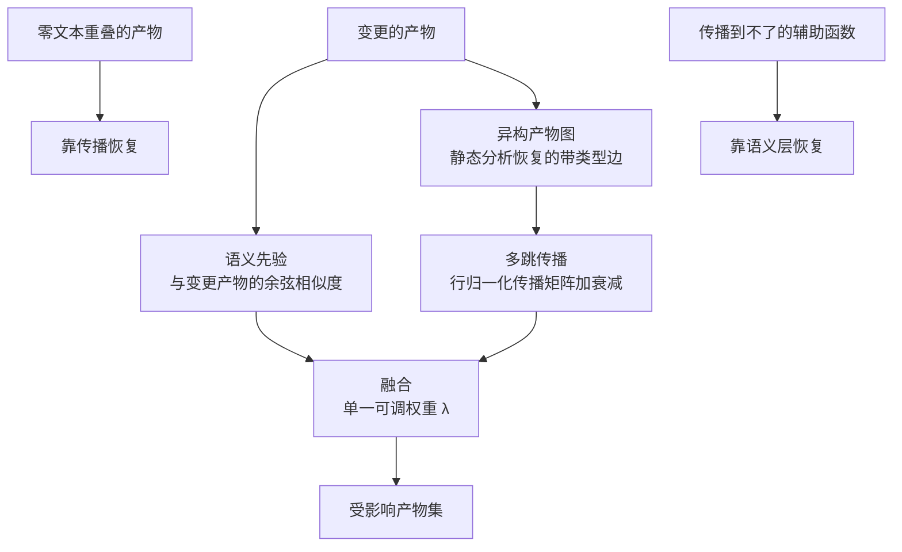

# 变更影响分析的两路信号融合（Toward Semantically-Seeded, Graph-Propagated Impact Analysis Across Software Artifacts）

## 基本信息

| 项目 | 内容 |
|------|------|
| **链接** | https://arxiv.org/abs/2606.18855 |
| **代码** | 未提供（论文定位为愿景与概念验证） |
| **作者** | Momil Seedat |
| **发布时间** | 2026-06-17 |
| **一句话总结** | 语义相似度与结构传播各有盲区，把两路信号在同一嵌入空间上融合是唯一能同时覆盖两种盲区的配置，权重参数即精确率召回率控制 |

---

## 置信度评估

| 信号 | 评估 |
|------|------|
| 发表场所 | arXiv 预印本（2026-06），定位为愿景论文加概念验证 |
| 引用/影响 | 低（新发布） |
| 代码可用 | **未提供** |
| 实验规模 | **小（仅 5 个标注变更场景）** |
| **综合置信度** | **🟡 中-低** |
| 需谨慎点 | 论文自己声明「原型数字是机制的示例，不是泛化结论」。**这是本篇最重要的使用前提** |

## 它解决了什么问题

当一个软件产物发生变化（需求、配置值、函数），工程上需要确定还有什么受影响。作者指出**现有的变更影响分析工具通常只依赖两种信号之一**：

- **语义相似度**：从文本恢复的信息检索式追溯、代码搜索、嵌入向量
- **结构依赖跟随**：调用图、IDE 的「查找引用」、测试影响选择

两者各有特征性盲区，作者把这一点说得很清楚：

- **语义驱动工具会漏掉**那些文本与变更没有共享词汇的受影响产物
- **结构驱动工具会漏掉**那些语义相关但没有边相连的产物
- **而且多数工具只在代码上运作**，覆盖不了「需求到配置到服务到测试」这条链

## 方法核心

作者的方案是把两路信号**融合在同一套嵌入上**，论文的表述是「同样的嵌入，不同的推理层」。

三个组成部分：

1. **异构产物图**：把系统建模成带类型边的图，边由静态分析恢复
2. **语义先验**：计算与变更产物的余弦相似度
3. **多跳传播**：在行归一化的传播矩阵上带衰减地传播影响

**融合用一个可调权重 λ 把两者混合，λ 同时充当精确率与召回率的显式控制。**

## 关键数据与诚实声明

作者在一个支付子系统上做了**小型但完整的概念验证，只有 5 个标注变更场景**。观察到两个机制性现象：

- **文本与变更零重叠的产物仍然被恢复出来了**。通过传播实现
- **传播单独到不了的辅助函数被恢复出来了**。通过语义层实现
- **融合是唯一同时覆盖两种盲区的配置**

作者进一步引用四个公开记录的生产事故（容器基础镜像更新、数据库引擎升级、指标重命名、遗留共享数据耦合），论证同样的公式可以扩展到代码分析触达不到的运维产物（镜像、指标、看板、数据模式）。

### 需要原样保留的措辞

论文明确写道：原型数字**「是机制的示例说明，不是泛化结论」**，并列出了未来工作方向（可学习的传播、LLM 验证、跨服务的可扩展部署）。**这意味着本篇只能作为方向与机制参考，不能作为效果证据。**

## 局限

- **未提供代码**
- **实验规模极小**：5 个标注变更场景，单子系统，不足以支撑泛化结论
- **是愿景论文**，作者自己把结论定位为「机制说明」而非效果验证
- 四个生产事故是**事后论证**，不是实验证据
- **未报告精确率与召回率的数值**，只报告了「融合覆盖两种盲区」这个定性结果
- λ 的取值方法与敏感性分析未见

## 对本项目的启发

### 方案要点

**这篇是给「关联与防孤岛」提供设计方向的材料，价值在盲区分析，不在实验结论。**

用户方案第二条主线要求「以代码符号引用作为硬证据」把三类卡片互相挂接。**「只靠符号引用」正是一个纯结构信号**，它有自己的盲区：**外部知识里用自然语言描述了一个概念、但没有写出任何符号名时，纯符号匹配什么都挂不上**。本篇的盲区分析恰好指出这一类问题，并给出「结构之外再补一路语义信号」的方向。

### 三条可操作的结论

1. **纯符号锚定会有盲区，需要显式承认并设计兜底**。用户方案说「外部知识提到公开符号就挂到对应卡片」，但**「没提到符号」的外部知识怎么办**，方案没有说。本篇给出的答案是补一路语义信号，且要**两路都留、混合使用**而不是二选一
2. **「融合」不等于「都要」**：作者明确说融合是唯一覆盖两种盲区的配置。落到本项目：如果只做符号匹配，那些语义相关但没写符号名的经验卡片会成为孤岛；如果只做语义相似度，那些明写了符号名的关联反而会不准。**两路信号应当是互补关系**
3. **可调权重作为精确率召回率控制杆**。这个设计对项目的 `confidence` 有直接含义：**混合权重可以成为 `confidence` 的计算依据**，让置信度有可解释的来源，而不是模型自报一个数

### 必须注意的使用边界

**本篇的验证强度远低于本目录其他材料**（5 个场景、无代码、愿景定位）。**建议把它当作「盲区清单」用，而不是当作方案依据。** 本目录中其他材料给出的机制（`2212.01479` 的双快照检测、`2609.29474` 的级联锚定）都有大规模实证支撑，**做方案时应当以那些为主，本篇只用来提醒不要只做单一信号**。

### 与「增量维护」专题的关系

本项目的增量维护方向需要「从代码变更定位受影响的文档」，本篇正是变更影响分析的直接相关材料。**两者可以合起来看**：增量维护解决「运行时要不要重新生成」，本篇解决「改了之后哪些知识受影响」。**注意本篇是愿景性材料，用它做增量维护的依据需要自己补验证。**
