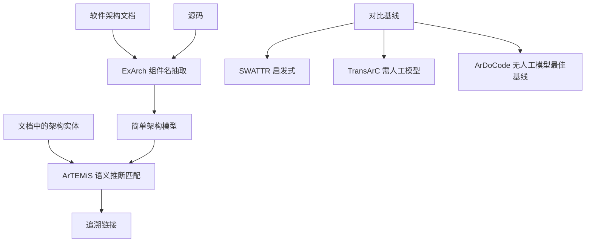

# 架构实体识别与追溯（Who's Who? LLM-assisted Software Traceability with Architecture Entity Recognition）

## 基本信息

| 项目 | 内容 |
|------|------|
| **链接** | https://arxiv.org/abs/2511.02434 |
| **代码** | ArDoCo 组织下有工具族与多个复现包（lissa、ardoco、benchmark 等仓），MIT 类许可 |
| **作者** | Dominik Fuchß, Haoyu Liu, Sophie Corallo, Tobias Hey, Jan Keim, Johannes von Geisau, Anne Koziolek（卡尔斯鲁厄理工学院） |
| **发布时间** | 2025-11-04（v2 2026-03-19） |
| **一句话总结** | 把架构追溯拆成「实体识别」与「实体匹配」两步，识别用 LLM 抽取组件名，匹配用语义推断，在不用人工建架构模型的条件下达到 F1 0.86，接近需要人工模型的 0.87 |

---

## 置信度评估

| 信号 | 评估 |
|------|------|
| 发表场所 | arXiv 预印本（ICSA 2025 论文的扩展版，v2 2026-03） |
| 引用/影响 | 中（该团队在此方向持续发表，形成 ArDoCo 工具族） |
| 代码可用 | 有（ArDoCo 工具族与复现包公开） |
| 实验设计 | 好（多 LLM 对比、修订过的基准、与三个最先进方法对比） |
| **综合置信度** | **🟢 高** |
| 需谨慎点 | 是架构文档与代码的追溯，粒度为架构组件，不是符号级 |

## 它解决了什么问题

在文本产物中识别「架构相关实体」是软件架构文档到源码追溯的前提。**传统做法需要人工创建软件架构模型**（SAM）来桥接文档与代码之间的语义差距，而这个创建过程很耗时。

作者的思路是：**让 LLM 从架构文档和源码中抽取架构实体，直接生成架构模型或建立追溯链接**，从而免掉人工建模这一步。

## 方法核心

两个方法，分别对应追溯的两个阶段。

- **ExArch**：从架构文档和源码中抽取组件名，形成简单架构模型，**消除人工建模型的需要**
- **ArTEMiS**：在文档中识别架构实体，与（人工或自动生成的）架构模型实体做匹配

**把「识别实体」与「匹配实体」分成两步是本篇的结构性贡献**：两步可以分别度量、分别优化，也各有一套失败模式。

## 关键数据

| 方法 | F1 | 说明 |
|---|---|---|
| TransArC | **0.87** | 强，但**需要人工创建架构模型** |
| **ExArch** | **0.86** | 仅用架构文档与代码，无人工模型 |
| ArTEMiS | 0.81 | 与传统启发式方法 SWATTR 相当 |
| ArDoCode | 基准 | 不用人工模型的最佳基线，被 ExArch 加 ArTEMiS 的组合超过 |

关键结论：

- **ExArch 用更少的输入（无人工模型）达到了与 TransArC 相当的结果**
- **ArTEMiS 在集成到 TransArC 中可以成功替代传统启发式方法**
- ArTEMiS 加 ExArch 的组合**超过了不用人工模型的最佳基线**

## 局限

- **追溯粒度是架构组件，不是代码符号**。与用户方案「以代码符号引用作为硬证据」的粒度不同，本方法定位到组件级
- 面向 Java 与特定的架构文档风格，**跨语言与跨文档格式的泛化性未见验证**
- 实体匹配依赖语义推断，**在组件名与代码命名差异大时效果未知**
- 未提供匹配错误的分类分析，**失败模式不如追溯落空的分类研究那样清晰**
- 同批调研中另有 ArDoCo 工具族的部署形态（`2606.28064`，见候选池 2️⃣2️⃣ 组），本方法需要与整个工具族配合才有工程价值

## 对本项目的启发

### 方案要点

**这篇给出「关联判断」的一个可拆解结构：识别与匹配是两件事，应分别实现与度量。**

用户方案的第四条要求「外部知识提到公开符号就挂到对应卡片」。这条链路实际上包含两个动作：**先判断外部知识里哪些词是符号，再判断这个符号对应哪些卡片**。本篇把这两步显式分开，并证明分开后可以达到接近「有额外人工输入」的效果。

### 三条可操作的结论

1. **实体识别与实体匹配应当作为两个独立可度量的环节**。落到本项目：从经验卡片文本里「认出疑似符号」与「把认出的符号映射到知识库里实际存在的卡片」应当分别实现、分别评测。**`ExternalExtractor` 与 `ReverseMapper` 两个注入点已经天然是分开的**，本篇的支持说明这个划分是对的，不应合并
2. **「无人工模型」也能达到接近的效果，说明自动识别的上限比预期高**。用户方案没有人工标注架构模型这一环，本篇的结论支持**不引入人工中间产物**也能可行
3. **匹配结果与启发式方法相当这一点有意义**：ArTEMiS 的 F1 0.81 与传统启发式 SWATTR 持平，说明**在证据充分时，简单规则与模型的效果可能接近**。这支持本项目的落地顺序。先做确定性匹配，只有在确定性方法明显不足时才上模型

### 与 ArDoCo 工具族的配合

同批调研的 ArDoCo 工具族（`2606.28064`，见候选池 2️⃣2️⃣ 组）说明这套方法已被工程化成 REST API 与 IDE 插件，包含四条追溯流水线（架构文档到模型、模型到代码、文档到代码、以及传递式三者）。**如果本项目要参考现成实现而不是自建，这是目前最完整的开源选择**，且以 Java 库加 HTTP 接口的形式提供，与本项目的部署环境相容。

### 一处方向性差异

本篇的追溯是**多对多的模糊匹配**（文档中的实体对应哪个组件），而用户方案的锚定是**基于符号存在的确定性判定**（这个符号在代码里存在吗、公开吗）。**后者更容易验证，但对「外部知识用自然语言描述了一个符号却没写出名字」这种情况束手无策**。建议本项目按两级实现：能精确匹配的走确定性，需要语义推断的走模型，并把结果分别标注置信来源。
