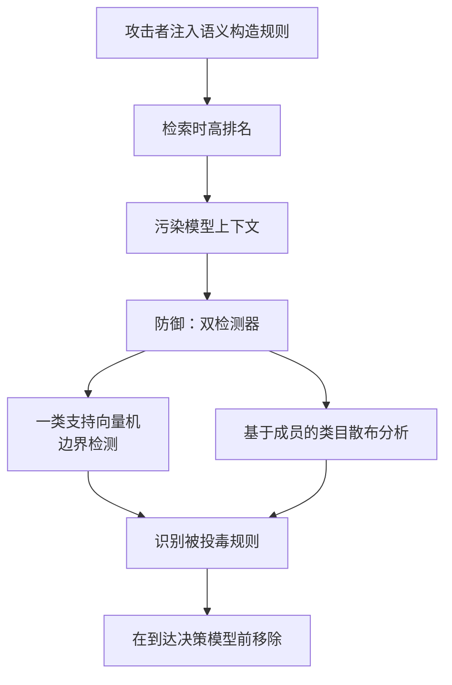

# 知识库投毒与跨类目异常检测（Knowledge Base Poisoning Attacks and Defense for Policy-Aware LLM-RAG Framework）

## 基本信息

| 项目 | 内容 |
|------|------|
| **链接** | https://arxiv.org/abs/2607.04379 |
| **代码** | 论文未提供公开实现 |
| **作者** | Om Solanki, Lopamudra Praharaj, Deepti Gupta, Maanak Gupta（田纳西理工大学等） |
| **发布时间** | 2026-07-05 |
| **一句话总结** | 一条精心构造的规则以 1.6% 的投毒率即可造成 85% 的上下文污染，防御方案靠跨类目嵌入签名识别异常，在 1.6% 到 25% 投毒率下保持 100% 上下文完整性，开销 7 毫秒 |

---

## 置信度评估

| 信号 | 评估 |
|------|------|
| 发表场所 | arXiv 预印本（2026-07），cs.CR |
| 引用/影响 | 低（新发布） |
| 代码可用 | 未提供 |
| 实验设计 | 中（自建场景，投毒率 1.6% 到 25% 扫描，与五种基线对比） |
| **综合置信度** | **🟡 中** |
| 需谨慎点 | 场景是特定领域（战场物联网策略库），防御依赖该场景的三类目分类法；未开源 |

## 它解决了什么问题

RAG 用外部知识库给 LLM 提供依据，但**知识库本身成了一个攻击面**：有写权限的攻击者可以注入语义上精心构造的文档，让它在检索时获得高相似度排序，从而把模型的上下文带偏。

作者指出，已有工作（PoisonedRAG、HijackRAG、PR-Attack）已经证明**极小的知识库污染就足以可靠地操纵模型行为**。本篇的具体场景是策略感知的 RAG（面向战场物联网的任务控制），并明确指出该框架此前的**基本信任假设是「知识库只包含合法未修改的策略规则」**，这在对抗环境下是漏洞。

## 方法核心

攻击与防御是一对。

### 攻击侧的关键性质

攻击被作者称为**查询无关的语义检索投毒**：注入的规则**不需要知道运行时提示词**就能在所有操作员查询类型上获得高检索排名。这一点使它比针对特定问题的投毒更危险。

### 防御侧的两个检测器

- **一类支持向量机**：做边界检测，找出偏离正常分布的样本
- **基于成员的类目散布分析**：这是作者自创的方法，**利用该场景固有的三类别策略分类法**（工作流、交战规则、能力），识别被投毒规则特有的**跨类目嵌入签名**

## 关键数据

| 指标 | 数值 |
|---|---|
| 单条注入规则的上下文污染率 | **85%**（投毒率 1.6%） |
| 单次上下文中的被投毒规则数饱和值 | 2.65 条（投毒率 7.7% 时） |
| 有效性随投毒率变化（1.6% 到 25%） | 基本不变 |
| 防御后上下文完整性 | **100%** |
| 防御计算开销 | **每任务 7 毫秒** |
| 对比基线 | DBSCAN、LOF、K 均值、孤立森林、一类支持向量机，均被超过 |

## 局限

- **场景特定性强**：防御的核心是**利用领域固有的三类别分类法**做跨类目签名分析。**换一个没有明确类目体系的场景，这个检测器无法直接使用**
- **未开源**，无法复现
- **自建场景与小规模评估**，没有公开基准上的横向对比
- 攻击实验设定在作者自己的策略库上，**真实系统的投毒可行性未评估**
- 未讨论**攻击者了解防御机制后的自适应攻击**
- 论文场景（战场物联网）与本项目的知识网络差异很大，数据与结论不宜外推

## 对本项目的启发

### 方案要点

**这是「经验污染治理」挑战的威胁模型材料，价值在于给出量化的威胁严重度与一条可借用的防御思路。**

用户方案第三条明确担心「早期低质量经验可能被飞轮学进知识库，优化过程也可能让知识倒退」。论文的结论把这件事的严重度量出来了：**不需要大量污染，1.6% 的比例就足以让 85% 的上下文被带偏**。对本项目的含义是，**污染的防线不能设在比例阈值上**（比例低不代表危害小），必须设在内容特征上。

### 四条可操作的结论

1. **低比例污染即高危，不能靠「占比小所以可容忍」的思路**。这条直接支持用户方案「经验卡片默认低置信、不与代码卡片同级发布」的严格立场
2. **跨类目异常是有效的检测信号，且本项目已有可用的类目体系**。论文的检测器靠「三类别策略分类法」识别异常签名。**用户方案里「按业务定制卡片类型」（数据摘要、实体、结构、概念、流程）恰好就是一个类目体系**，可以照这个思路建「卡片类型与来源类型的跨类目一致性」检测：某类卡片出现在它不该出现的来源类型上，就是异常信号
3. **检测必须在「到达消费方之前」执行**。论文的机制是在检索命中后、送入决策模型前移除。落到本项目：**污染检测应放在检索链上，而不是只放在入库门禁**。堆在入库侧的检查挡不住已被学进知识库的旧经验。这正是用户方案担心的「早期低质量经验」
4. **7 毫秒的开销说明这类检测可以进在线路径**。本项目不需要把它做成离线批处理

### 与 DocPrism、CASCADE 的分工

这三篇构成了降噪的三个层次，建议分层使用：

- **DocPrism**：提示词层面的分类约束，最便宜，用于第一轮收敛
- **CASCADE**：执行层面的交叉验证，较贵，用于高价值关联的二次确认
- **本篇**：分布层面的异常检测，开销低但依赖类目体系，用于检索链上的常态监控

### 与既有设计的衔接

`KnowledgeVersion` 有 `LOW_CONFIDENCE` 状态且定义是「保留停止证据」，**这正好是承载「被检测为可疑但未确证的关联」的位置**。用户方案要求「替换现用文档保留上一版可回退」，与本篇的隔离思路一致：**可疑内容不删除，改为隔离并保留证据**。
