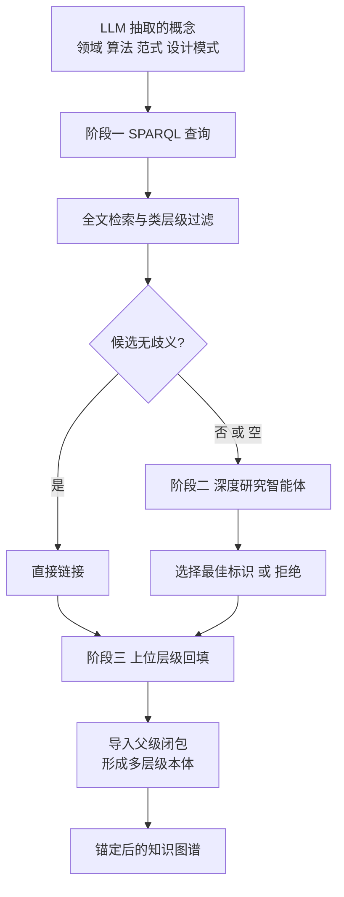

# 符号锚定的级联策略（CodeGraph: Open-Taxonomy Knowledge Graph for Source Code with Wikidata Grounding）

## 基本信息

| 项目 | 内容 |
|------|------|
| **链接** | https://arxiv.org/abs/2609.29474 |
| **代码** | 论文声明流水线源码完整发布（收录于 CIKM 2026） |
| **作者** | Federico Pennino, Andrea Gurioli, Stefano Zacchiroli, Maurizio Gabbrielli, Paolo Ferragina（博洛尼亚大学、巴黎电信、圣安娜高等研究学院） |
| **发布时间** | 2026-09-24 |
| **一句话总结** | 建了一个含约 1.58 亿节点的源码开放分类知识图谱，核心机制是三阶段实体链接：确定性查询处理无歧义实体，智能体解决长尾，最后回填上位层级闭包 |

---

## 置信度评估

| 信号 | 评估 |
|------|------|
| 发表场所 | CIKM 2026（第 35 届 ACM 信息与知识管理会议） |
| 引用/影响 | 低（新发表，但会议级别高、规模大） |
| 代码可用 | 有（论文声明流水线源码随图一起发布） |
| 实验规模 | **极大**（Stack-Edu 语料 1.67 亿文件，158,202,834 节点、1,020,887,480 条边） |
| **综合置信度** | **🟢 高** |
| 需谨慎点 | 链接目标是 Wikidata 而非项目内代码符号；精度上界 88% 与下界 68% 差距大 |

## 它解决了什么问题

公开代码仓库存有数十亿文件，其中隐含着大量工程知识，包括实现的算法、遵循的范式、使用的设计模式、服务的应用领域，但**现有工具受限于语法与词法层面的分析**，提取不出这些语义。作者指出，传统静态分析工具精度高但停留在语法层，**很少能捕捉程序做什么、以及为什么这样设计**。

作者的另一个关键判断是：LLM 抽取出的概念**在内部是一致的，但只是局部定义的**。用同一套流水线建两个图，它们会一致同意自己的节点标签，但对这些标签指代什么不一定一致。**要给图一个共享的语义基准，就需要把概念锚定到外部标识空间。**

## 方法核心

三阶段实体链接是核心机制，也是本篇对本项目最有价值的部分。

### 阶段一：确定性优先

**SPARQL 查询做全文检索加类层级过滤**，只处理候选集合无歧义的情况。这一阶段的判断不依赖模型，是可复现的确定性步骤。

### 阶段二：模型只处理长尾

**歧义或无结果的情况交给深度研究智能体**（论文用 Qwen3.6-27B）决定选择哪个标识或拒绝。**模型只被用在确定性方法失效的剩余部分**，这是整条流水线成本与可靠性的关键。

### 阶段三：回填上位层级闭包

链接成功后，**导入该标识的父级闭包**，把细粒度概念与更广的语义家族连起来，形成多层级本体。

### 质量控制：校准过的评估协议

作者设计了一套两阶段协议来量化标注精度：**小型人工金标准集加验证器选择步骤加银级 LLM 评判过滤**。

## 关键数据

| 指标 | 数值 |
|---|---|
| 总节点数 | 158,202,834 |
| 总边数 | 1,020,887,480 |
| 文件节点 | 144,910,008 |
| 抽取的概念实体 | 约 63,000 |
| 锚定到 Wikidata 的实体 | 约 19,800 |
| 覆盖编程语言 | 14 种 |

各语义轴的验证接受率（一万文件银级子集）：

| 语义轴 | 接受率 |
|---|---|
| 范式 | 93% |
| 算法 | 88% |
| 领域 | 88% |
| 设计模式 | 82% |

跨语言接受率落在 **87% 到 90%** 的窄带内（C 90%、Go 89%、Java 90%、JS 90%、Python 87%、Rust 88%）。

### 精度区间与一处重要的诚实披露

作者给出了两个精度估计：

- **保守下界 68%**：人工金标准集上的可接受率
- **宽松上界 88%**：LLM 验证器的整体接受率

**两者之间的差距有明确解释**：验证器的接受率系统性高于人工，这与人金标准集中「不确定」的判断被转换成验证器的「可接受」一致。原文照录这个态度：两个值「框定了合理精度估计的范围」。

作者还给出了一条**按语义轴的实用建议**：范式、领域、算法三个轴支持高置信度的锚定分析，而**设计模式的标注应当被当作探索性结果**。

## 局限

- **人工金标准集规模小**（127 条分层抽样），作者自己列为研究局限
- **锚定目标是 Wikidata 而非项目内部符号**，与本项目「以代码符号引用作为硬证据」的思路方向不同。Wikidata 是公共知识图谱，本项目需要的是项目内的符号空间
- **精度下界 68% 意味着约三分之一标注不可靠**
- 评估是**文件级**的，更细粒度的评估（如函数级）留作未来工作
- 该工作的目的是建立可跨语料比较的语义标注，**不涉及文档与代码的双向关联**

## 对本项目的启发

### 方案要点

**这是「关联与防孤岛」挑战里最值得借鉴的架构模式：确定性与模型的级联分工。**

用户方案要求「以代码符号引用作为硬证据」把三类知识挂接起来。CodeGraph 的级联结构把这件事拆成了可度量的步骤：**先用确定性方法处理能确定的部分，模型只处理长尾，最后做闭包回填**。

### 四条可操作的结论

1. **确定性优先、模型兜底长尾是最重要的架构决策**。这条与 [DocPrism](DocPrism不一致检测的精度陷阱.md) 和 [CASCADE](CASCADE用测试生成交叉检查.md) 的结论汇合：**模型不应处理全部关联判断**。落到本项目：公开符号的精确匹配应当由确定性代码完成，只有匹配不上或存在歧义时才调用模型。这同时降低了成本与不确定性
2. **「拒绝」必须是一个合法输出**。阶段二的智能体可以「选择最佳标识**或拒绝**」。这对应本项目的一个设计需要：`AssociationLink` 现在要求 `factId` 与 `targetId` 都必须存在，**但外部知识里必然存在无符号可挂的内容**。需要显式支持「判定为无法关联」这个结果，而不是硬塞一个低置信关联
3. **闭包回填让图连通**。链接后导入上位层级，把细粒度概念与更广的语义家族连起来。这正是「防孤岛」的机制：**即使某张经验卡片只挂到了一个符号，通过层级闭包它也能与整个网络连通**
4. **精度必须给区间而非点估计**。作者用 68% 与 88% 两个值框定范围，并诚实解释了差距成因。**本项目的 coverage 与关联精度指标应当照此报告**，单点数字会误导决策

### 一处需要谨慎的对应

论文的锚定目标是 Wikidata（公共标识空间），本项目的是代码符号（项目内标识空间）。**前者是开放分类，后者是封闭且精确的**。这意味着本项目的符号锚定理论上比论文的锚定更可靠。**符号是否存在、是否公开，是可以用编译器和静态分析机械判定的**，这一点比 Wikidata 链接强。论文的级联结构可以借用，但本项目的确定性第一级能做到比 SPARQL 查询更严格的程度。
