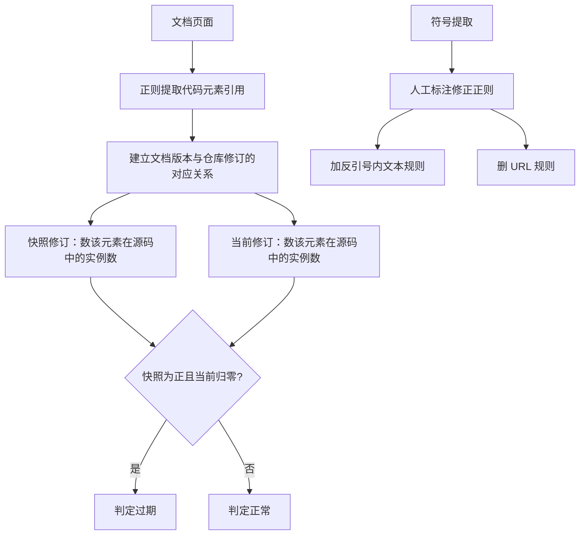

# 过期代码元素引用检测（Detecting Outdated Code Element References in Software Repository Documentation）

## 基本信息

| 项目 | 内容 |
|------|------|
| **链接** | https://arxiv.org/abs/2212.01479 |
| **代码** | https://github.com/wesleytanws/DOCER（作者实现，MIT 许可，Shell 与 Python 标准库） |
| **作者** | Wen Siang Tan, Markus Wagner, Christoph Treude（阿德莱德大学、墨尔本大学） |
| **发布时间** | 2022-12-02（期刊版本后收录于 Empirical Software Engineering） |
| **年份标注** | 早于本项目 2025 年收录线。因机制直接对应用户的「时效」挑战，显式保留 |
| **一句话总结** | 用文档更新时的仓库快照与当前修订做两次比对，若某代码元素在源码中的实例数从正数归零而文档仍引用它，即判定文档过期 |

---

## 置信度评估

| 信号 | 评估 |
|------|------|
| 发表场所 | arXiv 预印本，后投 Empirical Software Engineering |
| 引用/影响 | 中（该问题的早期系统性工作，作者称首次以代码元素引用判定过期） |
| 代码可用 | 有（MIT，可直接读改动） |
| 实验规模 | 大（3,279 个项目，两个数据集，人工标注 50 条算一致性） |
| **综合置信度** | **🟢 高** |
| 需谨慎点 | 方法只覆盖「引用了一个已消失的符号」，不覆盖「符号还在但关系变了」 |

## 它解决了什么问题

文档过时是软件工程的普遍问题。作者引用的调研数据是：一份对文档问题的研究中「时效问题」占文档内容问题的 39%；超过三分之二的受访者认为自己的系统文档已经过时。文档与代码不同的一点是**它会静默失效**：没有崩溃、没有报错，开发者改完源码后通常不知道文档已经不对了。

作者的判断是：既然失效是静默的，就需要一个能自动指出「哪条引用已经死了」的机制。

## 方法核心

判定条件只有一条，但需要两个修订点：**文档最后一次更新的那一刻所对应的仓库快照**，以及**当前修订**。



三个实现细节决定了这个方法能不能用。

### 细节一：符号提取用正则，并用人工标注回过头改正则

提取变量、函数、类名用正则表达式，而不用语言相关的解析器。理由是这样能跨语言、能匹配任意源码文件。正则表来自先前工作（Treude 等），作者在人工标注 50 条随机样本后做了三处修改：

- **新增匹配反引号内文本的规则**。作者发现开发者习惯用反引号标记代码元素。代码块（三个反引号）不加，因为里面多是长文本，匹配价值低
- **删掉原本匹配 URL 的规则**。URL 在后一阶段大量无法匹配到源码，产生噪声。仍在反引号内的 URL 会被提取
- **修改多处分组，只提取代码元素本身**，避免把不属于元素的空格带进来

三位作者对 50 条样本独立标注判定是否真过期，**自由边际 kappa 为 0.92**。

### 细节二：假阳性的排除清单

这份清单是本篇最可直接搬用的部分。作者把「不算过期」的情况明确列了五类：

- 源码文件与文档内容完全相同（有项目把同一份文档在 wiki 和源码仓各存了一份）
- 提取出的是项目内的通用词（项目名）、首字母大写的通用词（PRIMARY、INACTIVE）、缩写（API、iOS）或非项目特有词（Data、User）
- 提取出的是 URL 或 URL 的替代文本
- 源码文件本身就是文档性质的文本文件，比如 HTML
- 匹配到的实例位于源码注释里

「算过期」只有两类：文件在当前修订仍存在但该元素的实例被删；或文件本身在当前修订被删。

### 细节三：文件路径要当作额外的源码实例

文档经常引用源码文件路径，而路径通常不显式写在源码里。若不处理，这类引用会被误判为过期。作者的做法是把路径的每个后缀变体都当作额外的源码实例：若源码里有 `path/to/file.py`，则 `/path/to/file.py`、`path/to/file.py`、`/to/file.py`、`to/file.py`、`/file.py`、`file.py` 全部计入。

### 扩展分析：把判定从单点变成序列

作者为整段历史设计了符号表示，用四个记号描述「修订 R 时引用 C 在文档 D 中的状态」：

- `.` 该修订下文档不存在
- `-` 文档存在但不含对该元素的引用
- `0` 文档含引用但源码不含该元素
- `N` 文档含引用且源码含 N 个实例

这样一条元素的完整历史就是字符串，例如 `renderFiles('./files')` 在某个项目前 50 个修订上是：

```
.............------------------33333330000--------
```

即前 13 个修订文档不存在，14 到 31 修订文档无该引用，32 到 38 修订有引用且源码有 3 个实例，39 到 42 修订源码归零（过期），43 之后引用被删除。

**序列表示带来的判定修正**：单点判定要求「正数后面紧跟零」。若出现 `2 0 0 . 0 0 0` 这样的序列（文档被误删后又恢复），单点判定会漏判。改成序列后，判定条件是「之前出现过正数，之后出现过零」，不必相邻。

## 关键数据

| 指标 | top1000 数据集 | Google 数据集 |
|---|---|---|
| 当前过期的代码元素引用占比 | 3.9%（7910/201852） | 2.7%（1283/48078） |
| 当前含至少一处过期引用的文档占比 | 19.2%（1880/9784） | 9.7%（287/2947） |
| 当前含至少一处过期引用的项目占比 | 28.9%（265/918） | 5.4%（101/1879） |
| 过期引用当前已持续时长（平均） | 4.7 年 | 4.2 年 |

历史维度（分析了 top1000 中 800 个项目的完整历史）：

- **82.3%（658/800）的项目在历史上至少有一段时期文档是过期的**
- 文档层面 40.7%（2878/7071）
- 代码元素引用层面 12.3%（23588/191849）
- 修好之后**再次过期**的引用占 1.3%（2431/191849）

## 局限

- **只覆盖一种失效形式**：引用了一个已从源码消失的符号。作者明说，如果代码元素都还在，就检测不出文档与仓库之间关系已经不对
- **图片、视频等形式的文档覆盖不到**，因为方法依赖文本正则
- **注释与变更日志会误报**：删掉某个元素的最后一个实例，如果它出现在注释里会被判过期；变更日志里提到已废弃的类名也会被误报。作者说这类假阳性「难以消除，需要维护者逐条确认」
- **作者自己说明偏保守**：用严格精确匹配（整词、区分大小写、完全相等）来数实例，这会低估真实过期数量

## 对本项目的启发

### 方案要点

**这套机制可以整体搬到本项目的时效挑战上，且不需要模型调用。**

用户方案的第五条要求「材料绑定固定修订版本，来源更新即把旧关联标记为过期，不靠时间戳而靠修订感知」。这篇论文给的就是这个机制的可执行版本：

- 关联建立时，除了记录来源版本，还要记录**当时该符号在源码中的实例数**
- 关联复核时，重新数一遍实例数。**从正数归零就标记失效**
- 用序列而非单点保存历史，这样「符号消失后又出现」和「文档被回滚」都不会漏判

### 可直接复用的三个具体做法

1. **假阳性排除清单**直接对应「防孤岛」需要过滤的噪声。用户方案说「外部知识提到公开符号就挂到对应卡片」，但外部文档里出现的大写词、缩写、通用词、路径、注释内容都不是有效符号锚点。这份五类清单是把「提到符号」收敛成「锚定符号」的过滤器
2. **符号提取用正则，并用人工标注回过头修正则**。这条对「按业务定制卡片类型」有直接含义：不同类型卡片的符号形态不同，正则表要按类型分别维护并各自评测
3. **路径变体全部计入**。这条能消掉「文档写的是路径、源码里没有该字符串」这一类误报，实现成本极低

### 要注意的边界

**精确串匹配是双刃剑。** 作者用严格匹配换来低误报，代价是漏掉真实过期。用户方案里的 `aliases` 字段说明项目本来就要处理别名与变体，那么匹配口径需要显式定下来并实测误报率。**作者提到的 κ 为 0.92 的人工标注流程值得照搬**。先标注几十条算一致性，再据标注结果调规则。

### 与既有设计的衔接

`Source.schema.json` 已有 `revision`、`observedRevision` 与 `drift` 字段，`status` 里有 `STALE`。**这篇论文补上的正是从「发现漂移」到「定位到具体失效引用」这一段**：现有 `drift` 是文件级布尔判定，论文的方法给出了把判定下沉到符号级的具体算法。实现上不需要新增存储结构，只需要在关联记录里多存一个实例数快照。
