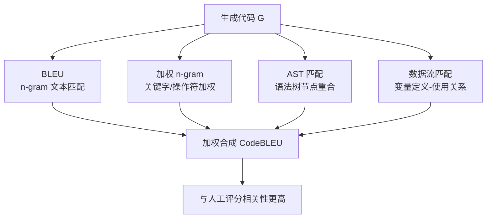

# CodeBLEU — 代码感知的自动评测指标

> 论文：https://arxiv.org/abs/2009.10297
> 名称：CodeBLEU: a Method for Automatic Evaluation of Code Synthesis

## 基本信息

| 项目 | 内容 |
|------|------|
| **链接** | https://arxiv.org/abs/2009.10297 |
| **发布时间** | 2020-09 |
| **一句话总结** | BLEU 只看 n-gram 文本重合，对代码评测太弱；CodeBLEU 在 BLEU 基础上加入语法（AST）与语义（数据流）匹配，四个分量加权合成 |
| **核心创新** | 评测代码不止看"长得像"，还要看"语法结构像"和"数据流逻辑像" |

## 置信度评估

| 信号 | 评估 |
|------|------|
| 发表场所 | arXiv 预印本（2020-09） |
| 引用/影响 | 高（代码生成评测广泛使用，与 HumanEval 配套成为事实标准之一） |
| 代码可用 | 开源（github.com/k4black/codebleu 等实现） |
| 来源机构 | 腾讯 AI Lab 等 |
| **综合置信度** | **🟢 高**（多实现可复现，广泛引用） |
| 需谨慎点 | 与人工评价的相关性提升有限；仍是"参考实现"的近似，不是行为等价 |

## 它解决了什么问题

文本相似度指标（BLEU/ROUGE）评测代码有两个致命缺陷：

1. **改名即扣分**：`compute_tiling` 改成 `calc_tiling`，语义完全一样，BLEU 大降
2. **换写法即扣分**：`a = a + 1` 和 `a++` 行为相同，n-gram 匹配不到
3. **语法错误不敏感**：`int x = 1;;` 与正确代码 n-gram 几乎相同，但编译不过

代码评测需要"语法正确 + 逻辑正确"两个维度，纯文本匹配做不到。

## 方法核心

### 四个分量

1. **BLEU（n-gram）**：文本重合度，权重约 25%
2. **加权 n-gram**：代码关键字、操作符加权，权重约 25%
3. **AST 匹配**：解析成抽象语法树，比较子树重合，权重约 25%（语法正确性）
4. **数据流匹配**：比较变量定义-使用关系（def-use chain），权重约 25%（逻辑正确性）

加权方式：`CodeBLEU = 0.25·BLEU + 0.25·BLEU_weighted + 0.25·AST_match + 0.25·dataflow_match`（各实现略有差异）。

## 关键洞察

1. **多分量加权 > 单一指标**：文本 + 语法 + 语义三个视角互补，比任何单一指标更接近人工判断
2. **AST 管"语法对不对"**：结构相同但变量名不同，AST 匹配高
3. **数据流管"逻辑对不对"**：同样的操作顺序、同样的依赖关系，即使写法不同，数据流匹配高
4. **它不是行为等价**：两个实现逻辑相同但写法差异极大（如递归 vs 迭代），CodeBLEU 也可能不高；反之，CodeBLEU 高不代表行为一致

## 局限与注意

- 依赖解析器：C++ 解析复杂（模板、宏），AST 匹配对 C++ 支持较弱
- 与人工评分相关性仅"更高"，并非充分替代执行评测
- 对"行为正确但写法不同"仍可能误判（递归 vs 迭代、库函数替换）
- 不能替代测试执行：它测"像不像参考"，不测"跑不跑得对"

## 对我们项目的启发

### 直接借鉴 ✅

1. **相似度升级方向（P1）**：当前相似度用 `difflib.SequenceMatcher`（纯文本），正是 CodeBLEU 批评的"改名即扣分"水平。升级为 AST 匹配 + 数据流匹配（或直接用开源 codebleu 库），能区分"功能等价但写法不同"与"真抄源码"
2. **防作弊辅助信号**：CodeBLEU 的 AST/数据流分量比文本相似度更能抓"改写式抄袭"（换变量名、调整格式的源码搬运）

### 需要改造 🔧

- C++ AST 解析：用 pycparser 不支持 C++；可选 tree-sitter（支持 C++）做语法树，数据流用简单 def-use 近似（MVP 阶段可只做 AST 分量）

### 需要注意 ⚠️

- CodeBLEU 是"辅助归因"，不是门禁主判：功能正确仍以测试执行为准（执行式评测优先）
- 相似度阈值要按分量分别校准，不能用文本 BLEU 的旧阈值

## 关联

- [EvalPlus差分测试增强评测集.md](EvalPlus差分测试增强评测集.md) — 执行式评测（测试主判）与 CodeBLEU（相似度辅助）互补
- ../../设计/门禁与评测机制.md — 门禁设计（相似度只进归因，不参与门禁判定）
