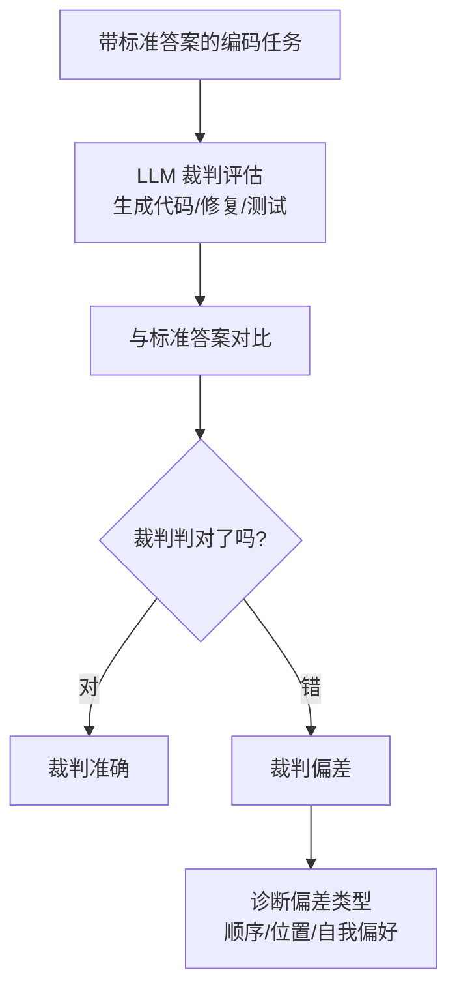

# CodeJudgeBench — LLM 当裁判的可靠性评测

> 论文：https://arxiv.org/abs/2507.10535
> 名称：CodeJudgeBench: Benchmarking LLM-as-a-Judge for Coding Tasks

## 基本信息

| 项目 | 内容 |
|------|------|
| **链接** | https://arxiv.org/abs/2507.10535 |
| **发布时间** | 2025-07 |
| **一句话总结** | 系统性评测 26 个 LLM 当"代码裁判"（判断生成代码好坏/修复/测试质量）的可靠性，发现 LLM 裁判有顺序偏差、位置偏差等系统性问题 |
| **核心创新** | 把"LLM-as-a-Judge"本身变成被评测对象：裁判准确率、公平性、可诊断性三维度 |

## 置信度评估

| 信号 | 评估 |
|------|------|
| 发表场所 | arXiv 预印本（2025-07，v2 2025-08） |
| 引用/影响 | 中（新发布，代码开源） |
| 代码可用 | 开源（github.com/hongcha0/CodeJudgeBench） |
| 来源机构 | 学术界 |
| **综合置信度** | **🟡 中-高**（基准开源，26 模型实测） |
| 需谨慎点 | LLM 裁判能力随模型版本快速变化，结论时效性有限 |

## 它解决了什么问题

用 LLM 当裁判（judge）评估代码生成质量越来越流行，但裁判本身可靠吗？

1. **顺序偏差**：两段代码谁好谁坏，交换呈现顺序后结论可能反转
2. **位置偏差**：裁判倾向选第一个/最后一个答案
3. **自我偏好**：裁判对"和自己生成风格相似"的代码给高分
4. **无 ground truth 验证**：裁判说了算，但没人验证裁判说得对不对

CodeJudgeBench 把裁判拉下神坛：**用带标准答案的评测集验证裁判的判词。**

## 方法核心

### 三个评测维度

1. **可靠性（accuracy）**：裁判结论与 ground truth 一致率
2. **公平性（fairness）**：交换顺序/位置后结论稳定性
3. **诊断性（diagnostics）**：裁判给出的理由是否可解释、可追溯

### 关键发现

- 简单调换两个答案的呈现顺序，裁判准确率明显波动
- 裁判在"代码修复"任务上比"代码生成"任务更不可靠
- 强模型裁判 > 弱模型裁判，但即使强模型也有系统性偏差

## 关键洞察

1. **LLM 裁判不是 ground truth**：它是"带偏差的近似"，必须用客观信号校验
2. **顺序/位置偏差是可测的**：交换呈现顺序对比结论即可量化
3. **裁判判词要可解释**：光给分不够，理由要能追溯到具体代码行

## 局限与注意

- 只测"裁判判断"，不测"裁判生成修复代码"的质量
- LLM 裁判能力随版本变化，基准需要持续更新
- 标准答案本身的质量仍依赖人工/执行验证

## 对我们项目的启发

### 直接借鉴 ✅

1. **Review 角色 = 特殊 LLM 裁判**：我们的 LLMReview 也是"LLM 当裁判"（归因 + 修订指令）。CodeJudgeBench 警示：**Review 的归因结论不能直接采信**，必须与评测报告（客观信号）交叉验证（我们已做：Review 只看评测失败详情，不自己跑测试）
2. **顺序/位置偏差防护**：若未来用 LLM 对比"两个候选代码哪个好"，必须正反各问一次（对称呈现），防顺序偏差
3. **Review 输出可解释性**：corrections 必须带 knowledge_path + criterion（可执行判据），不能只给"感觉不好"——已落地

### 需要改造 🔧

- 增加"Review 判词 vs 评测报告"一致性检查：Review 说"编译失败"但报告说编译过，判为 Review 错误（可自动检测）

### 需要注意 ⚠️

- 不要用 LLM 裁判替代测试执行（执行式评测仍是金标准）；LLM 裁判只用于"归因解释"层

## 关联

- [执行式评测与表面形式评测.md](执行式评测与表面形式评测.md) — 执行式是金标准，LLM 裁判是辅助
- ../../设计/知识飞轮流程设计.md — Review 角色设计
