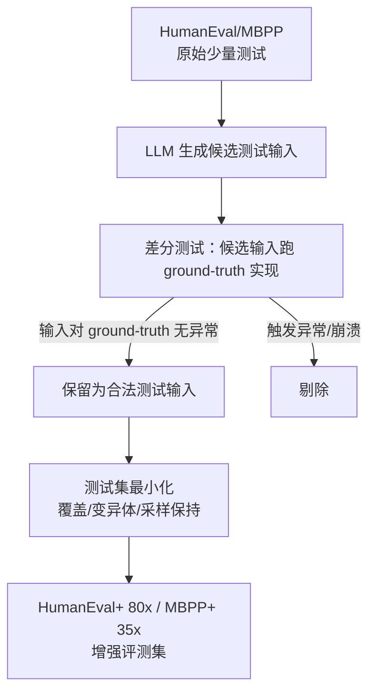

# EvalPlus — 差分测试增强评测集

> 论文：https://arxiv.org/abs/2305.01210
> 名称：Is Your Code Generated by ChatGPT Really Correct? Rigorous Evaluation of Large Language Models for Code Generation

## 基本信息

| 项目 | 内容 |
|------|------|
| **链接** | https://arxiv.org/abs/2305.01210 |
| **发布时间** | 2023-05（NeurIPS 2023） |
| **一句话总结** | 现有代码生成基准（HumanEval/MBPP）测试用例太少太弱，导致大量"假阳性"通过；EvalPlus 用差分测试自动把测试输入扩充 80x/35x，暴露 LLM 代码的隐藏错误 |
| **核心创新** | 测试输入增强（LLM 生成候选输入 + 差分验证保真）+ 测试集最小化（保持杀错能力、削减执行成本） |

## 置信度评估

| 信号 | 评估 |
|------|------|
| 发表场所 | NeurIPS 2023（顶级会议） |
| 引用/影响 | 高（成为 LLM 代码评测事实标准之一，HumanEval+ 广泛采用） |
| 代码可用 | 开源（github.com/evalplus/evalplus） |
| 来源机构 | 多校合作（清华大学等） |
| **综合置信度** | **🟢 高**（开源实现可复现） |
| 需谨慎点 | 测试增强依赖 ground-truth 实现，只适用于"有标准解"的任务 |

## 它解决了什么问题

HumanEval 每道题平均只有 7.7 个测试用例，MBPP 更少。问题在于：

1. **测试太少 → 假阳性通过**：LLM 生成的代码能通过少量测试，但换个输入就错。EvalPlus 实测：ChatGPT 在 HumanEval 上 pass@1 = 65.8%，但在增强后的 HumanEval+ 上只有 **46.6%**，掉了近 20 个百分点
2. **测试太弱 → 无法区分真懂与背题**：少量边界用例覆盖不到极端输入，模型"看起来会"但"实际不会"
3. **人工写测试不可扩展**：手工补测试用例成本高，跟不上基准规模

核心立场：**评测集的测试输入数量和质量，直接决定评测结论的可信度。**

## 方法核心

### 三步流程

1. **候选输入生成**：用 LLM 针对每个问题生成大量可能的测试输入（边界值、随机值、类型变化）
2. **差分验证**：把候选输入跑在 ground-truth 实现上，输入导致 ground-truth 异常/崩溃的剔除（防污染）；保留输入本身合法、ground-truth 输出可比的
3. **测试集最小化**：用覆盖、变异体击杀、采样保持等准则挑最小子集，在保持评测力的同时降低执行成本

### 关键数字

- HumanEval+：测试用例数扩大 **80 倍**（平均 7.7 → 约 700+ 用例/题）
- MBPP+：扩大 **35 倍**
- 模型得分普遍大幅下降（ChatGPT 65.8% → 46.6%），证明原基准明显高估

## 关键洞察

1. **测试用例是评测的生命线**：测试越多越强，越能揭穿"背题式"高分
2. **差分测试是自动扩测试的可靠手段**：用 ground-truth 实现校验输入合法性，避免自生成测试的污染
3. **假阳性通过是隐藏的**：基准分数虚高不会自己暴露，需要增强评测去戳穿
4. **测试集也要"杀错能力"**：最小化准则里包含变异体击杀，说明测试质量可用变异体衡量

## 局限与注意

- 依赖 ground-truth 实现：没有标准解的任务（如业务代码）无法直接套用
- 差分验证假设 ground-truth 正确：若 ground-truth 本身有缺陷，会放大错误
- 增强测试主要针对"输入多样性"，对性能、内存等维度覆盖不足

## 对我们项目的启发

### 直接借鉴 ✅

1. **评测集要防"测试太少→假阳性"**：我们的 tiling 评测集有 8 条用例（探针跑源码拿期望），数量偏少。应按 EvalPlus 思路扩充边界输入（totalLength=0 已被排除、大数、整除/不整除、多核/单核、空输入等），并定期用变异体校验评测集强度
2. **差分测试=探针思想已落地**：我们评测集期望输出来自探针程序跑真实源码（红线），与 EvalPlus 用 ground-truth 校验候选输入同构。可以更进一步：用 LLM 生成候选测试输入 → 探针差分验证 → 扩充评测集
3. **测试集最小化**：如果评测集很大，用变异体击杀准则挑最小子集，降低飞轮每轮执行成本

### 需要改造 🔧

- 业务代码无 ground-truth：差分验证的"正确性基准"只能退化为"探针跑当前源码"，探针输出即期望（我们已在做）。要防源码缺陷污染期望（totalLength=0 除零已排除）

### 需要注意 ⚠️

- 评测集增强后，门禁阈值可能需要重新校准（用例变多变强，confidence 分布会变）

## 关联

- [变异测试与测试集质量.md](变异测试与测试集质量.md) — 变异体击杀是 EvalPlus 最小化准则之一，也是评测集强度度量
- [CodeBLEU代码感知评测指标.md](CodeBLEU代码感知评测指标.md) — 相似度类指标（文本级），与执行式评测互补
- [从程序文档生成自动化测试.md](从程序文档生成自动化测试.md) — 用测试作为质量信号
- ../../设计/门禁与评测机制.md — 门禁设计（多信号组合）
