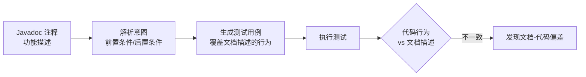

# Automated Test Generation from Program Documentation Encoded in Code Comments

## 基本信息

| 项目 | 内容 |
|------|------|
| **链接** | https://arxiv.org/abs/2504.21161 |
| **作者** | Giovanni Denaro, Luca Guglielmo |
| **发布时间** | 2025-04-29 |
| **一句话总结** | 从代码注释（Javadoc）里的功能描述自动生成测试——把"文档"直接变成可执行的验证信号 |

---

## 置信度评估

| 信号 | 评估 |
|------|------|
| 发表场所 | arXiv 预印本 / AST 会议 |
| 引用/影响 | 低（新发布） |
| 代码可用 | 待确认 |
| 来源机构 | 学术机构 |
| **综合置信度** | 🟡 中 |
| 需谨慎点 | 依赖注释质量；思路价值大于工程成熟度 |

## 它解决了什么问题

测试生成大多从代码本身出发（覆盖分支、找 bug）。但代码注释（Javadoc）里写着**程序员对功能意图的描述**——"这个函数应该做什么"。论文的思路：文档是功能规格，**从文档生成测试**，可以测出"代码实现和文档描述不一致"的问题——这比从代码生成测试更能抓住"代码做错了"而不是"代码没覆盖"。

---

## 方法核心

- 从注释提取功能规格（做什么、输入输出约束）
- 基于规格生成测试，测试文档声称的行为
- 执行后对比：代码是否满足文档描述

---

## 实验结果

- 从文档生成的测试能发现传统测试方法漏掉的问题
- 特别擅长抓"文档和代码不一致"——包括文档过时、代码偏离规格
- 对测试覆盖和 bug 检测有补充价值

---

## 局限与注意

- 注释质量决定上限：注释模糊/过时，生成的测试不可靠
- 只适合有良好注释习惯的代码库
- 生成测试本身也可能有误报

---

## 对我们项目的启发 ⭐

### 直接相关（门禁的第三种信号）

**① 文档 → 测试 = 知识 → 测试**：我们的知识文档就是"文档描述"，可以借鉴这个思路：**基于知识文档生成测试**，用测试验证"知识声称的行为"是否成立。这是门禁的多信号组合里很有价值的一路——测的是"知识对不对"，而不只是"代码像不像"。

**② 抓文档-代码偏差 = 抓知识-源码偏差**：论文的核心价值是发现"文档说 A、代码做 B"的偏差。我们的飞轮差异分析本质上就是找"知识说 A、源码做 B"——思路一致，可以借鉴它的规格提取方法。

### 需要改造的

**① 注释 → 完整知识文档**：它用 Javadoc，我们用解释型 Markdown 知识。知识文档信息量更大，可提取的规格更多，理论上生成的测试更有针对性。

**② 测试作为门禁组件**：建议在门禁设计里加一路"知识→测试→跑测试"：知识声称的行为能被测试验证，说明知识准确；测试失败则说明知识有误（或源码有 bug，需要人工判断）。这是对"相似度对比"的重要补充。

### 需要注意的

- 依赖知识文档的质量和规范性——知识模板里要有"功能规格"字段（输入/输出/约束），才能稳定生成测试。这应该写进 knowledge-format.md 的模板设计。

---

## 关联

- **对应飞轮环节**：门禁设计（多信号之一：文档/知识驱动的测试）
- **相关论文**：ReVeal（2506.11442）——自主生成测试验证代码
- **相关论文**：Code-QA-Bench（2605.29277）——评测防作弊
