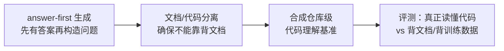

# Code-QA-Bench: Separating Code Reasoning from Documentation Memorization in Repository-Level QA

## 基本信息

| 项目 | 内容 |
|------|------|
| **链接** | https://arxiv.org/abs/2605.29277 |
| **作者** | Jun Zhang, JianYing Qu, Hanwen Du, Zhongkai Sun, Yehua Yang, Qiao Zhao |
| **发布时间** | 2026-05-28 |
| **一句话总结** | 一个全自动的仓库级代码理解评测框架，能把"真正读懂代码"和"背文档/背训练数据"区分开 |

---

## 置信度评估

| 信号 | 评估 |
|------|------|
| 发表场所 | arXiv 预印本（2026-05） |
| 引用/影响 | 低（新发布） |
| 代码可用 | 待确认 |
| 来源机构 | 工业界（华为/中兴等） |
| **综合置信度** | **🟡 中** |
| 需谨慎点 | 防作弊方法论与门禁高度相关，建议重点验证 |

## 它解决了什么问题

评测 LLM 是否真的理解代码时有个陷阱：模型可能靠**记文档**（仓库里已有文档直接给了答案）或者**预训练记忆**（这个开源项目它训练时见过）答对，而非真正读代码。现有评测基准没法区分这两种情况，导致分数虚高——模型看着理解得很好，实际遇到新代码就露馅。

对知识工程来说这尤其致命：如果评测分不出来"模型是读了我的知识答对的，还是背下来的"，知识质量就没法真实评估。

---

## 方法核心

两个方法论贡献：

**① answer-first 生成（答案优先）**：先从代码里确定正确答案，再反向构造问题，避免从文档里挖问题（那样答案就在文档里）。这样问题必须读代码才能答。

**② 文档/代码分离**：构造评测时把"代码里能推理出的"和"文档里直接写的"分开，专门构造需要代码推理才能答的题目。同时规避预训练数据污染（用新合成或改动过的代码）。

---

## 实验结果

- 在仓库级代码理解任务上，用该框架合成基准评测主流 LLM
- 发现模型在"文档背诵"类题目上得分虚高，真实代码推理能力低于表面分数
- 框架能自动化生成大规模基准，不需要人工标注

---

## 局限与注意

- 合成代码可能和真实代码风格有差异
- 评测聚焦 QA 理解，不等同于代码生成能力
- answer-first 构造对生成质量有依赖

---

## 对我们项目的启发 ⭐

### 可以直接借鉴的

**① 门禁评测的防作弊设计**：我们门禁是"Agent 基于知识生成代码 → 对比源码"。这篇提醒我们：要防止 Agent 靠"背源码"（预训练见过）而不是"读知识"来生成代码。评测时应该用**改造过的代码**或**新代码**，确保 Agent 只能靠我们的知识答对/生成对。

**② answer-first 思路用于评测构造**：如果我们要自建小规模评测集，先确定代码真值、再构造知识问题，能保证评测的区分度。

### 需要改造的

**① 从 QA 评测 → 生成评测**：它评测理解，我们评测生成。但核心思想通用：**评测要能归因**——分数高是因为知识好，还是因为模型见过源码？我们的门禁必须能回答这个归因问题。

**② 文档记忆 vs 知识理解**：它的"文档背诵"对应我们的场景是"知识照抄"——如果知识文档直接把源码片段全贴进去（我们明确不这么做），Agent 生成代码时就是抄，门禁分数没有意义。这反过来验证了我们"解释型知识"（抽象而非搬运）的设计是对的。

### 需要注意的

- 预训练数据污染在 GLM 5.1 上同样存在——如果评测用的代码模块是公开开源项目，GLM 可能训练时见过。优先用公司内部/私有代码做门禁评测，或对公开代码做变换。

---

## 关联

- **对应飞轮环节**：门禁评测（核心方法论参考）
- **相关论文**：A Survey on Evaluating LLMs in Code Generation（2408.16498）——评测指标综述
- **相关论文**：Benchmarks and Metrics for Code Generation（2406.12655）——现有评测的批判性审查
