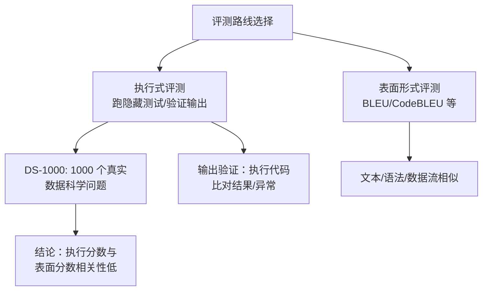

# 执行式评测 vs 表面形式评测（Execution-based Evaluation）

> 代表论文：
> - DS-1000：https://arxiv.org/abs/2211.11501（DS-1000: A Natural and Reliable Benchmark for Data Science Code Generation）
> - 执行式评测工作：https://arxiv.org/abs/2211.09374（Execution-based Evaluation for Data Science Code Generation Models）
> - 代码生成评测综述：https://arxiv.org/abs/2406.12655（Benchmarks and Metrics for Evaluations of Code Generation: A Critical Review）

## 基本信息

| 项目 | 内容 |
|------|------|
| **链接** | 见上 |
| **发布时间** | 2022-2024 |
| **一句话总结** | 评测代码生成有两条路线：执行式（跑测试看功能对错）与表面形式（BLEU/CodeBLEU 看像不像）；执行式更接近真实质量，表面形式省成本但会误判 |
| **核心创新** | 系统比较两种评测路线，指出执行式评测（DS-1000 等）更能捕捉功能错误 |

## 置信度评估

| 信号 | 评估 |
|------|------|
| 发表场所 | DS-1000 ICML 2023；综述 arXiv |
| 引用/影响 | DS-1000 高（数据科学代码生成标准基准） |
| 代码可用 | DS-1000 开源 |
| 来源机构 | 学术机构 |
| **综合置信度** | **🟢 高** |
| 需谨慎点 | 执行式评测需要可靠沙箱与正确测试；表面形式并非完全无用（成本低、可解释） |

## 它解决了什么问题

代码生成评测历史上长期用 BLEU 等表面形式指标，但：

1. **表面形式高分 ≠ 功能正确**：DS-1000 发现表面形式分数高的模型，执行分数可能很低（代码表面相似但跑不出正确结果）
2. **数据科学代码尤其如此**：pandas 一行可以表达复杂操作，写法差异大但功能等价，文本相似度完全失效
3. **评测结论被指标带偏**：模型排名在不同指标下完全不同

## 方法核心

### DS-1000 的可靠性设计

- **真实问题**：从 StackOverflow 收集 1000 个数据科学问题，而非合成
- **多解验证**：每个问题允许多个正确解，执行验证（输出匹配/异常捕获）判定
- **环境隔离**：pandas/numpy 版本固定，输出比对

### 关键结论

- 表面形式分数与执行分数相关性低：**高 BLEU 的模型执行分数可能垫底**
- 执行式评测能捕捉表面评测漏掉的错误（错误使用 API、边界处理、环境依赖）

## 关键洞察

1. **"像不像"与"对不对"是两回事**：执行式评测是金标准，表面形式只能做辅助
2. **评测基准的可靠性取决于问题真实性与验证方式**：真实问题 + 执行验证 = 可信排名
3. **多解问题用执行验证**：允许不同解法，只要输出/行为正确
4. **表面形式仍有价值**：成本低、可解释、可做归因辅助（如相似度防作弊）

## 局限与注意

- 执行式评测成本高（需要沙箱、环境、测试）
- 测试/验证不完整时执行式也会误判（通过测试 ≠ 全对）
- 数据科学领域（pandas 一行式）与系统代码（C++ 多行逻辑）的执行验证难度不同

## 对我们项目的启发

### 直接借鉴 ✅

1. **执行式主判已落地**：我们评测闭环 = 编译 + 测试执行 + confidence，正是执行式评测路线（对应执行手册 §3）
2. **表面形式只做辅助**：当前 similarity 只进归因报告、不参与门禁判定，与"执行式主判 + 表面形式辅助"结论一致
3. **多解接受**：评测集期望输出来自探针（行为验证），允许不同实现（只要输出正确），不会因写法不同误杀

### 需要改造 🔧

- 输出验证的充分性：DS-1000 用输出比对 + 异常捕获；我们的 native 评测集是显式断言（更严格），但要保证断言覆盖足够输入（配合 EvalPlus 扩充）

### 需要注意 ⚠️

- 沙箱隔离：执行式评测要在受控环境跑（我们已做目录隔离 + 编译隔离）
- 测试正确性：期望输出必须来自探针跑真实源码（红线），避免"测试本身错"污染评测

## 关联

- [Pass@k无偏评测指标.md](Pass@k无偏评测指标.md) — pass@k 也是执行式评测
- [CodeBLEU代码感知评测指标.md](CodeBLEU代码感知评测指标.md) — 表面形式指标，只做辅助
- [EvalPlus差分测试增强评测集.md](EvalPlus差分测试增强评测集.md) — 执行式评测的测试增强
- ../../设计/门禁与评测机制.md — 门禁设计
