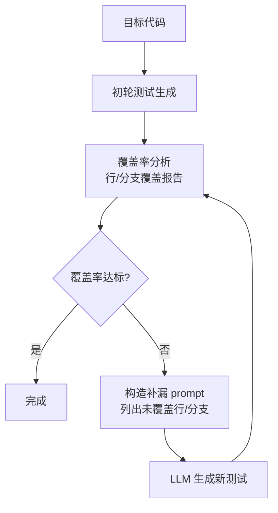

# 覆盖率引导的测试生成（Coverage-Guided Test Generation）

> 代表论文：
> - CoverUp：https://arxiv.org/abs/2403.16218（CoverUp: Coverage-Guided LLM-Based Test Generation）
> - CodaMosa：https://arxiv.org/abs/2303.14002（CodaMosa: Escaping Coverage Plateaus in Test Generation with Pre-trained Large Language Models）

## 基本信息

| 项目 | 内容 |
|------|------|
| **链接** | 见上 |
| **发布时间** | CoverUp 2024-03；CodaMosa 2023-03（ICSE 2023） |
| **一句话总结** | 用覆盖率分析（行/分支）告诉 LLM"哪里还没测到"，让 LLM 迭代生成补漏测试；CodaMosa 先用搜索式测试生成到瓶颈，再让 LLM 补低覆盖函数 |
| **核心创新** | 覆盖率作为测试生成的反馈信号，形成"生成→测覆盖→再生成"闭环 |

## 置信度评估

| 信号 | 评估 |
|------|------|
| 发表场所 | CoverUp arXiv 预印本；CodaMosa ICSE 2023（顶级会议） |
| 引用/影响 | CodaMosa 高；CoverUp 中-高 |
| 代码可用 | CoverUp 开源；CodaMosa 相关工具链可复现 |
| 来源机构 | 学术机构（UBC 等） |
| **综合置信度** | **🟢 高**（CodaMosa 会议发表 + 复现） |
| 需谨慎点 | 覆盖率目标（行 vs 分支）影响测试风格；高覆盖 ≠ 高质量断言 |

## 它解决了什么问题

1. **测试生成的质量难以度量**：LLM 生成一堆测试，怎么知道"够不够"？覆盖率提供了可执行、可迭代的目标
2. **覆盖率平台期**：搜索式测试生成（SBST）前期覆盖增长快，后期陷入平台期，难以突破
3. **LLM 一次性生成测试不可靠**：一次 prompt 生成的测试对低覆盖代码无能为力

## 方法核心

### CoverUp 流程

1. 运行现有测试，用 coverage.py 拿到行/分支覆盖报告
2. 把"未覆盖的行/分支 + 相关代码上下文"构造进 prompt
3. LLM 针对未覆盖点生成新测试
4. 重新测覆盖，迭代直到达标或预算耗尽

### CodaMosa 流程（混合）

1. SBST（搜索式）先跑到覆盖率平台期
2. 把未覆盖函数交给 Codex 生成示例测试
3. 验证并合入，突破平台期

CoverUp 在挑战性 Python 代码上显著超过 CodaMosa 等基线（每模块覆盖中位数提升明显）。

## 关键洞察

1. **覆盖率是"测试盲区地图"**：未覆盖行/分支就是测试没测到的地方，是最直接的补测指引
2. **反馈信号越具体越好**：告诉 LLM"缺什么"，比笼统"生成更多测试"有效得多
3. **迭代式补漏 > 一次性生成**：LLM + 覆盖率反馈闭环可以持续提升覆盖
4. **覆盖率与变异测试互补**：覆盖率管"测到没有"，变异测试管"测错了能不能发现"（后者更难）

## 局限与注意

- 覆盖率只说明"执行到了"，不说明"断言验证了"：全绿可能断言很弱
- 分支覆盖比行覆盖难，但更接近行为覆盖；工具支持因语言而异（C++ 用 gcov/lcov 行覆盖为主）
- 覆盖率成本：插桩、反复跑测试有开销

## 对我们项目的启发

### 直接借鉴 ✅

1. **评测集覆盖量化（P1）**：用 gcov 对被测源码（tiling）测评测集的线覆盖/分支覆盖，把"评测集覆盖 XX%"写进评测集质量报告，作为评测集合格性参考信号
2. **补测试自动化**：评测集覆盖不足的分支，用 LLM 生成补充用例（探针验证期望输出后入评测集），流程与 CoverUp 同构

### 需要改造 🔧

- C++ 覆盖工具：gcov + lcov（g++ 自带插桩），对单模块简单可用；分支覆盖需 -fprofile-arcs -ftest-coverage 编译

### 需要注意 ⚠️

- 覆盖率是"评测集覆盖被测实现的度量"，与"评测集杀变异体"（变异测试）一起构成评测集质量双指标：覆盖低=没测到，杀不掉=测不到错
- 覆盖率高不是门禁主判（测试通过率才是），只做质量报告辅助

## 关联

- [变异测试与测试集质量.md](变异测试与测试集质量.md) — 覆盖率（测到没有）与变异测试（发现错误没有）互补
- [EvalPlus差分测试增强评测集.md](EvalPlus差分测试增强评测集.md) — 测试输入扩充与覆盖/变异最小化
- ../../设计/评测集构建指南.md — 评测集构建流程
