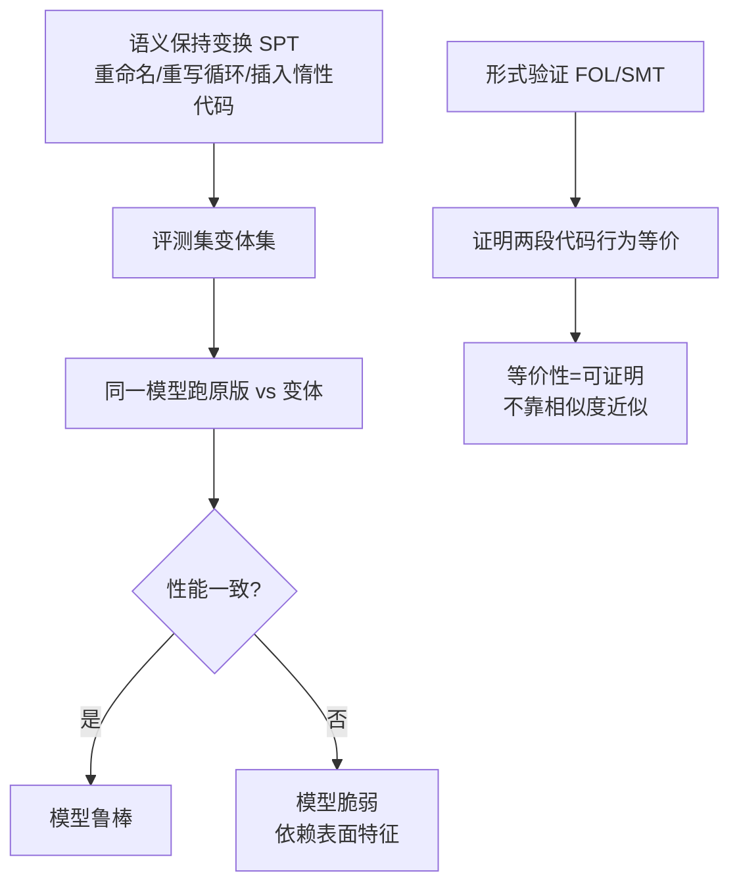

# 语义等价评测与鲁棒性（Semantic Equivalence & Robustness）

> 代表论文：
> - Semantic Mutation：https://arxiv.org/abs/2506.17369（Re-Evaluating Code LLM Benchmarks Under Semantic Mutation）
> - Jagged Frontier：https://arxiv.org/abs/2608.18389（Evaluating Robustness of Code Agents to Semantics-Preserving Transformations）
> - 语义等价自博弈：https://arxiv.org/abs/2604.17010（Semantic Equivalence Self-Play with Formal Verification）

## 基本信息

| 项目 | 内容 |
|------|------|
| **链接** | 见上 |
| **发布时间** | 2025-2026 |
| **一句话总结** | 三类新方案：①对评测集做语义保持变换（SPT）测模型鲁棒性（Jagged Frontier）；②对 prompt 做语义突变测基准稳定性（Semantic Mutation）；③用形式验证测代码语义等价（Self-Play + FOL） |
| **核心创新** | 评测焦点从"代码对错"扩展到"评测本身稳不稳"与"代码等价性可证明" |

## 置信度评估

| 信号 | 评估 |
|------|------|
| 发表场所 | arXiv 预印本（2025-2026，最新） |
| 引用/影响 | 低-中（新发布） |
| 代码可用 | Jagged Frontier 有实验设计；Semantic Mutation 有复现数据 |
| 来源机构 | 学术界 |
| **综合置信度** | **🟡 中**（新方向，待社区验证） |
| 需谨慎点 | 语义保持变换的"等价性"本身依赖测试套件等价定义 |

## 它解决了什么问题

传统评测假设"问题不变、代码变"，但真实场景更复杂：

1. **评测集语义相同但写法不同**：同样的函数，变量名、循环写法、注释不同，模型表现可能骤降（Jagged Frontier 实测前沿模型也中招）
2. **prompt 微调导致分数波动**：同一道题换句话问，基准分数可能大幅变化（Semantic Mutation）
3. **相似度指标无法证明等价**：CodeBLEU 说"像"，形式验证才能说"行为等价"

## 方法核心

### 三种实现

1. **Jagged Frontier（鲁棒性）**：随机语义保持变换采样器（重命名、循环改写、插入无副作用语句），16 组合（2 脚手架 × 4 模型 × 2 基准）实测，前沿模型也受扰动影响
2. **Semantic Mutation（prompt 敏感性）**：对 prompt 做语义保持/语义破坏的突变，测同一模型在变体 prompt 下的分数差异
3. **语义等价自博弈（形式验证）**：generator 与 evaluator 对抗，用 Liquid Haskell / FOL 证明代码等价，把"像不像"升级为"等不等价"

## 关键洞察

1. **模型依赖表面特征**：换写法性能骤降 = 模型没真懂语义，只认表面模式
2. **评测集本身要多样化**：同一语义多形态（多写法、多 prompt 表述），评测才稳
3. **形式验证是等价性的终极答案**：但成本高、语言受限（Haskell/FOL 场景），MVP 不现实
4. **鲁棒性应成为评测维度**：不只测"能不能过"，还测"换个写法还能不能过"

## 局限与注意

- 语义保持变换的"等价"依赖测试套件等价定义（有局限）
- 形式验证对 C++ 大规模代码不可行（Haskell/FOL 是特例）
- 新方向证据还少，需要更多复现

## 对我们项目的启发

### 直接借鉴 ✅

1. **评测集多形态化（P2 方向）**：同一知识语义，评测用例提供多种输入形态（不同边界组合），防"背题式"通过
2. **prompt 敏感性防护**：知识文档/评测 prompt 的表述要稳定；若 Coder 对同一知识多次生成差异大，说明知识文档语义不清晰（可做"同知识两次生成"一致性检查）
3. **语义保持变换用于防作弊**：对源码做无害变换（重命名）后测 Coder 生成代码，若相似度对重命名敏感（骤降），说明 Coder 在抄源码而非理解语义——比文本相似度更本质

### 需要改造 🔧

- "同知识两次生成一致性"：Coder 用同一知识文档生成两次，代码语义应一致（用评测集验证，非 LLM 判断）

### 需要注意 ⚠️

- 形式验证（FOL/SMT）对 C++ 业务代码成本过高，MVP 不做；保持"执行式评测 + 多形态输入"路线

## 关联

- [变异测试与测试集质量.md](变异测试与测试集质量.md) — 变异是"语义破坏"，SPT 是"语义保持"，互补
- [CodeBLEU代码感知评测指标.md](CodeBLEU代码感知评测指标.md) — 相似度 vs 等价性
- [EvalPlus差分测试增强评测集.md](EvalPlus差分测试增强评测集.md) — 输入多样化
