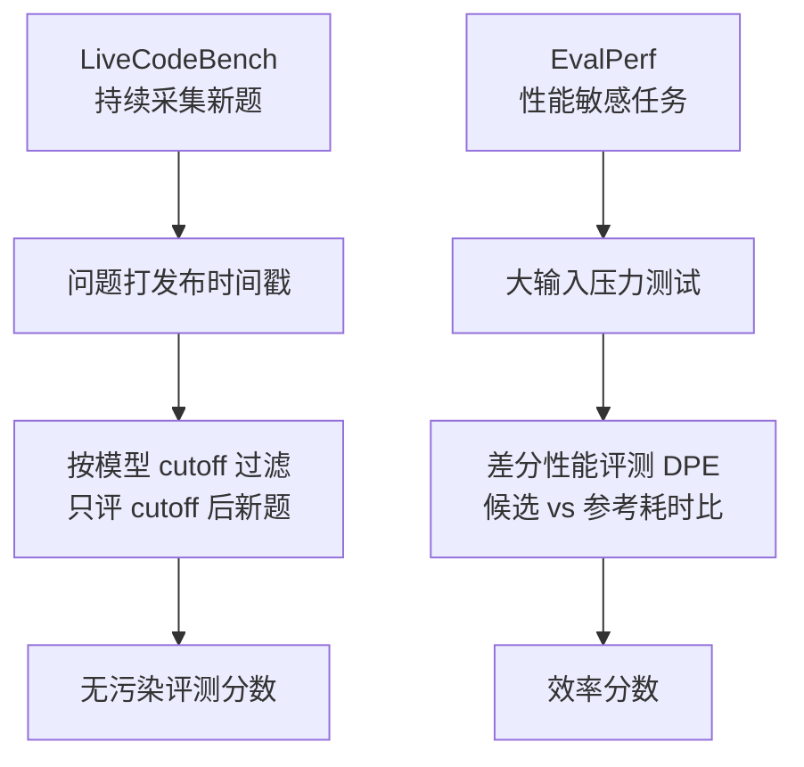

# 防污染评测与效率评测（LiveCodeBench / EvalPerf）

> 代表论文：
> - LiveCodeBench：https://arxiv.org/abs/2403.07974（LiveCodeBench: Holistic and Contamination Free Evaluation of Large Language Models for Code）
> - EvalPerf：https://arxiv.org/abs/2408.06450（Evaluating Language Models for Efficient Code Generation，COLM 2024）

## 基本信息

| 项目 | 内容 |
|------|------|
| **链接** | 见上 |
| **发布时间** | LiveCodeBench 2024-03；EvalPerf 2024-08 |
| **一句话总结** | LiveCodeBench 用"问题发布时间"过滤训练数据污染（只评 cutoff 之后的新题）；EvalPerf 用差分性能评测（DPE）测生成代码的效率（不止对错） |
| **核心创新** | ①防污染 = 时间窗过滤，②评测维度从"对不对"扩展到"快不快" |

## 置信度评估

| 信号 | 评估 |
|------|------|
| 发表场所 | LiveCodeBench ICLR 2025；EvalPerf COLM 2024（会议发表） |
| 引用/影响 | 高（LiveCodeBench 成为事实标准之一） |
| 代码可用 | 均开源 |
| 来源机构 | 学术机构 + 工业界 |
| **综合置信度** | **🟢 高**（会议发表 + 广泛采用） |
| 需谨慎点 | LiveCodeBench 只防"题目级"污染，不防"代码风格级"污染 |

## 它解决了什么问题

1. **基准污染**：LLM 训练语料包含评测题，得分虚高。LiveCodeBench 给每个问题打上发布时间戳，只评"模型 cutoff 之后发布"的题，从源头隔离污染
2. **只测对错不测效率**：两个代码都对，但一个 O(n) 一个 O(n²)，评测分不出。EvalPerf 用性能敏感任务 + 大输入差分对比运行时间/内存

## 方法核心

### LiveCodeBench

- 数据源：LeetCode / AtCoder / Codeforces 持续采集
- 时间窗评估：按模型训练 cutoff 过滤问题，天然免疫数据泄漏
- 评测任务多样：代码生成、自修复、代码执行、测试输出预测

### EvalPerf（差分性能评测）

- 选"性能敏感"任务（有最优解 vs 次优解差距大的题）
- 生成大输入压力测试，测量候选代码与参考实现的耗时/内存比
- 121 个性能评测任务，跨语言

## 关键洞察

1. **时间戳过滤是防污染的最干净手段**：不需要猜训练数据，只需要"晚于 cutoff"
2. **效率是可评测的**：差分对比（候选 vs 参考）消除机器差异
3. **评测维度可以扩展**：正确性只是第一维，效率/内存/鲁棒性都能进评测框架

## 局限与注意

- 时间窗过滤需要持续采集新题（运营成本高）
- 效率评测需要性能敏感任务 + 环境控制（机器噪音、频率调节）
- 差分评测假设参考实现是"合理基线"，参考太慢会高估候选

## 对我们项目的启发

### 直接借鉴 ✅

1. **防污染思维（已部分落地）**：我们的防作弊 = 目录隔离 + 评测集只放测试文件。LiveCodeBench 提示另一个维度：**知识文档与评测集要防止"被 Coder 记忆"**——Coder 每轮看到的评测集用例应打乱/轮换（P2）
2. **效率评测（P2 方向）**：算子代码（tiling 等）性能关键。可在评测集加"耗时/内存上限"断言：生成代码正确但超时/超内存判失败（native 测试文件已支持自定义断言，可扩展）
3. **差分思想一致**：我们的期望输出 = 探针跑真实源码（参考实现），与 DPE"候选 vs 参考"同构

### 需要改造 🔧

- 效率断言：测试文件加 `assert(runtime < threshold)`，阈值从探针跑源码的实测数据取（红线：不编造）

### 需要注意 ⚠️

- 效率评测环境敏感（机器负载），阈值要留裕量（如 3x 探针耗时）
- MVP 阶段正确性优先，效率断言作为可选扩展

## 关联

- [执行式评测与表面形式评测.md](执行式评测与表面形式评测.md) — 执行式评测框架可扩展效率维度
- [EvalPlus差分测试增强评测集.md](EvalPlus差分测试增强评测集.md) — EvalPlus 团队出品 EvalPerf
- ../../设计/门禁与评测机制.md — 门禁设计
