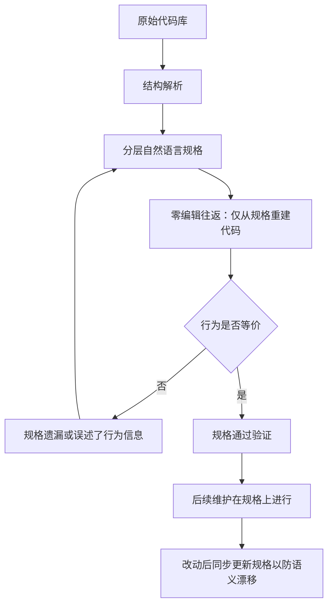

# 从代码到规格的验证层

## 基本信息

| 项目 | 内容 |
|---|---|
| **论文标题** | From Reading Code to Reading Spec: A Verified Layer for LLM-Driven Codebase Maintenance |
| **arXiv** | [2609.06383](https://arxiv.org/abs/2609.06383) |
| **发表时间** | 2026-09 |
| **一句话总结** | 用分层自然语言规格替代源码作为操作对象，通过「零编辑往返重建」证明规格捕获了行为，再在规格上做维护 |

## 置信度评估

| 维度 | 评估 |
|---|---|
| **方法可信度** | 高。等价性定义明确，往返验证的逻辑闭环清楚 |
| **实验充分度** | 中高。三个真实仓库、多轮修复的通过率对比，另有结构与可解释性评估 |
| **可复现性** | 中。方法描述完整，但重建与验证的工程实现复杂度较高 |
| **对本项目的适用性** | 中高。提供了「用重建验证规格」这一思路，属于较重的方案，可作为长期方向 |

## 它解决了什么问题

LLM 生成代码让代码库规模增长，直接管理代码库变得越来越难。论文提出的思路是**间接管理**：不直接编辑代码，而是维护一份结构化的自然语言规格，代码由规格派生。

具体做法叫 PROOF（Provable Representation Of Original Functionality）。它把代码库的拓扑结构抽象成分层自然语言表示，然后通过一个关键检验来建立信任：**只从规格重建源码，看重建结果与原代码行为是否一致**。

这个检验之所以有效，是因为它把「规格是否正确」这个抽象问题，转化成了「重建结果是否等价」这个具体问题。

## 方法核心

### 两个层次的一致性检查

论文把一致性分成两层，这个区分是方法的关键。

**结构同构**验证的是调用关系与依赖。规格图的拓扑与原始代码库一致，说明函数之间的调用、依赖方向没有搞错。

**结构同构不够**。节点之间的自然语言描述由模型写的，描述可能遗漏或误述行为。拓扑对了，但描述错了，规格仍然不能准确反映代码行为。

所以要加第二层。做法是**零编辑往返**（zero-edit roundtrip）：规格是操作对象，而规格与可执行代码是两种无法直接比较的表示，于是从规格反向重建出代码，把「规格是否正确」变成「原代码与重建代码的行为是否相同」。

这个转换很巧妙：把无法直接验证的表示层性质，转成了可以用执行验证的行为性质。

### 结果

在三个真实仓库上的测试通过率：

| 仓库 | 方案 | 第 1 轮 | 第 2 轮 | 第 3 轮 |
|---|---|---|---|---|
| Flask | PROOF | 84.9% | 97.6% | 100% |
| Flask | RepoAgent | 4.28% | 67.5% | 94.6% |
| Seaborn | PROOF | 83.5% | 98.1% | 100% |
| Seaborn | RepoAgent | 29.95% | 46.96% | 51.32% |
| Pytest | PROOF | 0% | 91.24% | 96.80% |

一个值得注意的现象是 **Pytest 上所有方法的第一轮通过率都接近零**。论文的解释是：这个仓库规模最大、耦合最紧，高层的集成错误会广泛传播，导致大面积测试失败。第一轮的接近零不代表所有重建函数都错了，而是耦合结构放大了单点错误的影响。到了后续轮次，靠保留调用图拓扑，通过率快速回升。

## 局限与注意

- **工程复杂度高**。从规格重建整个代码库是一项重工程，论文的场景是系统性重建，不是局部检查
- **规模与耦合带来质变**。Pytest 的结果说明代码库达到一定规模后，第一轮的失败率会失去区分度
- **规格维护成本**。规格要与代码同步演进，论文提到改动后同步更新规格以防止语义漂移，这个同步本身需要机制保证
- **等价验证依赖测试**。往返验证最终仍要判断两份代码是否行为等价，测试不充分时验证也不充分

## 对本项目的启发 ⭐

项目的知识文档在功能位置上与论文的规格有相似之处：都不是源码，都要描述模块的行为，都被下游用来重建或理解代码。区别在粒度与用途。

### 解决哪个环节的什么问题

**环节：知识文档的充分性判断。**

项目当前判断知识文档质量的方式是重建实现能否通过测试。论文提供了一个更严格的检验视角：如果知识文档真的捕获了行为，那么**只从知识文档重建**应该能得到行为等价的实现。

### 方案要点

**① 重建本身可以作为知识充分性的检验**

项目已经让 Code 从知识文档重建实现，这个流程天然具备检验能力。论文的补充是把它明确成一个验证动作：重建结果与原实现的行为差异，反映的是知识文档的遗漏与误述，而不是重建能力不足。这两种失败需要区分对待，处理方式完全不同。

**② 区分结构信息与行为信息**

论文的两层检查对本项目有直接映射：知识文档描述的调用关系与依赖属于结构层，描述的函数行为属于行为层。结构层可以由解析保证，行为层才是容易出问题的地方，也是检查的重点。

**③ 跨函数集成错误的表现值得预期**

Pytest 的结果提示了一种可能：当模块耦合较紧时，单个知识文档的疏漏会通过调用链放大，导致大面积失败。项目在解读重建失败率时需要注意这种放大效应，避免把集成问题误判为大量单点错误。

**④ 知识文档与代码的同步需要机制**

论文提到改动后同步更新规格以防语义漂移。项目面临同样的问题：源码演进后知识文档会失配，需要机制发现并处理。这与 [Governed Capability Evolution](../../版本管理/GovernedCapabilityEvolution版本升级治理与回滚.md) 里的在线监控是同一类需求。

### 提供了什么思路

**① 把不可直接验证的性质转成可验证的**

规格正确性无法直接验证，重建后的行为等价可以。这个转换与 [用反例证明程序不等价](用反例证明程序不等价.md) 换问题形式的做法同源：不去回答难判定的问题，而是把它改写成可判定的问题。

**② 往返是建立信任的一种通用手段**

序列化与反序列化、编码与解码、抽象与重建，只要往返能回到等价的原点，就说明中间表示没有丢失关键信息。项目在引入任何中间表示时都可以考虑用往返做验证。

**③ 分层表示兼顾可读与可验**

规格是分层的，顶层给人看，底层精确到能重建。这种结构同时服务人和机器，项目在设计知识文档结构时可作参考。

### 需要注意的

- **这个方案对项目偏重**。完整重建整个代码库不在项目范围内，可取的只是「用重建验证知识充分性」这个思想
- **等价判定仍然要落到具体手段**。论文的往返验证最终依赖测试或差分比对，这些手段本身的不完备性会传导过来
- **规模效应要考虑**。项目的模块规模比论文的仓库小，耦合放大效应可能存在但幅度不同
- **不要因为它重就忽略**。项目如果需要为知识文档建立高可信度，往返验证是可用的一条路

## 关联

- **对应环节**：知识文档的充分性验证；`code` 阶段重建结果与知识质量的归因
- **相关论文**：[用反例证明程序不等价](用反例证明程序不等价.md)：等价判定的具体手段
- **相关论文**：[差分模糊测试检查功能等价](差分模糊测试检查功能等价.md)：不依赖测试的等价检查
- **相关论文**：[规则驱动的合规检查](规则驱动的合规检查.md)：规则侧的结构化组织方式
