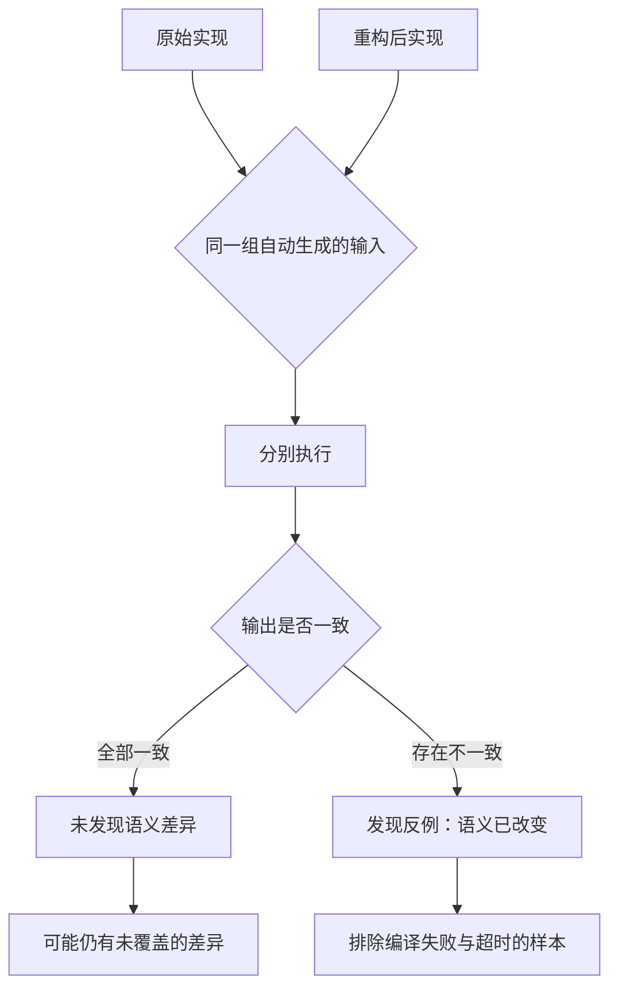

# 差分模糊测试检查功能等价

## 基本信息

| 项目 | 内容 |
|---|---|
| **论文标题** | A Differential Fuzzing-Based Evaluation of Functional Equivalence in LLM-Generated Code Refactorings |
| **arXiv** | [2602.15761](https://arxiv.org/abs/2602.15761) |
| **发表时间** | 2026-02 |
| **一句话总结** | 用自动生成的成千上万个输入做差分比对，测得 19% 到 35% 的重构改变了语义，其中约 21% 躲过了现有测试套件 |

## 置信度评估

| 维度 | 评估 |
|---|---|
| **方法可信度** | 高。差分比对是确定判定：同一输入下输出不同即为语义差异，不需要模型判断 |
| **实验充分度** | 高。6 个模型、3 个数据集、2 类重构、4368 个重构样本 |
| **可复现性** | 高。方法不依赖模型构造探测，流程固定，公开数据集 |
| **对本项目的适用性** | 高。与比较判定环节直接对应，且不需要额外的模型调用 |

## 它解决了什么问题

重构的定义是「改变代码结构，保持功能行为」。LLM 做重构时，这个「保持」并不自动成立。已有的评估方式依赖预定义的测试用例，而测试用例的覆盖面有限，通过测试不等于行为未变。

论文的做法是换掉评估手段：不依赖预定义用例，用**差分模糊测试**（differential fuzzing）自动生成大量输入，把重构前后的实现放在同样的输入上跑，比较输出。

差分比对的核心优势是它**不需要判断标准**。输出相同就是相同，不同就是不同，没有解释空间。这直接绕开了「这两段代码算不算等价」这个难以判定的问题。

## 方法核心

检查器叫 Eq@DFuzz，流程可以概括为三步：

1. 自动生成大量输入，覆盖不同的取值区间与边界
2. 把输入同时喂给原始实现与重构实现
3. 比较两侧输出，不一致即判定语义已改变

比起基于用例的评估，它探索的输入空间大得多。论文强调这个方法的成本主要在**执行**而不是模型调用，与需要模型构造探测的做法相比开销更低。

### 数据规模

| 维度 | 数量 |
|---|---|
| 模型 | 6 个（CodeLlama、Codestral、StarChat2、Qwen-2.5、Olmo-3、GPT-4o） |
| 数据集 | 3 个 |
| 重构类型 | 2 类 |
| 初始重构样本 | 4,368 |
| 排除编译错误与超时后 | 3,538 |

### 两个主要发现

**语义改变的比例不低**。六个模型产出的重构中，功能不等价的比例在 19% 到 35% 之间。Codestral 最高，约 35%。被公认为最先进的几个模型也落在 19% 到 22%。论文特别指出：所有这些模型都被明确要求避免不安全的重写。

**现有测试套件漏掉约 21% 的语义差异**。论文把差分检查判定为不等价的样本，回头查验现有测试是否通过：

| 数据集 | 不等价样本数 | 现有测试全部通过的比例 |
|---|---|---|
| HumanEval | 333 | 20.72% |
| MBPP | 194 | 21.65% |
| APPS | 406 | 22.41% |

三个数据集的结果接近，平均 21.65%。

### 一个反直觉的观察

APPS 数据集的测试用例数量远多于另外两个，但漏检率不降反升，略高于其他两个。论文对此的解释是：**更多的测试用例可能在重复验证相似的执行路径**，而不是揭示关键的语义差异。用例多不等于覆盖广。

这条对「往测试集里加用例」这种做法是个提醒。

## 局限与注意

- **差分检查也不完备**。输入没覆盖到的差异不会被发现。找不到差异只能说明在当前输入分布下未发现
- **要求确定性和可比输出**。随机行为、依赖外部状态的代码不适用
- **需要能自动生成有效输入**。输入构造要符合接口约束，否则大量样本会因类型错误而无效，论文为此排除了编译失败与超时的样本
- **场景是函数级重构**，输入输出关系清晰。涉及状态与跨模块交互的场景未覆盖
- **对未定义行为的处理未讨论**。C/C++ 这类语言的未定义行为会让差分结果不稳定

## 对本项目的启发 ⭐

项目的 Check 环节依赖给定规则做比较，规则由外部提供。这篇论文提供了一条可以并行使用、不依赖模型判断的检查手段。

### 解决哪个环节的什么问题

**环节：生成实现与原始实现的行为一致性验证。**

当前的一致性判断落在规则比较与模型分析上。论文提示的角度是：可以用**执行结果**直接做判定，把一部分判断从「模型认为」变成「执行显示」。

### 方案要点

**① 输入自动生成加差分比对，可作为规则比较之外的独立检查**

这个检查不需要模型参与，成本主要在编译与执行。项目的评测环节本来就要编译运行，差分比对可以搭在现有的编译运行能力上，不需要新的基础设施。

**② 优先覆盖接口边界**

论文的输入生成要符合接口约束。对本项目而言，公开接口声明了参数类型与取值范围，边界值、极端组合、异常路径是差分检查最该覆盖的地方。

**③ 测试用例多不等于覆盖关键差异**

APPS 的观察对本项目有直接含义：测试集规模增长时，要检查新增用例是否只是重复了已有路径。项目的测试集按源码身份固定，扩充时值得注意这一点。

**④ 差分结果可以作为差异报告的证据**

差分检查发现不一致时，产出的是具体的输入与两侧的实际输出。这比「模型认为这两处行为不同」更适合作为报告证据，也更适合进入门禁判定。

### 提供了什么思路

**① 绕开判定难题的方式是改变问题的形式**

「两份实现是否等价」难以判定，「存在一个输入使得输出不同」则可判定。论文没有去解决前一个问题，而是换成了后一个。这个转换思路对项目里其他难判定的验收项有借鉴意义。

**② 不需要判断标准的检查最可靠**

差分比对不需要规则、不需要模型、不需要人工判断，只需要执行环境和输入。项目在设计检查项时，可以优先采用这类不依赖解释的判据。

**③ 排除无效样本是必要的工程步骤**

论文剔除了 19% 的样本（编译失败与超时）。差分检查在实践中会产生大量无效样本，这个比例需要预期到。

### 需要注意的

- **输入生成的质量决定检查能力**。生成器只产生平凡输入时，差分检查什么也发现不了。这与测试用例的质量问题同源
- **未发现差异不能写成「等价」**。表述应该是「在当前输入分布下未发现行为差异」，与 [用反例证明程序不等价](用反例证明程序不等价.md) 的边界一致
- **C/C++ 场景要处理未定义行为**。同一段代码在不同优化等级或不同内存布局下可能给出不同结果，这类不稳定会污染差分判定
- **这项检查不能替代规则比较**。规则比较处理的是「是否符合给定承诺」这类语义问题，差分比对处理的是「行为是否变了」，两者互补

## 关联

- **对应环节**：`checkAgent` 的差异判定；`evaluation` 的行为一致性检查
- **相关论文**：[用反例证明程序不等价](用反例证明程序不等价.md)：用模型构造探测找反例，与之互补的是自动生成输入
- **相关论文**：[从代码到规格的验证层](从代码到规格的验证层.md)：从规格侧保证一致性的路线
- **相关论文**：[测试充分性准则对 LLM 代码的检出率](../TestGenAgent/测试充分性准则检出率.md)：覆盖率同样无法代理行为一致性的保证
