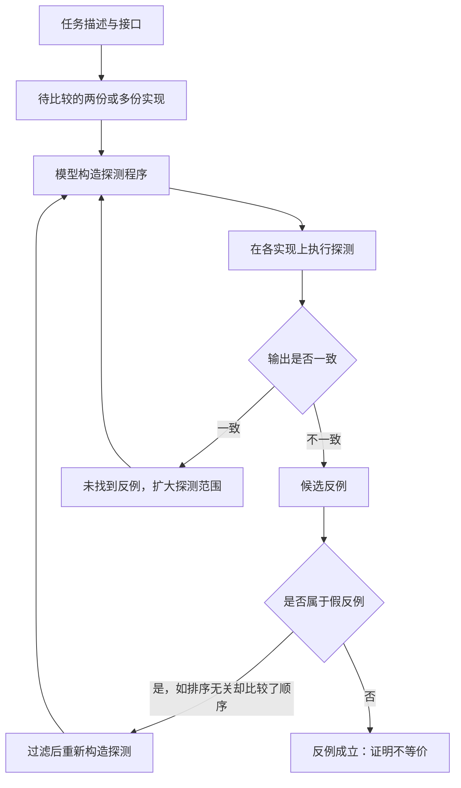

# 用反例证明程序不等价

## 基本信息

| 项目 | 内容 |
|---|---|
| **论文标题** | Disproving Program Equivalence with LLMs |
| **arXiv** | [2502.18473](https://arxiv.org/abs/2502.18473) |
| **发表时间** | 2025-02 |
| **一句话总结** | 让模型构造探测程序去搜反例，用执行反馈迭代：找到反例就证明两段代码不等价，推翻了 18% 被单测判定为等价的样本 |

## 置信度评估

| 维度 | 评估 |
|---|---|
| **方法可信度** | 高。判定逻辑是确定的：反例一经执行验证即为证明，不存在模型自评的空间 |
| **实验充分度** | 中高。在代码合成基准上有量化结果，并给出聚类与自一致性的应用效果 |
| **可复现性** | 中高。方法描述完整，依赖模型与执行环境，需要可运行代码 |
| **对本项目的适用性** | 高。给出了一条不依赖相似度打分的差异判定路线，可直接替换待研究的评分方案 |

## 它解决了什么问题

用来评估代码生成质量的单元测试往往不充分，漏掉边界情况与实现特有的怪癖。两份实现都能通过同一套测试，但它们的行为并不等价。

论文针对的是**不可比（undecidable）问题的一个可判定片段**：不试图证明两份代码等价，而是试图**证明它们不等价**。这个方向的不对称很重要：

- 找到反例：不等价，结论确定
- 没找到反例：只是没找到，不能推出等价

这种只做否定判定的方法在逻辑上完备性不足，但所有输出都是可验证的确定结论。

## 方法核心

### 探测程序

核心构造叫**探测程序**（probe）：一段接受实现作为输入、返回可比较值的代码。多个探测可以组合成一个复合探测，对所有实现同时施加。

流程分三步：

1. 模型读取任务描述与接口，构造探测程序
2. 把探测作用在每个待比较实现上，执行得到输出
3. 比较输出值，不同即得到候选反例

**执行反馈**是让模型做对这件事的关键。模型能看到跑出来的实际输出，据此判断自己构造的探测是否有效，再决定是调整探测还是确认反例。没有执行反馈时模型难以判断自己的探测是否真的有区分力。

### 假反例过滤

不是所有输出差异都代表真实的行为差异。论文举的例子是排序：任务描述说索引顺序无关，而探测返回了顺序不同的两个列表，这是**假反例**（spurious counterexample），差异来自自然语言的模糊或未被规定的行为。

过滤方式是用模型判断差异是否源于规格的固有歧义。论文明确指出这一步有引入假阴性的风险，也就是把真实差异误判为假反例。

### 结果

论文报告了两个数字：

**推翻了 18% 的等价判定**。在代码合成基准上，被基准自带单元测试判定为与标准答案等价的样本里，有 18% 被找出了反例。这个比例说明单测的等价判定本身有相当大的误判空间。

**聚类提升 pass@1 约 10%**。用探测结果给模型的多个输出做语义聚类，把语法不同但语义相同的样本合并，pass@1 提升 10%。这说明探测的输出可以当作语义指纹使用。

## 局限与注意

- **不完备**。找不到反例不等于等价。方法的输出只有「找到」这一种确定结论
- **要求代码可执行且确定**。代码必须在给定输入上可执行、结果确定。有副作用、依赖外部状态或非确定的代码不适用
- **需要可比较的返回值**。探测的输出必须能直接比较，返回函数、无限生成器这类情形不适用
- **成本高于跑单测**。构造探测要调用模型，比跑单元测试贵得多。论文明确说这个方法只在单测已经无法推翻等价时才值得用
- **过滤假反例会引入假阴性**，这个权衡是显式的

## 对本项目的启发 ⭐

项目把相似度算法、评分、权重与阈值列为待研究，并且明确不能给出相似度分数作为发布依据。这篇论文给了一条绕开打分的方向。

### 解决哪个环节的什么问题

**环节：Check 的差异判定方式。**

当前的做法是按给定规则逐条比较，由模型判断差异是否阻塞。这个做法能产出可读的差异报告，但判定依据仍然落在「模型认为这两段代码是否等价」上。论文提供了另一条路：让判定变成「存在一个输入，两份实现的输出不同」。

### 方案要点

**① 把判定从「是否相似」改成「能否找到反例」**

拿一个具体输入让两侧实现都跑一遍，比较输出。输出不同就是行为差异的确定证据，模型不需要解释这个差异是否重要。这个改法把判定从主观评估变成了可执行验证，与项目「门禁是一组事实而不是分数」的立场一致。

**② 边界输入值得优先探测**

论文的动机是单测漏掉边界情况。对项目而言，比较规则里已经写明公开接口的承诺，可以让探测集中在接口边界上：空输入、极值、异常路径。

**③ 假反例过滤需要显式的规则来源**

论文用模型判断差异是否源于规格歧义，这一点风险明确。项目有给定规则作为参照，可以做得更好：差异是否属于假反例，由规则是否规定了该行为来决定，而不是由模型判断。

**④ 执行结果可以作为语义指纹**

论文用探测输出给模型输出做语义聚类。项目的版本管理需要判断两个版本是否实质相同，探测输出可以充当这个判断的依据，比文本相似度更能反映行为。

### 提供了什么思路

**① 只做否定判定是一个可接受的设计**

不完备但结论确定，这个取舍在很多工程场景里是合适的。项目需要回答的问题落在「能否找到两份实现行为不同的证据」上，而「两份实现是否完全等价」这个更宽的问题不需要回答。

**② 执行反馈是让模型做对判断的关键**

论文强调模型配执行反馈才表现好。这一点对项目有普遍意义：任何要求模型做技术判断的环节，都应该让它看到实际执行结果，而不是只看代码。

**③ 一个方法可以服务多个目的**

探测程序最初为等价性检查设计，同时可用于语义聚类。项目在引入机制时可以留意这种复用可能。

### 需要注意的

- **成本考虑**。论文自己说明这个方法比跑单测贵。项目的每轮飞轮有预算约束，探测的规模需要控制
- **不适用于非确定行为**。项目比较的是 C/C++ 实现的确定性行为，这一点满足前提；但如果重建实现涉及内存布局、未定义行为或依赖时序，探测结果会不稳定
- **找不到反例要如实表达**。输出应该是「未发现行为差异」，不能写成「行为等价」
- **过滤假反例需要规则支撑**。没有规则支撑的过滤会退化成模型自评

## 关联

- **对应环节**：`checkAgent` 的差异判定；比较规则的执行方式
- **相关论文**：[差分模糊测试检查功能等价](差分模糊测试检查功能等价.md)：不依赖模型构造探测，用自动生成输入做差分比对
- **相关论文**：[验证器博弈与同构扰动](验证器博弈与同构扰动.md)：检查本身可能被表层满足
- **相关论文**：[从代码到规格的验证层](从代码到规格的验证层.md)：用规格重建证明等价的正向路线
