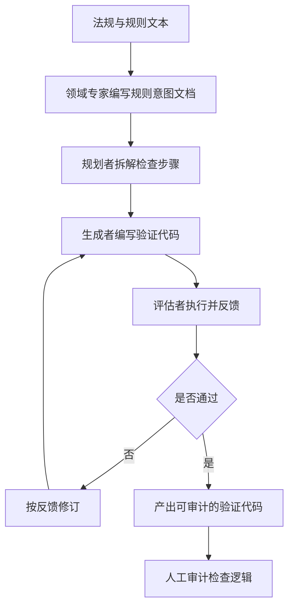

# 规则驱动的合规检查

## 基本信息

| 项目 | 内容 |
|---|---|
| **论文标题** | ARCHER: Agentic Rule and Compliance Harness for Executable Regulations |
| **arXiv** | [2607.25566](https://arxiv.org/abs/2607.25566) |
| **发表时间** | 2026-07 |
| **一句话总结** | 从法规文本生成可审计的验证代码，用六级 harness 对照发现确定性编排优于让模型自由编排 |

## 置信度评估

| 维度 | 评估 |
|---|---|
| **方法可信度** | 高。六级 harness 是受控对照，结论有归因依据 |
| **实验充分度** | 中高。四个骨干模型、六级 harness、覆盖不同数据治理层级 |
| **可复现性** | 中。方法完整，但依赖领域专家编写的规则意图文档 |
| **对本项目的适用性** | 中高。规则驱动的检查结构与本项目同构，且给出了编排方式的实证结论 |

## 它解决了什么问题

建筑合规检查需要把成千上万条规则对照大型建筑信息模型验证，人工成本极高。已有的自动合规检查器难以跨场景复用，且多数是闭源的，用户无法核实检查逻辑是否准确反映了法规意图。

论文的切入点是把**规则文本转成可执行的验证代码**，并让生成的代码可审计：用户能直接看到检查逻辑，不必只接受一个结论。

对本项目而言，可借鉴的部分在于**规则驱动的检查如何组织**：规则从哪来、怎么保证它被准确执行、生成的检查逻辑如何审计。建筑领域的具体做法不需要移植。

## 方法核心

### 六级 harness 对照

论文的价值很大程度上在于这组受控对照。它把 agent 结构的复杂度分成六级，逐级增加能力：

| 级别 | 名称 | 特征 |
|---|---|---|
| 0 | 盲测 | 单 agent 只能依据需求自评，无训练数据 |
| 1 | 模型感知 | 可以针对训练模型执行来评估 |
| 2 | 完整测试驱动 | 还能看到针对标准答案计算的指标 |
| 3 | 加规划步骤 | 提示词里加入显式规划环节 |
| 4 | 多 agent，非确定性编排 | 规划、生成、评估三个子 agent 由编排 agent 决定调用顺序 |
| 5 | 多 agent，确定性编排 | 同样三个子 agent，但由**固定控制循环**而非模型来编排 |

第 5 级就是 ARCHER。它的循环是固定的：先让规划者写出计划，再让生成者按计划编写代码，然后让评估者执行并报告准确率和需要修的地方，根据结果决定是否重新规划。最大迭代次数与重新规划次数都是预设常量。

**从第 4 级到第 5 级的对比是论文最值得记的地方**：两者都有同样的三个子 agent，唯一差别是编排由模型决定还是由固定循环决定。论文的结论是确定性编排更优。

同时论文记录了 harness 设计上的一个细节：生成者每次写入文件时都会被静默评分，但这些分数**不参与控制流**，只用于后续的轨迹分析。控制流只由评估者给出的反馈驱动。

### 审计分层

论文把可审计性分成两层：非编程背景的领域专家通过面向专家的产物审阅，也就是规则意图文档、标注的判定结果、逐元素输出；代码级检查需要工程师参与。相比闭源检查器，至少代码是可检视的。

## 局限与注意

- **依赖专家编写规则意图文档**。这部分工作量未计入成本分析，且假设专家能准确捕获法规意图，这个假设的可靠性未验证
- **规则被孤立处理**。论文明确说没有对规则之间的依赖与矛盾建模，多条规则同时适用时的相互作用不在范围内
- **准确率不足时归因困难**。达不到满分时，不容易判断问题出在规则描述、测试用例还是代码缺陷
- **场景差异大**。建筑几何检查与代码一致性检查的对象完全不同，方法论可借鉴，具体实现不可移植

## 对本项目的启发 ⭐

项目 Check 环节的基本形态与 ARCHER 同构：规则由外部提供，检查依据规则执行，产出可审计的报告。差别在于 ARCHER 把检查逻辑生成为代码，项目让模型直接做比较。

### 解决哪个环节的什么问题

**环节：规则驱动检查的编排方式与审计组织。**

项目当前是固定流程加模型判断。ARCHER 的六级对照给出了一个具体结论：**在生成加评估这类循环里，固定编排优于让模型自主编排**。

### 方案要点

**① 编排固定，判断交给模型**

ARCHER 的固定循环是「规划、生成、评估、按反馈决定是否重来」。项目 Check 的修正流程结构类似：首次报告、按失败反馈修正、最多两次。论文的结论支持把循环结构写死在框架里，模型只负责每一步的内容。

**② 用反馈驱动控制流，评分只做观测**

ARCHER 里生成者每写一次就被评分，但这些分数不影响流程，流程只由评估者的反馈决定。这个分离与本项目「门禁是一组事实」的设计一致。项目在有多个信号可用时，值得明确哪个信号驱动流程，哪个只做记录。

**③ 规则的有效性需要在调用模型前校验**

项目已经规定规则缺失、说明为空或编号重复时在模型调用前失败。ARCHER 的规则意图文档由专家编写，属于上游产物，其质量决定检查质量。项目可以明确一点：规则本身的质量问题与检查执行的问题要分开报告。

**④ 审计产物要分层**

论文的审计分层对本项目有参考价值：面向流程的产物（规则、判定结果、差异报告）供人工审阅，代码级证据供工程师核对。项目已经有证据定位与原文提取的设计，符合这个分层思路。

### 提供了什么思路

**① 受控对照比单一方案更有说服力**

六级 harness 的价值在于它能回答「哪一部分带来的改善」。项目在做流程改造时，如果一次改多处，效果无法归因。分步对照的成本不高，但能让结论可信。

**② 规则孤立处理是一个已知缺口**

论文明确承认没有建模规则之间的关系。项目如果有多条比较规则，规则之间是否可能冲突、是否可能互相覆盖，这是一个值得提前考虑的问题，而不是等出现问题再补。

**③ 可审计性是相对于闭源而言的**

论文把「代码可检视」本身当作进步。项目在生成检查逻辑或评测逻辑时，让产物可检视比让结论可信更容易做到，也更早建立信任。

### 需要注意的

- **别照搬六级分类**。项目的流程结构已经确定，需要的是「固定编排」这条结论，不是照搬分级
- **专家编写规则的成本是真实的**。项目里这个角色由人承担，规则的质量与维护成本要纳入考虑
- **归因困难是共性问题**。论文遇到的「说不清是规则、用例还是代码的问题」，项目在评测失败的归因上也会遇到，需要机制支撑而不是靠推测

## 关联

- **对应环节**：`checkAgent` 的规则驱动比较；检查流程的编排方式
- **相关论文**：[用反例证明程序不等价](用反例证明程序不等价.md)：规则比较之外的判定手段
- **相关论文**：[验证器博弈与同构扰动](验证器博弈与同构扰动.md)：检查被执行到位与被表层满足的区别
- **相关论文**：[从代码到规格的验证层](从代码到规格的验证层.md)：规格与规则的结构化组织
