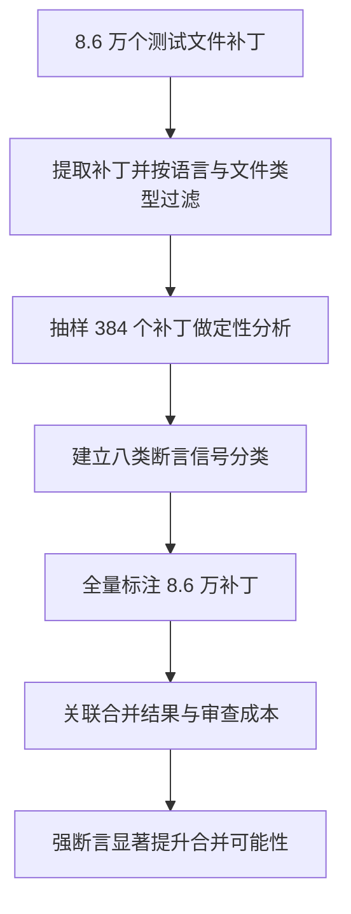

# Agent 测试代码的断言信号

## 基本信息

| 项目 | 内容 |
|---|---|
| **论文标题** | All Smoke, No Alarm: Oracle Signals in Agent-Authored Test Code |
| **arXiv** | [2606.18168](https://arxiv.org/abs/2606.18168) |
| **发表时间** | 2026-06（MSR 2026） |
| **一句话总结** | 对 8.6 万个 agent 编写的测试补丁做实证，发现 80.2% 缺少显式断言信号，证明用测试文件数量衡量验证强度会严重高估 |

## 置信度评估

| 维度 | 评估 |
|---|---|
| **方法可信度** | 高。样本来自真实开源仓库，分类经人工定性分析建立，两个标注者之间有一致性检验 |
| **实验充分度** | 高。8.6 万个补丁、3.3 万个 PR、2807 个仓库、五种主流编码 agent |
| **可复现性** | 高。复制包已公开 |
| **对本项目的适用性** | 高。给出可直接用作验收项的断言信号分类，对应本项目「执行过不等于测试有效」这一已知缺口 |

## 它解决了什么问题

编码 agent 现在会同时产出实现代码和测试代码，社区普遍把「有没有测试文件」当作质量信号。论文指出这个信号是错的：**测试文件存在与验证强度是两件事**。

缺少断言的测试会执行代码路径但不检查输出。这类测试全都通过，看起来是正面的质量证据，实际上什么都没验证。开发者用「test theater」形容这个现象，意思是测试在演戏：确认代码「做到了它已经在做的事」。

论文的切入点是**测试预言信号**（oracle signal），也就是测试代码里用来判断行为是否符合预期的那些语法结构。断言是最典型的一种，此外还有异常检查、快照比对等。

## 方法核心

### 数据规模

| 维度 | 数量 |
|---|---|
| 测试文件补丁 | 86,156 |
| agent 编写的 PR | 33,596 |
| 仓库 | 2,807 |
| 覆盖的编码 agent | OpenAI Codex、GitHub Copilot、Devin、Cursor、Claude Code |

定性分析抽样了 384 个分层补丁，据此建立八类断言信号分类，再用这套分类对全量数据做标注。

### 主要发现

**绝大多数测试补丁缺少有效断言**。80.2% 的测试补丁属于「弱断言」或「无显式断言信号」。这个比例在五种 agent 之间都比较稳定，说明这是 agent 编写测试的通病，不是某个产品的特性。

**测试文件数量会高估验证强度**。既然多数补丁不检查行为，那么统计「新增了多少测试文件」得到的数字，与实际验证能力之间没有对应关系。

**强断言确实有价值，但需要控制变量才能看出来**。原始的合并率对比会误导：强断言 PR 的原始合并率反而更低。作者做了回归分析，控制 agent 类型、PR 规模、仓库热度、任务类型和语言之后，强断言显著提升合并可能性（优势比 1.28，p 小于 0.001）。

这个反差本身值得记：强断言 PR 往往改动更大、涉及更核心的模块，所以原始合并率低；把它们与同类型 PR 对比，价值才显现。

### 八类断言信号

论文建立的分类是语法层面的，也就是**从代码结构上就能判断**，不依赖对测试意图的理解。按验证强度从弱到强大致排列：

- **无断言**：执行了函数但没有检查任何输出
- **仅检查不抛异常**：调用并期望它不崩，隐含假设「能跑通就是对的」
- **仅检查返回值非空或非零**：检查了输出存在，没检查内容
- **快照或整体对象比对**：比对了大块结构，但比对基准本身可能来自当前实现
- **属性或不变式检查**：检查了应当始终成立的关系
- **精确值断言**：检查了具体的预期值
- **异常类型与消息断言**：检查了错误路径的具体形态
- **多条件组合断言**：同时检查多个维度的行为

分类是语法性的，因此可以自动化扫描。这正是论文建议的用法：**把断言感知的检查加入质量门**。

## 局限与注意

- **语法分类不能判断意图**。断言了精确值但值本身是错的（比如从缺陷实现抄来的），语法上属于强断言，实际是误导测试。这类问题需要与 [buggy code 误导效应](BuggyCode误导单测生成.md) 那篇一起看
- **合并率不等于质量**。合并是维护者决策的结果，受项目习惯影响。论文用回归控制了一部分变量，但合并仍是间接指标
- **快照测试的定位有争议**。快照比对属于哪个强度取决于基准怎么来的，论文把它归为中等强度，实际项目里要具体看
- **覆盖五类主流 agent，但不含自建 agent**。样本对商业编码 agent 有代表性，自建流水线的情况可能不同

## 对本项目的启发 ⭐

项目的测试有效性有一段已经写明的认识：监督器可以证明测试被执行过，却证明不了这个测试有效。这篇论文给这段认识提供了外部实证，并给出了可操作的检查方式。

### 解决哪个环节的什么问题

**环节：测试生成的有效性验收。**

当前的验收覆盖了「测试能否编译运行」「是否真的进入执行」「是否伪造结果」这几项，都是从执行侧判断的。缺少的是对**测试内容本身**的判断：这段测试到底在检查什么。

### 方案要点

**① 把断言检查加入测试生成的验收项**

论文的分类是语法层面的，可以直接作为扫描规则实现。最低要求可以定在「每个测试用例必须包含对返回值的实际比较」，而不是只调用被测函数。这条规则能用程序检查，不需要模型判断。

**② 用断言强度替代测试数量作为进度指标**

飞轮如果统计「生成了多少测试」，这个数字会误导。更有意义的指标是**不同强度的断言各有多少**。论文的数据说明这两者的差距可以达到数倍。

**③ 区分「通过」的两种含义**

测试通过有两种情况：真正验证了正确行为，或者只是没触发任何检查。项目的 `PASS` 判定目前基于全部用例通过，可以考虑在结果里同时记录断言覆盖情况，让「通过但无有效断言」这种情况暴露出来。

**④ 异常路径的测试也要有断言**

「调用后不抛异常」是论文分类里最弱的一级。项目的测试用例结构里有预期字段，可以要求预期不为空，避免生成只检查不崩溃的用例。

### 提供了什么思路

**① 语法信号可以代理语义性质**

断言强度本质上是语义概念，但论文证明用语法结构做代理是可行的，而且能自动化。这个思路对项目有普遍意义：很多看似需要模型判断的验收项，可能存在一个够用的语法或结构代理。

**② 原始指标与回归指标可能反向**

强断言 PR 的原始合并率更低这一点很有启发。项目在做效果对比时需要注意类似的混淆：改动范围大的版本往往涉及更核心的内容，各项指标天然更差，直接对比会得出相反结论。

**③ 样本来自真实生产环境**

论文用的是真实开源仓库里的 agent 产物，不是受控实验。这一点让结论更接近实际，也说明 agent 生成测试的断言缺失是普遍现象，不是实验设置造成的假象。

### 需要注意的

- **语法强度不等于实际有效性**。断言了从缺陷实现抄来的值，语法上很强，实际是误导测试。断言检查必须与信号来源的检查配合
- **不同测试框架的断言形式不同**。项目的测试是 C/C++ 且限制入口函数返回 0 或非 0，断言形式与论文样本里的 Python、JavaScript 等不同，分类需要做场景转换
- **别把这条当成为测试数量背书的理由**。论文的结论是数量指标不成立，不是数量完全不重要

## 关联

- **对应环节**：`testGenAgent` 的输出验收；测试有效性的判定
- **相关论文**：[buggy code 对单测生成的误导效应](BuggyCode误导单测生成.md)：强断言也可能验证错误行为
- **相关论文**：[测试充分性准则对 LLM 代码的检出率](测试充分性准则检出率.md)：覆盖率同样不能代理验证强度
- **相关论文**：[奖励作弊基准](奖励作弊基准.md)：跳过验证步骤是模型常见的捷径之一
