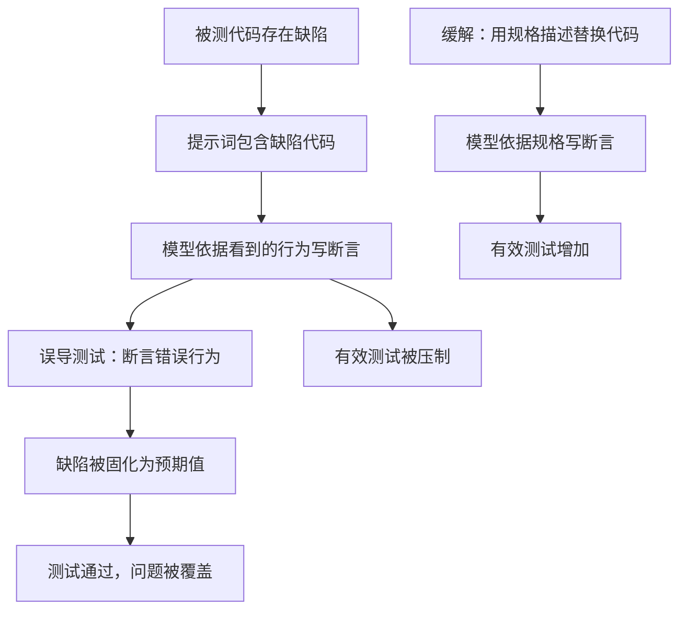
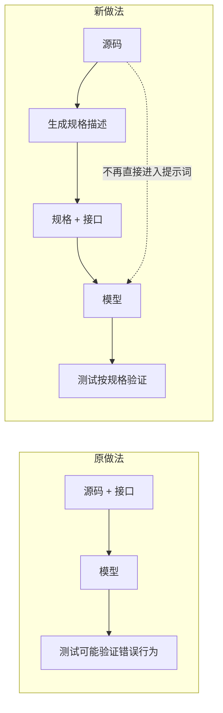

# buggy code 对单测生成的误导效应

## 基本信息

| 项目 | 内容 |
|---|---|
| **论文标题** | Evaluating and Mitigating the Misguidance Effect of Buggy Code in LLM-Generated Unit Tests |
| **arXiv** | [2607.22883](https://arxiv.org/abs/2607.22883) |
| **发表时间** | 2026-07（ISSTA 2026） |
| **一句话总结** | 用实证证明把有缺陷的代码放进提示词会让模型写出「验证错误行为」的测试，并提出用规格描述替换被测代码来消除这种误导 |

## 置信度评估

| 维度 | 评估 |
|---|---|
| **方法可信度** | 高。既给出行为层的量化结果，又从模型内部的序列概率给出旁证，两条证据独立 |
| **实验充分度** | 高。多模型、多基准，并做了 buggy 与 bug-free 两个方向的对照 |
| **可复现性** | 中高。方法描述完整，基准为公开数据集，但缓解方案依赖模型生成的规格质量，这部分未完全解耦 |
| **对本项目的适用性** | 高。直接对应 TestGen 从源码与接口生成测试这一段，且给出了比现有约束更彻底的方案 |

## 它解决了什么问题

自动化单测生成有个被忽视的失效：被测代码本身有缺陷时，模型倾向于**按代码实际的行为**写断言，而不是按代码**应该有的行为**写。缺陷于是被固化进测试的预期值，测试全绿，问题被覆盖。

论文把这个现象叫**误导效应**（misguidance effect），并给出量化方法。它的影响是双重的：

- 一方面增加**误导测试**（misguided test），即断言了错误行为的测试
- 另一方面压制**有效测试**（effective test），即能在缺陷代码上失败、在修复后通过的测试

一个关键区分是**回归断言**与**预期行为断言**。前者断言「代码现在是这么做的」，后者断言「代码应该这么做」。前者在缺陷代码上必然通过，因此对发现缺陷毫无帮助。

## 方法核心

### 误导效应的量化

论文用两个指标刻画：误导测试数量与有效测试数量。在缺陷代码上提示时，三组模型的平均结果是：

| 指标 | 提示含缺陷代码 | 提示含修复代码 |
|---|---|---|
| **误导测试** | 137.69 条（3.84%） | 16.46 条（0.46%） |
| **有效测试** | 104.15 条（2.98%） | 304.08 条（8.51%） |

换成修复后的代码，误导测试降到约八分之一，有效测试涨到近三倍。这个对照说明缺陷代码本身就是误导的来源，而不是模型能力问题。

论文还报告了一个容易被忽略的数字：**在缺陷代码上通过的测试里，超过 90% 是真正的负例**。测试通过这个信号本身几乎不携带验证信息。

### 模型内部证据

除了行为层结果，论文用**序列分数**（sequence score）给出了模型内部视角的旁证。序列分数衡量模型生成某个输出的概率偏好。

实验逻辑是：如果缺陷代码扭曲了模型的生成偏好，那么以缺陷代码为条件时，误导测试应该获得更高的序列分数；以修复代码为条件时，有效测试应该分数更高。实验结果与这个预测一致，说明模型确实把缺陷代码当成了行为依据，而不是一个待检验的对象。

这一点值得留意：模型在生成误导测试时，并不认为自己写错了。它的输出在给定的上下文里是概率上最自然的延续。

### 缓解方法：用规格替换代码

论文提出的做法是**基于规格的测试生成**（specification-based unit test generation）：把提示词里的被测代码整体替换成一段**规格描述**（通常是文档字符串形式，由模型从代码生成，描述函数应该做什么）。

结果上，这个做法同时降低了误导测试、提高了有效测试，并且在多轮反馈式生成流程里同样有效。论文还验证了它对无缺陷代码同样适用。

配套结论是规格质量会传导到测试质量，规格写得含糊，测试也跟着含糊。

## 局限与注意

- **规格本身可能出错**。规格由模型从代码生成，如果生成规格时同样受到缺陷代码影响，误导会转移到规格上。论文的缓解只切断了一次传导，没有消除源头
- **评测基准是函数级单元测试**。论文的实验集中在独立函数上，有明确输入输出的场景最适用；涉及状态、时序或跨模块交互的场景未覆盖
- **有效测试不等于覆盖率**。论文关注的是测试能否在缺陷代码上失败，这与覆盖率是两件事
- **多轮流程中的改善幅度小于单轮**，论文报告了这一点，但未完全解释原因

## 对本项目的启发 ⭐

项目的 TestGen 有一条明确约束：不读取候选知识和重建代码，避免文档与测试使用同一个错误答案。这条约束的方向与论文一致，但论文给出的做法更彻底。

### 解决哪个环节的什么问题

**环节：测试生成的信号来源。**

当前的约束是「不读重建代码」，也就是让模型看不到可能出错的实现。论文指出的问题是：光不看不够，模型还需要一个正确的参照来写断言。缺少参照时，模型会转向别的东西——如果提示词里只有代码，那就转向代码。

### 方案要点

**① 把「不读实现」升级为「按规格生成」**

论文的核心做法是用规格描述替代被测代码，模型依据规格而不是实现写断言。对项目的含义是：测试生成的输入里应该有一份**对预期行为的独立描述**，光有源码与接口声明不够。源码仍然需要，但它的角色是提供规格的依据，不是提示词的直接内容。

**② 保留「参考实现校验」这一层，但要认清它证明什么**

项目现有流程是先在原始源码上校验测试，通过后才固定测试集。这一步能发现测试的编译、运行与预期值错误。论文的结果提示它的边界：参考校验通过说明测试与原始实现一致，而原始实现本身是否正确、测试断言是否真的在检查行为，这两件事它都证明不了。

**③ 测试有效性需要一个独立的检查项**

「测试通过」与「测试在验证行为」是两件事。项目已经有监督器证明测试真的执行过，下一步可以补的是断言质量的检查：测试里是否存在对返回值的实际比较，而不是只调用函数看它不崩。

**④ 误导的方向要盯住「通过率异常高」**

如果某一轮生成出来的测试在候选实现上通过率明显高于其他轮次，这里有另一种解释：测试退化成只断言实际行为，从而失去了区分能力。这个信号可以作为飞轮里的一个观测项。

### 提供了什么思路

**① 用对照实验判断信号来源**

论文的行为层证据用的是「同一组模型，只换提示词里的代码版本」的对照。这种设计能区分「模型能力不足」与「输入信号误导」两种解释。项目在排查测试生成质量问题时可以借用这个思路。

**② 概率偏好可以当作诊断工具**

序列分数是一个不依赖人工标注的诊断手段，用来观察模型把什么当作依据。它比结果指标更早暴露问题，因为结果指标要等到测试跑完才知道。

**③ 规格是可以独立维护的资产**

规格描述在论文里是从代码派生出来的中间产物，但它本身可以当作独立资产维护。对项目而言，知识文档在某种程度上就是这类规格，区别在于论文的规格是函数级的、面向测试的，知识文档是模块级的、面向理解与重建的。

### 需要注意的

- **规格生成这一步可能成为新的误导入口**。如果规格由同一个模型从缺陷代码生成，缺陷会顺着规格传导下去。项目中生成规格的输入应该与生成测试的输入做隔离
- **函数级结论不能直接外推到模块级**。论文的实验是独立函数，项目的知识文档与重建实现是模块级的，存在跨函数与跨文件的交互，误导的表现形式可能不同
- **不要用这个结论给「不读实现」的做法做背书**。论文的价值在于指出了这条约束不够，加一层规格才能形成闭环

## 关联

- **对应环节**：`testGenAgent` 的输入构造与提示策略；测试有效性验收
- **相关论文**：[Agent 测试代码的断言信号](Agent测试代码断言信号.md)：测试缺少断言的比例及其识别
- **相关论文**：[测试充分性准则对 LLM 代码的检出率](测试充分性准则检出率.md)：为什么覆盖率不能替代断言检查
- **相关论文**：[奖励作弊基准](奖励作弊基准.md)：模型绕过验证的动机与形式
