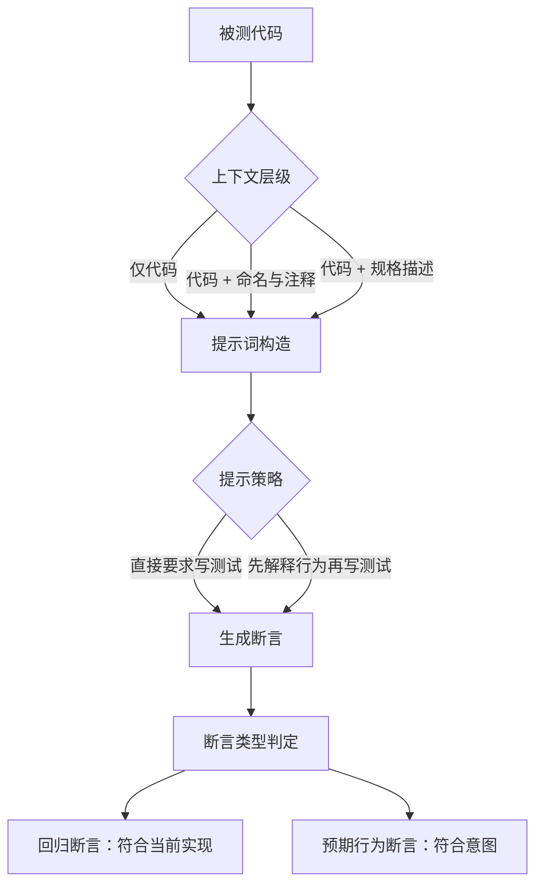

# LLM 测试断言生成的实证研究

## 基本信息

| 项目 | 内容 |
|---|---|
| **论文标题** | Understanding LLM-Driven Test Oracle Generation |
| **arXiv** | [2601.05542](https://arxiv.org/abs/2601.05542) |
| **发表时间** | 2026-01 |
| **一句话总结** | 系统研究提示策略与上下文层级如何影响模型生成的断言质量，并区分了「断言代码现在做什么」与「断言代码应该做什么」两类断言 |

## 置信度评估

| 维度 | 评估 |
|---|---|
| **方法可信度** | 中高。实证设计的变量控制清楚，结论以对比数据呈现 |
| **实验充分度** | 中高。覆盖多种提示策略与不同层级的上下文输入 |
| **可复现性** | 中高。方法描述完整，具体数据取决于模型版本 |
| **对本项目的适用性** | 中高。给出提示策略层面的具体结论，可直接用于调整测试生成的提示词构造 |

## 它解决了什么问题

已有的自动化单测生成技术主要产出**回归断言**（regression oracle）：断言的是被测类**已经实现**的行为。这类断言对防止回归有用，但它回避了**预言问题**（oracle problem），也就是「怎么区分正确行为与错误行为」。

回归断言在逻辑上的位置是「记录现状」。如果现状本身有缺陷，回归断言会把缺陷记录下来并加以保护。所以它能发现变化，不能发现错误。

LLM 的出现在理论上提供了新的可能：模型可以从自然语言描述、命名、注释等信号中推断**意图**，从而生成断言**预期行为**的断言。论文要回答的是，这个可能性在多大程度上能实现，以及哪些因素影响它。

## 方法核心

### 两个变量

论文把影响断言质量的因素分成两组。

**上下文层级**指的是提示词里包含多少关于意图的信息：

- 只有实现代码
- 实现代码加上函数名、参数名、注释
- 实现代码加上独立的规格描述

**提示策略**指的是怎么向模型提出要求：

- 直接要求生成测试
- 先让模型解释代码应该做什么，再据此写测试
- 提供参考实现或示例断言

### 结论要点

论文的主要结论可以概括为：

**更多意图信息带来更好的断言**。当提示词里包含规格描述这类独立于实现的意图表达时，生成的断言更可能反映预期行为而不是当前实现。

**提示策略的影响小于上下文层级的影响**。同样是「直接要求写测试」，加上规格描述之后结果明显不同；而同样上下文的条件下，换个提示措辞带来的变化有限。

**回归断言是模型的默认倾向**。即使提示词里有意图信息，模型仍然有相当比例的输出落在回归断言一侧。这与模型按上下文最自然延续的生成方式有关。

## 局限与注意

- **结论是趋势性的，不是精确的阈值**。论文给出的是不同条件下的对比方向，具体比例依赖模型与任务
- **规格质量未被独立控制**。上下文层级里的规格描述由模型或人工提供，质量差异会影响结论
- **判定断言类型需要人工或启发式规则**。区分回归断言与预期行为断言在自动化上有难度，论文的判定方式对结论有影响
- **实验对象是类级单元测试**，面向对象的结构特征明显，函数式或过程式代码的情况需要另行考虑

## 对本项目的启发 ⭐

项目从原始源码和公开接口生成测试，这个输入组合恰好落在论文讨论的「上下文层级」问题上。

### 解决哪个环节的什么问题

**环节：测试生成的提示词构造。**

当前提示词要求模型只依据源码和接口编写测试，并提供真实依据。这个约束保证了测试有据可查，但没有说明依据是「代码现在这么做」还是「代码应该这么做」。

### 方案要点

**① 输入里补一份独立的意图表达**

论文的结论是上下文层级比提示策略更重要。项目当前输入是源码加公开接口，属于论文分类里较低的一级。补一份独立于实现的规格描述，是提升断言质量最直接的改动。

这一点与 [buggy code 误导效应](BuggyCode误导单测生成.md) 那篇的结论重合，两篇从不同角度指向同一个做法。

**② 明确区分用例的断言类型**

项目的测试用例里有一个预期字段。可以让这个字段承担区分的作用：写清这个用例检查的是「接口承诺的行为」还是「当前实现返回的值」。前者是有效用例的主要形式，后者只在确实需要锁定现状时使用。

**③ 避免把实现细节写进用例说明**

论文指出模型有回归断言的默认倾向。如果用例的目标描述直接从代码行为里摘出来，这个倾向会被强化。描述应该从接口承诺出发。

### 提供了什么思路

**① 提示策略与上下文分开评估**

项目在调整测试生成效果时，通常会同时改提示词和输入材料，这样无法判断哪个起作用。论文的做法是把两个变量分开，值得借鉴。

**② 先解释再生成是一种可用的策略**

「先让模型解释代码应该做什么，再据此写测试」这个做法在论文里属于提示策略一侧，影响力弱于上下文层级，但它有独立价值：解释过程本身是可见的，人工可以在生成测试之前先检查解释对不对。

**③ 命名与注释是低成本的意图信号**

论文的中间层级是「代码加上命名与注释」。对项目的场景，公开接口的命名与接口注释是现成的意图信号，成本很低，可以作为规格描述的补充。

### 需要注意的

- **别指望一份规格就解决问题**。论文的效果提升是有限的，且规格质量会传导
- **规格与实现需要分别维护**。如果规格每次都从实现现推，那它只是实现的一个转述，不提供独立信息
- **C/C++ 与类级对象的差异**。论文的断言类型划分基于面向对象的单元测试，项目的测试是函数级 C/C++，断言形式需要做场景转换

## 关联

- **对应环节**：`testGenAgent` 的提示词构造与输入材料
- **相关论文**：[buggy code 对单测生成的误导效应](BuggyCode误导单测生成.md)：规格替换代码的完整方案与效果
- **相关论文**：[测试充分性准则对 LLM 代码的检出率](测试充分性准则检出率.md)：规格引导的断言生成的实测效果
- **相关论文**：[Agent 测试代码的断言信号](Agent测试代码断言信号.md)：断言的语法分类与自动检查
