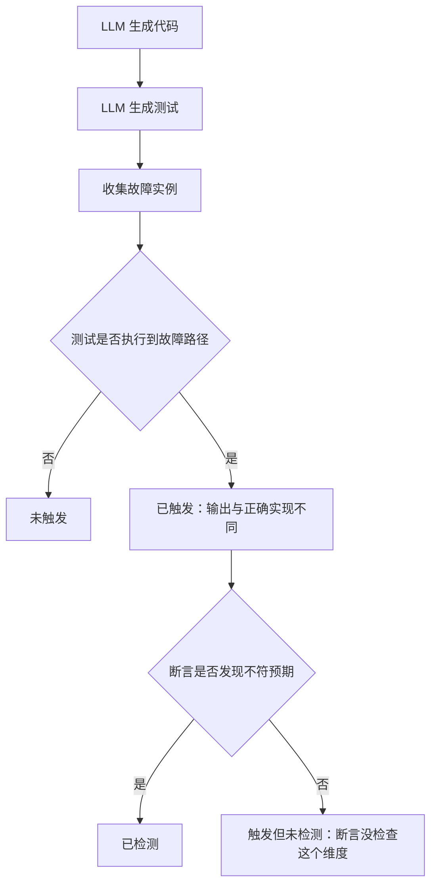

# 测试充分性准则对 LLM 代码的检出率

## 基本信息

| 项目 | 内容 |
|---|---|
| **论文标题** | How effective are traditional test criteria at detecting bugs in large language models generated code? |
| **arXiv** | [2609.09315](https://arxiv.org/abs/2609.09315) |
| **发表时间** | 2026-09 |
| **一句话总结** | 实测 6000 多个故障实例，发现语句与分支覆盖、变异测试对难故障的检出率常常接近零，根因在断言抓不住被触发的错误行为 |

## 置信度评估

| 维度 | 评估 |
|---|---|
| **方法可信度** | 高。给出故障触发与故障检测的形式化定义，两个概念分离得清楚 |
| **实验充分度** | 高。5 个模型、4 个基准、6000 多个故障实例，模拟代码与测试都自动生成的端到端流程 |
| **可复现性** | 高。基准公开，流程描述完整 |
| **对本项目的适用性** | 高。直接回答了「能不能用覆盖率判断测试质量」这个问题，并且给的是否定答案加具体理由 |

## 它解决了什么问题

测试充分性准则（test adequacy criteria）长期被用来评估和引导测试。常见的三个是语句覆盖、分支覆盖和变异测试。这套准则在人类编写的程序上经过充分检验，但 LLM 生成的代码有不同特点，准则是否仍然有效需要重新验证。

论文模拟的是**代码和测试都由 LLM 生成**的端到端流程，这正是本项目所处的场景。它把两个容易混淆的量分开定义：

- **故障触发**（fault trigger）：测试执行了受影响的那条路径，程序的输出与正确实现的输出不同
- **故障检测**（fault detection）：测试不仅触发了故障，而且**断言发现了输出不符预期**

这个区分是整篇论文的关键。测试可以触发错误行为却没有检测到，因为断言没有检查那个维度。

## 方法核心

理解这张图要抓住一点：**触发与检测之间隔着断言**。覆盖率衡量的是左边那一段，检出率还取决于右边那一段，而恰恰是右边这段出了问题。

### 数据规模

| 维度 | 数量 |
|---|---|
| 涉及的 LLM | 5 个 |
| 基准 | 4 个 |
| 故障程序实例 | 6,000 以上 |
| 评估的充分性准则 | 语句覆盖、分支覆盖、变异测试 |

### 四个主要发现

**多数 LLM 引入的故障容易被抓到**。这部分不构成挑战。

**难故障用传统准则很难触发**。无论基于覆盖率还是基于变异，这类故障都难以被测试执行到。提高覆盖率对此帮助有限。

**实际检出率常常接近零，根因在断言**。即使测试触发了错误行为，断言也常常抓不住，因为它检查的是别的维度。论文把这一点称为自动测试生成的关键局限。

**变异测试只比覆盖率略好，但成本高得多**。论文据此质疑在 LLM 代码场景下变异测试的额外成本是否划算。

### 规格引导的断言生成有所改善，但有限

论文测试了用自然语言规格引导断言生成，检出率有提升，但整体效果仍然有限。作者的建议是：断言需要人工推理，不能完全交给自动化。

## 局限与注意

- **基准以函数级任务为主**。结论对独立函数的适用性最强，复杂模块的情况需要另行验证
- **故障由工具注入或从真实代码收集**。注入式故障的分布可能与自然发生的故障不同
- **规格引导的效果依赖规格质量**。论文的规格由模型生成，质量参差是效果受限的原因之一
- **「检出率接近零」是特定组合下的结果**，不同的模型与基准组合会有波动，但量级上的结论稳定

## 对本项目的启发 ⭐

项目的评测流程里，测试是主判依据，编译必须通过。论文给出的结论直接影响「测试通过」这个信号能承载多少信任。

### 解决哪个环节的什么问题

**环节：测试集的充分性判断，以及 PASS 的含义。**

项目现在能判断测试是否全部通过，但没有判断这套测试本身是否充分。论文说明这两个问题不能互相替代。

### 方案要点

**① 区分「测试跑到过」与「测试检查到了」**

论文的两个概念对本项目直接可用。重建实现通过了测试，可能只是测试执行过了那些代码路径，并没有检查关键行为。项目在报告评测结果时可以把这两个层次分开，避免把「执行覆盖」当成「行为验证」。

**② 覆盖率不作为测试质量的判据**

论文的实测说明覆盖率与难故障的检出之间没有稳定关系。项目若要引入测试质量指标，覆盖率不是一个好的选择。

**③ 变异测试不值得在当前场景引入**

论文发现变异测试只比覆盖率略好，成本却高得多。对一个以 C/C++ 模块为对象、每轮都要编译运行的流程来说，额外成本的收益不成立。

**④ 断言的充分性需要另外的检查手段**

论文与 [断言信号](Agent测试代码断言信号.md) 那篇指向同一个结论：断言是瓶颈。可用的手段是检查断言的存在与强度，以及要求测试用例声明它检查的维度。

### 提供了什么思路

**① 把「触发」与「检测」分开定义的价值**

这两个概念分开之后，「测试通过」这个二值信号被拆成了两个可分别观测的量。项目在做评测报告时可以借鉴这种拆分方式：把笼统的失败拆成「没跑到」「跑到了但没检查」，归因会清楚很多。

**② 一个否定结论同样有指导价值**

论文的贡献之一是证明某条常规做法在这个场景下不成立。项目在选型时也需要这类结论，避免引入看似合理但没有实际收益的机制。

**③ 自动化有明确的边界**

论文明确说断言需要人工推理。这与项目把最终判定交给门禁与人工治理的设计一致。自动化可以覆盖生成、执行、证据收集，判断行为是否符合预期这一步仍有其边界。

### 需要注意的

- **别把「检出率接近零」理解为测试无用**。论文的对照是难故障，容易的故障仍然能被抓到。测试的价值在于过滤掉那部分，只是不能指望它覆盖全部
- **本项目的测试有参考校验这一层**。论文的流程里没有对应环节，项目的参考校验能排除一部分断言写错的情况，处境略好于论文的实验设置
- **结论建立在自动生成测试的前提上**。如果测试来源改变，结论需要重新评估

## 关联

- **对应环节**：`evaluation` 阶段的测试判定；测试充分性的评估
- **相关论文**：[Agent 测试代码的断言信号](Agent测试代码断言信号.md)：断言缺失的规模与分类
- **相关论文**：[buggy code 对单测生成的误导效应](BuggyCode误导单测生成.md)：断言存在但仍验证错误行为的情形
- **相关论文**：[LLM 测试断言生成的实证研究](LLM测试断言生成实证.md)：提示策略对断言质量的影响
