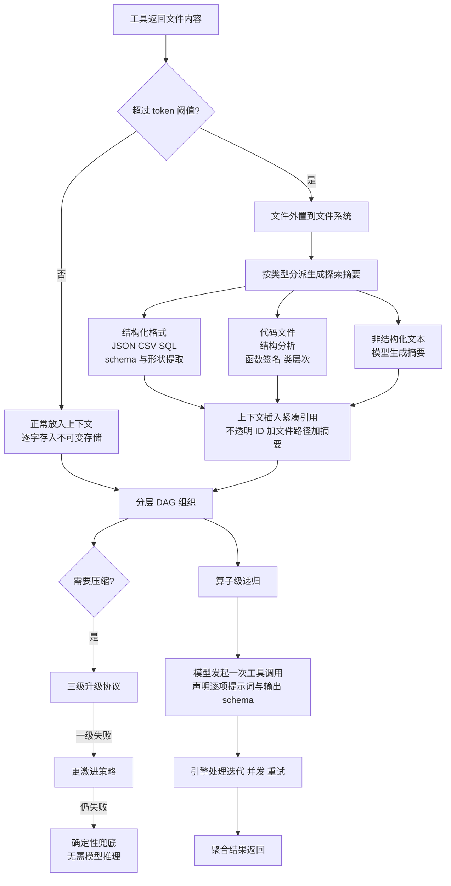

# LCM: Lossless Context Management

## 基本信息

| 项 | 内容 |
|---|---|
| 链接 | https://arxiv.org/abs/2605.04050 |
| 代码 | 未明确提供，集成系统代号 Volt |
| 作者 | 未明确标注机构 |
| 发布时间 | 2026-02-14 |
| 一句话总结 | 面向 agent 的确定性上下文管理架构，超大文件外置到文件系统、上下文只留引用与按类型生成的探索摘要，并把迭代逻辑从模型移到确定性引擎 |

## 置信度评估

| 维度 | 评估 |
|---|---|
| 发表场所 | 预印本，含完整数据模型与工具接口附录 |
| 引用影响 | 新近工作，2026-02 发布 |
| 代码可用 | 未明确提供，但附录给出了数据表结构与工具签名 |
| 来源机构 | 未明确标注 |
| 综合置信度 | 中高。架构描述细致、附录有 schema 与接口、基准对比有大跨度数据；但机构不明 |
| 需谨慎点 | 论文自认 OOLONG 基准存在**数据污染**问题，并专列一节讨论向抗污染评测的迁移。评测口径要打折看 |

## 它解决了什么问题

agentic 编码会话里，工具返回经常包含单个就接近或超过上下文上限的文件：一个大的日志、数据集或代码库转储一次就能吃掉整个窗口。

现有做法各有短板：把文件读进来会撑爆上下文；让模型自己写循环遍历切片（符号递归）虽然灵活，但要求模型每次执行都正确处理错误、并发与状态管理，在生产环境引入方差。

论文还点出一个具体失败模式：**压缩失败**，即模型被要求总结文本却产出比输入更长的输出。依赖模型生成控制流的架构必须处理这个场景。

## 方法核心

三个部件：分层 DAG 做记忆组织，阈值加类型分派做大文件处理，算子级递归做迭代。

### 关键设计一：阈值外置，代码文件做结构分析

设一个 token 阈值，低于阈值的文件正常放进上下文，**高于阈值的存到外部，上下文里只插入一个紧凑引用**：不透明 ID、文件路径、预计算的探索摘要。

探索摘要由**按文件类型分派的分析器**生成：

| 文件类型 | 处理方式 |
|---|---|
| 结构化格式（JSON / CSV / SQL） | schema 与形状提取 |
| **代码文件** | **结构分析，例如函数签名与类层次** |
| 非结构化文本 | 模型生成摘要 |

代码走结构分析这条路，是本篇对项目最直接有用的一条。它承认代码不该被当成普通文本去写摘要，而应该提取签名与层次这类结构信息。

### 关键设计二：文件内容只存在于文件系统

LCM 在不可变存储里只保存**文件的路径引用**，文件内容始终留在磁盘。论文给的理由是生产现实：会话中被操作的文件（日志、数据集、构建产物）可以达到几十 GB，复制不可行。

更进一步，论文把文件操作交还给文件系统工具。因为文件是异构的、有大量外部交互，用标准文件操作（读、grep、编辑）最合适，而这些工具 agent 本来就会。**LCM 只负责让模型始终知道有哪些文件存在。**

### 关键设计三：文件 ID 沿摘要 DAG 传播

当引用某个文件的消息被压缩时，产生的摘要节点**继承这些文件 ID**。这保证即使经过多轮压缩，模型仍然知道会话早期遇到过的文件并且能重新读取。

这一条解决的是「压缩后信息丢失」里最隐蔽的一类：不是内容丢了，而是**模型不知道自己曾经见过什么**。

### 关键设计四：算子级递归，把控制流移到确定性层

论文区分两条路：

- **符号递归**：让模型写循环（`for chunk in context: ...`）。灵活，但要求模型每次自己实现错误处理、并发与状态管理
- **算子级递归**：提供两个工具，`LLM-Map` 与 `Agentic-Map`。两者都对列表中每一项并行应用一个提示词。模型**只发起一次工具调用**，引擎处理全部迭代、并发与重试

`LLM-Map` 的接口形状：输入一个 JSONL 文件，对每一项发起独立的模型调用，引擎管理默认并发 16 的进程池，**用调用方提供的 JSON Schema 校验每个响应**，失败项带校验错误反馈重试。逐项调用没有工具、没有副作用，是纯粹的输入到结构化输出的函数。结果写入 JSONL 并注册到不可变存储。

论文对这一步的定性是：**把控制流逻辑从随机层移到确定性层**。一个工具调用可以处理任意多的输入，而模型从不需要管理循环或上下文窗口。

`Agentic-Map` 是重量版：为每一项启动完整的子 agent 会话，带文件 I/O 与代码执行工具，适合逐项处理需要多步推理或与环境交互的场景。

### 关键设计五：三级升级协议保证收敛

如果某一级摘要没能降低 token 数，系统自动升级到更激进的策略，最终落到**不需要模型推理的确定性兜底**。

这直接回应了「压缩失败」这个失败模式：不让模型的输出质量成为架构收敛的前提。

## 实验结果

在 OOLONG 任务上评测，上下文长度从 8K 到 1M：

- Volt（LCM 集成）平均绝对分 **74.8**，Claude Code 70.3，**领先 4.5 分**
- 相对原生 Opus 4.6 的提升：Volt 平均 +29.2 分，Claude Code +24.7 分
- **8K 与 16K 时两者相当**，Claude Code 在 8K 略占优（+13.1 对 +11.2）。此时完整输入能舒适放进窗口
- **从 32K 起 Volt 在每个长度上都领先**，差距随长度扩大：256K 时领先 10.0 分，512K 时 12.6 分，1M 时 4.3 分
- 原生 Opus 4.6 不带任何 agent 脚手架在 65K 以上急剧退化，在最大长度上跌破 20 分

论文对结果的分析给出两个性能区间，这段比数字本身有价值：

- **32K 以下**：确定性机制相对原生文件系统访问没有优势。两者都能把完整输入放进上下文，任务退化为普通推理。LCM 在这里不亏分，但也不得分
- **32K 以上**：两者策略根本不同。Claude Code 依赖模型自己想出并执行分块策略（通常是线性读文件或写 Bash 脚本切分处理），灵活但引入两个错误来源：模型必须在每次 rollout 都正确实现分块逻辑，而且必须在自己的上下文里跨块维持一致状态
- Volt 则把迭代与聚合交给 `LLM-Map`，**在模型上下文之外并行处理**。模型从不看见原始数据，只指定逐项提示词与输出 schema。这消除了聚合任务中「上下文饱和」这个失败模式

论文由此解释为什么 Volt 的准确率在最大长度上仍然稳定甚至上升：数据更多提供了更多信号，而没有给模型增加认知负荷。

## 局限与注意

- **OOLONG 存在数据污染**，论文专列一节承认并讨论向抗污染评测的迁移。这意味着绝对分数要打折
- 场景是**会话内工具返回**的上下文管理，不是「一次读透一个模块生成文档」。它的预算是按会话累积算的，本项目是按单次任务算的
- 评测任务是聚合类（OOLONG 的长文本问答），**不是文档生成**。算子级递归在「需要跨切片推理」的任务上是否同样有效，论文没有验证
- 阈值、并发数（16）等参数是在其场景下调的，换场景需要重测
- 未提供代码，集成细节依赖附录描述
- 「Lossless」指的是**消息**逐字存储不是无损压缩。文件走的是摘要加引用，那部分是有损的

## 对我们项目的启发 ⭐

### 解决哪个环节的什么问题

直接对应 DocGen 第 83 行的缺口原文：「业务分组、上下文预算及跨模块依赖处理尚未实现」，其中「上下文预算」与「保存中间摘要」这两项，本篇给的是完整机制。也对应 TestGen 的源码与公开接口读取。

项目现状是把去重后的文件列表**均分**给 0 到 5 个 Worker、汇总一次成文。这套机制的三个具体缺陷，本篇都有对应解法：均分不管内容多少与依赖关系；Worker 各自分析完只靠一次汇总；汇总的输入规模不受控。

### 方案要点

给 DocGen 的读取加一层「阈值加类型分派」：模块的源码里，小文件直接读，大文件外置并生成结构摘要。摘要的生成方式按文件类型分派，**代码文件提取签名与层次结构，而不是写一段自然语言概述**。上下文里保留的是文件引用，需要细节时按引用重读。

把 Worker 的遍历从模型里拿出来。现在 Worker 是各自读自己那份文件列表然后分析，模型在执行控制流。改成模型声明「对这些切片做这个分析、输出这个结构」，由执行端负责遍历、并发、失败重试与聚合。这样 Worker 数量、切片数量都不再受上下文限制。

为「跨轮次」补文件 ID 的传播。上一轮 Worker 读过哪些源码，压缩成摘要后应当仍然保留这些引用，否则下一轮修订时会丢掉「这份文档依据了哪些分析」。

### 提供了什么思路

「模型从不看见原始数据」这个设计立场值得单独记住。它把问题从「怎么在上下文里塞更多」翻转成「怎么让模型不必看见」。

对本项目的含义：三十万行代码不需要全部经过模型。需要经过模型的是**结构摘要与判断**，原文可以留在文件系统里被引用、被回查、被验证。TestGen 的 `sourceEvidence` 已经限定为精确文件路径，这个设计天然适合配合引用式的读取。

三级升级协议也值得借：如果某级压缩没达到效果，不该让流程卡住，而应该自动升级到更激进的策略，最后有一个不依赖模型的兜底。项目的门禁已经有类似的分支结构。

### 需要注意的

**这套机制解决上下文预算，不解决信息损耗。** 探索摘要是模型或规则生成的，它的保真度上限就是摘要器的能力上限。项目要的不只是「装得下」，还有「装下的内容足以重建实现」，后者本篇没有评测。

阈值外置与项目的「按代码单元迭代」设计需要对齐。项目是按函数或模块单元独立评估、独立过门禁，那么阈值应该按单元算而不是按会话算。

并发与 Schema 校验是执行端的新增能力。`LLM-Map` 的接口要求调用方提供 JSON Schema 并保证逐项校验与重试，这部分项目需要实现在执行端。好消息是 TestGen 已经有「适配器的有限 Schema 修复」这类基础设施。

评测口径要打折：OOLONG 有数据污染，绝对分数不可直接引用，机制层面的结论更可靠。

## 关联

- 对应环节：`doc_gen` 的源码分析与分批汇总（IO-07 / IO-08 / IO-09 / IO-10）、`test_gen` 的源码读取
- 对应缺口：DocGen 自认「上下文预算及跨模块依赖处理尚未实现……仍是待论文调研的方案」
- 相关论文：cAST `2506.15655`（怎么切分，与本篇的读取方式互补）、Is Progressive Disclosure All You Need `2607.17598`（披露层级该做几层）、Agent4cs `2607.01425`（层级汇总与关键词桥接）、Correctness-Aware Repository Filtering `2605.14362`（先扔掉什么）、Maximum Effective Context Window `2509.21361`（预算按什么算）
- 本项目代码路径与验收命令：
  - `docs/specs/domainFunction/agents/docGenAgent/DocGenAgent.md`：第 31 行现状与第 83 行缺口
  - `docs/specs/domainFunction/agents/testGenAgent/TestGenAgent.md`：`sourceEvidence` 限定为精确文件路径
  - `tests/integration/DocGenSubAgents.test.ts`：Worker 批次、失败与复用
