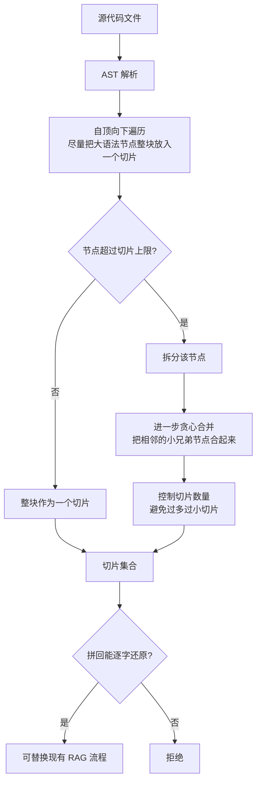

# cAST: Enhancing Code Retrieval-Augmented Generation with Structural Chunking via Abstract Syntax Tree

## 基本信息

| 项 | 内容 |
|---|---|
| 链接 | https://arxiv.org/abs/2506.15655 |
| 代码 | 未明确提供 |
| 作者 | 未明确标注机构 |
| 发布时间 | 2025-06-18 |
| 一句话总结 | 用抽象语法树做递归切分，先尽量整块保留大语法节点、必要时才拆、拆完贪心合并，做到切片拼回可逐字还原原文件 |

## 置信度评估

| 维度 | 评估 |
|---|---|
| 发表场所 | 预印本，含检索与生成两组实验加四组消融 |
| 引用影响 | 代码 RAG 切片这个细分方向的代表性工作 |
| 代码可用 | 未明确提供，算法有伪代码描述 |
| 来源机构 | 未明确标注 |
| 综合置信度 | 中高。四个设计目标清晰可判、消融充分（含合并必要性、上下文长度选择、最大切片大小选择） |
| 需谨慎点 | 下游任务是代码补全与检索，不是知识文档生成；「可还原」是格式层的性质，不等于语义无损耗 |

## 它解决了什么问题

代码检索增强生成里，切片是一个被忽视的环节。常见的固定长度切分会把语法单元从中间切断：一个函数被腰斩成两半、一个类的字段和方法分到不同片。

被切断的后果不只是不好看：**AST 被破坏后，切片里的代码在语法上就不完整**，模型据此推理会得到错误结论，检索时也无法判断这个片段的边界含义。

论文还对比了已有做法：固定长度切分简单但破坏结构；按行切分同样会切断语法单元；按函数切分粒度太粗，长函数会超限，而且会丢掉函数之间的上下文。

## 方法核心

四个设计目标定得非常清楚，值得逐条记：

1. **语法完整性**：只要可能，切片边界就对齐完整的语法单元，而不是把它切开
2. **高信息密度**：每个切片填到固定大小预算，但不超过预算
3. **语言无关**：算法不使用任何特定语言的启发式规则，因此能在不同语言与任务上原样工作
4. **即插即用**：**把所有切片拼起来必须能逐字还原原文件**，从而能在现有 RAG 流程里直接替换

### 关键设计一：先整体后拆分，不是自底向上合并

论文的算法是**自顶向下**遍历树，尽量把大的 AST 节点整块放进一个切片。只有必须拆的节点（超过切片大小上限）才拆。这个顺序很重要：自顶向下意味着优先保留大的语义单元，而不是先切成小块再往上拼。

### 关键设计二：拆完要贪心合并

拆分会产生过多的小切片。论文在拆分之后加一步**贪心合并**：把相邻的小兄弟节点合起来，最大化每个切片的信息密度。消融实验专门验证了这一步的必要性。

这个细节容易被忽略但很实用：只做拆分不做合并，结果是切片数量爆炸、每片都太小，检索时反而更难用。

### 关键设计三：可还原性是硬约束

第四个设计目标把「可还原」写成硬性要求。这带来两个好处：一是切分过程本身可验证（拼不回就是实现错了）；二是可以在现有流程里无缝替换固定长度切分。

对「怎么保证信息不丢」这个问题，这是最直接的一个答案：**让切分过程可逆**。压缩步骤不引入模型、不产生幻觉、丢了什么一测便知。

## 实验结果

- 在检索与生成两组任务上评测，切片策略改进带来一致的收益
- 消融实验覆盖四项：合并步骤的必要性、上下文长度的选择、最大切片大小的选择、以及整体设计
- 论文报告了检索性能与生成性能的相关性，说明检索侧改进能传导到生成侧

（具体数值论文正文以表格给出，这里不逐项抄录，重点是机制与设计目标。）

## 局限与注意

- **下游任务是代码补全与检索，不是知识文档生成。** 本项目要的不是「检索到相关片段」，而是「基于片段写出解释型文档」，后者的信息需求不同
- **「可还原」是格式层性质，不等于语义无损耗。** 切片拼回能还原，但模型每次只看一片，跨片的语义关系（比如 A 函数调 B 函数、共享的全局状态）仍然看不见
- 算法声称语言无关，但**AST 解析器本身是语言相关的**。项目要覆盖 C/C++ 与 TypeScript，需要两套解析器，而 C/C++ 的宏与条件编译会让 AST 解析变得困难
- 切片大小上限的选择在消融里做了，但没有给出「该按什么原则定」的一般答案，需要按场景重测
- 未提供代码

## 对我们项目的启发 ⭐

### 解决哪个环节的什么问题

对应 DocGen 的 Worker 切片环节。现状是「按去重后的文件列表均分」，即以**文件**为最小单位分配。这带来两个问题：单个大文件会压垮一个 Worker，而多个小文件分到一个 Worker 又浪费预算。

用 AST 切分后，分配单位从文件变成语法单元，就可以按**内容量与语法完整性**分配，而不是按文件个数均分。

也对应 TestGen 的取证要求：`sourceEvidence` 必须限定为精确文件路径，切片边界如果与语法单元对齐，取证时可以精确到函数级而不是文件级。

### 方案要点

把切片单位从文件改成语法单元。每个切片记录三件事：所属文件路径、在文件内的起止位置、对应的语法节点类型。这组信息既是分配依据，也是后续取证的依据。

切片边界优先对齐完整语法单元，只有单个语法单元超过预算时才拆，拆完把相邻的小单元合并以控制切片数量。**保持拼回可还原**，作为实现正确性的自检条件。

跨切片的依赖关系单独处理，不指望靠切片解决。切片保证的是「每一片内部语法完整」，跨片的调用关系需要另一层机制（见本目录 README 的 Option C）。

### 提供了什么思路

「可还原」这个约束可以直接搬来做项目的自检。项目的切片最终是要喂给模型生成知识文档，而知识文档不能包含源码原文。那么切分过程可以在流水线内部保持可还原，同时用可还原性验证切分器没有丢内容。这是一个纯程序化的检查，不需要模型参与。

另一个值得借的思路是**把切分质量与下游效果分开度量**。切片好不好，可以先在检索层测（找到的片段是否正确、完整），不必每次都跑到文档生成。这能大幅降低调参成本。

### 需要注意的

**语法完整不等于语义完整。** 这个区别是本项目最大的风险点。一个函数在语法上是完整的切片，但它的行为取决于调用它的上下文、它依赖的全局状态、它遵守的接口约定。切片切得再好，这些关系也在切片之外。

所以切片方案必须与依赖图方案配合使用，不能单独上线。README 里把依赖图路线（Option C）放在切片之后实现，原因就是切片本身不解决跨模块问题。

C/C++ 的解析成本要提前评估。宏展开与条件编译会让同一份源码在不同编译配置下产生不同的 AST。项目如果只做静态解析，需要在文档里说明这是哪个配置下的结构。

知识文档不得包含源码原文这条项目纪律仍然适用。切片是流水线内部的中间表示，不是最终文档内容。

## 关联

- 对应环节：`doc_gen` 的 Worker 切片与分配（IO-09）、`test_gen` 的取证粒度
- 对应缺口：DocGen 自认「业务分组……尚未实现」以及「当前文件均分……不算这些目标完成」
- 相关论文：LCM `2605.04050`（切片之后怎么读、怎么按需展开）、Partial Dependency Graph `2608.01927`（跨片依赖怎么取）、How Does Chunking Affect Code Completion `2605.04763`（切片策略的受控实证）、Hierarchical Context Pruning `2406.18294`
- 本项目代码路径与验收命令：
  - `docs/specs/domainFunction/agents/docGenAgent/DocGenAgent.md`：第 31 行 Worker 均分现状、第 83 行缺口
  - `docs/specs/domainFunction/agents/testGenAgent/TestGenAgent.md`：`sourceEvidence` 的路径限定规则
  - `tests/integration/DocGenSubAgents.test.ts`：Worker 批次与片段交接的回归
