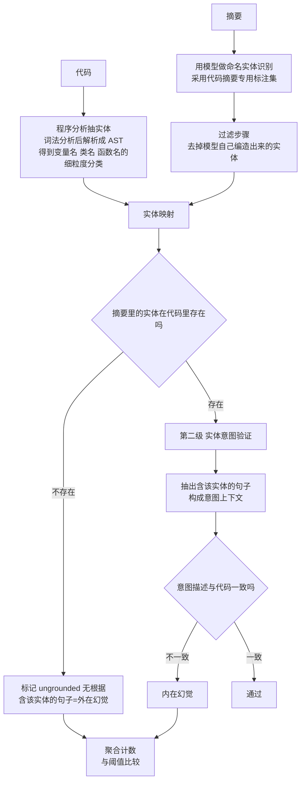

# ETF: An Entity Tracing Framework for Hallucination Detection in Code Summaries

## 基本信息

| 项 | 内容 |
|---|---|
| 链接 | https://arxiv.org/abs/2410.14748 |
| 代码 | 未明确提供，含自建数据集 CodeSumEval |
| 作者 | 未明确标注机构 |
| 发布时间 | 2024-10-17 |
| 一句话总结 | 通过追踪实体与其意图来检测代码摘要里的幻觉，分实体验证与意图验证两级，并把幻觉原因整理成分类学 |

## 置信度评估

| 维度 | 评估 |
|---|---|
| 发表场所 | 预印本，含自建数据集、幻觉因素分类学、命名实体识别的人工对照 |
| 引用影响 | 代码摘要幻觉检测方向的代表性工作，被后续工作引用 |
| 代码可用 | 未明确提供，但数据集与提示词在附录 |
| 来源机构 | 未明确标注 |
| 综合置信度 | 中高。判据两级递进且规则化，幻觉分类学有实用性，主动报告了few-shot 提示失败这类负面结果 |
| 需谨慎点 | 只做**检测**不做损耗率测量；判据只覆盖**实体类**错误，抓不到「源码里有但文档没说」这类遗漏 |

## 它解决了什么问题

代码摘要的幻觉指生成文本**错误地表达了代码**。论文指出这类问题的现实压力来自 LLM 代码文档工具的广泛使用（Amazon Q Developer、IBM Watsonx Code Assistant 都在此类），所以检测代码相关输出的幻觉对可靠性是关键。

难点在于模型倾向于产出**有说服力但不准确**的摘要。

论文给了一个很有说服力的例子：一个方法 `getJobID()` 接受 `jobName` 参数并简单地返回 `-1`，而生成的摘要详细描述了「如何连接数据库、尝试用给定的 jobName 检索 jobID、并把 jobStatus 存进变量」。**摘要依赖的实体在代码里根本没有对应，模型是靠方法名幻觉出一个看似合理的说明。**

第二个例子是跨语言混淆：一个 Java 方法创建 16 位整数列，而摘要引入了**不存在的 `int16` 数据类型**并继续讨论后续逻辑。`int16` 在 C、C++、C#、Go 里都合法，模型是把其他语言的记忆迁移了过来。论文还指出多个模型（Llama、Granite）**都未能检测出这个幻觉**。

## 方法核心

两级递进：先查实体在不在，再查意图对不对。

### 第一级：实体验证

从**两侧**分别抽实体，然后映射：

- **代码侧**用程序分析：代码先被词法分析，再解析成抽象语法树，得到所有 token 的细粒度分类（变量名、类名、函数名等）
- **文档侧**用命名实体识别，采用代码摘要专用的标注集

因为让模型做 NER 本身有幻觉风险（可能编造出摘要里不存在的实体），论文加了一个**过滤步骤**去掉这类编造实体。

映射后找出**只出现在摘要里、不在代码里**的实体，这类叫 **ungrounded（无根据）**，包含这些实体的句子标为外在幻觉。

### 第二级：实体意图验证

实体存在**不代表**描述正确。论文的例子：`jobId` 是正确的实体，但「从数据库检索 jobID」这个上下文是错的。

做法是抽出摘要里包含目标实体的句子构成该实体的**意图上下文**，然后验证意图与代码是否一致。

意图识别试过两种方法，结果值得记：

- **基于提示词**的方法
- **字符串匹配启发式**

论文的定性评估显示**规则启发式既更有效也更高效**，而基于提示词的方法**容易产生幻觉**。所以最终采用字符串匹配启发式。

随后的意图正确性验证用零样本提示让模型对比代码。论文也试过 few-shot（把各种幻觉类型的例子连同样例代码放进提示），结果是**性能反而下降，原因是提示变长**，这与近期其他工作的发现一致。

### 阈值怎么定

论文的阈值不是从技术指标倒推的，而是来自人工标注：当平均有 **1.33 个实体的意图被错误描述**时，人工标注者把摘要评为「一般」或「差」，于是把阈值定为 1。

这个做法值得单独记：**判据阈值应当来自人工作为参照的标注。**

## 实验结果

- 建立了 CodeSumEval 数据集
- 整理了幻觉因素的分类学，把常见成因分类映射
- 命名实体识别部分做了人工对照：模型预测与人工数据强相关，确认其可用于该框架的实体检测
- 做了定量分析、分类学分析与预测性分析、错误分析

（论文的具体检测指标数值在正文表格，本目录关注的是判据的构造方式。）

## 局限与注意

- **只做检测，不做损耗率测量**。它能判断「这份摘要有没有幻觉」，但不能回答「压缩掉了多少信息」。要得到损耗率还需要一个基准与多个压缩档位的对比
- **只覆盖实体类错误**。判据是「摘要提到了源码里没有的实体」和「实体的意图描述错了」。它抓不到**遗漏**：源码里明确存在的东西文档没写。而本项目最关心的恰恰是遗漏，因为知识文档刻意不包含源码全文，信息的损失主要形式是没写而不是编错
- **依赖程序分析抽实体**，C/C++ 的宏与条件编译会让这一步变复杂
- 意图验证仍然用模型（虽然意图识别用了规则），所以仍有判官偏差
- 未提供代码
- 论文是 2024 年，不在本轮调研偏好的 2025 年后区间。收录理由是它是这一方向里判据最具体、最可复现的一篇

## 对我们项目的启发 ⭐

### 解决哪个环节的什么问题

这是「信息损耗测量」方案里**轴二（依据保持）的判据来源**。它也直接对应项目的一条硬要求：知识文档不得包含源码原文，所以文档里的每个技术实体都必须能在源码里找到对应。

### 方案要点

**把「依据」判据做成两级，程序化优先。**

第一级做实体映射：从源码侧用程序分析抽实体（抽完能得到变量名、类名、函数名的分类），从文档侧抽实体，然后找**只在文档里存在**的那些。这一步完全规则化、不需要模型、成本低，可以每次都跑。

第二级做意图验证：实体存在但描述可能错。抽出包含该实体的句子，判断它讲述的行为与源码是否一致。

**意图识别用规则，不要用提示词。** 论文的实测是提示词方法更容易产生幻觉，字符串匹配启发式既更有效也更高效。这一条可以直接照搬到项目：找出描述某个实体的句子，用规则匹配比让模型去找更可靠。

**意图验证的提示词用零样本，不要堆 few-shot 例子。** 论文明确报告 few-shot 让性能下降，原因就是提示变长。这与本目录其他论文的结论一致（上下文越长越不可靠）。

**阈值从人工标注来。** 项目要定「多少个错误实体算文档不合格」，应当先看几个人工评过的一般或差的文档里平均有多少这类错误，据此定阈值，而不是从相似度指标倒推。

### 提供了什么思路

**跨语言实体混淆对项目是高概率风险。** 论文那个 `int16` 的例子（在 C/C++/C#/Go 里合法但 Java 里不存在）说明模型的错误来源是跨语言记忆迁移。项目的技术栈是 **TypeScript 与 C/C++ 并存**，这两者共享大量相似但不相同的类型与 API 概念。实体映射这一级能直接抓出这类错误。

**判据可以完全程序化，不依赖模型。** 第一级只要求实体抽取加集合差集，是纯规则计算。这意味着它可以做成一个不花模型调用、可进 CI 的检查。对项目尤其有价值，因为项目的模型约束是本地部署的 GLM 5.1，省调用就是省钱。

**「有说服力但不准确」是这类系统的主要风险形态。** 论文的两个例子都说明错误摘要读起来完全合理。这支持项目把「依据」作为独立轴来测，因为结果判据（重建相似度）对这种错误不敏感。

### 需要注意的

**判据的方向是反的：ETF 抓「编造」，项目最需要抓「遗漏」。** 这个区别必须在实现时补上。ETF 的假设是摘要应该覆盖代码的意图，所以多说了不该说的算错。而项目要求知识文档**刻意不带源码全文**，所以缩略是设计的一部分，不能一概算错。项目需要的判据是「**关键信息**有没有漏」，关键的定义应当来自源码结构（公开接口、边界条件、错误路径）而不是篇幅比例。

**实体验证的粒度要按项目需要调整。** 论文处理的是单个函数的摘要，实体抽取的粒度是变量名与函数名。项目的知识文档是模块级的，需要处理跨函数的实体与关系，抽取范围要扩大。

**与项目已有的溯源设计合并，不要另建一套。** 项目已经要求每段知识标注对应源码位置。实体映射本质上是溯源关系的一种，「文档里的实体能否在标注的源码位置找到」可以直接复用已有的溯源链来回答，不必从零搭抽取器。

## 关联

- 对应环节：`doc_gen` 的知识依据检查、`check` 阶段的比较判据、`evaluation` 的判据扩展
- 对应缺口：DocGen 自认「源码分析是否完整、矛盾是否解决及文档是否足以重建真实业务，仍需真实模型和业务场景验收」；本目录「信息损耗测量」的判据缺口
- 相关论文：[信息损耗测量方案](README.md)、Does Accuracy Equal Evidence `2608.01631`（为什么需要独立的依据轴）、SONAR `2608.04195`（另一条用重建做判据的路线）、Entity-level Factual Consistency `2102.09130`（实体级事实一致性）、HalluEntity `2502.11948`（实体级幻觉检测基准）
- 本项目代码路径与验收命令：
  - `docs/specs/domainFunction/agents/docGenAgent/DocGenAgent.md`：素材约束与来源要求
  - `docs/specs/domainFunction/knowledge/Knowledge.md`：源追溯与索引设计
  - `docs/specs/domainFunction/agents/checkAgent/CheckAgent.md`：比较判据的现有边界
