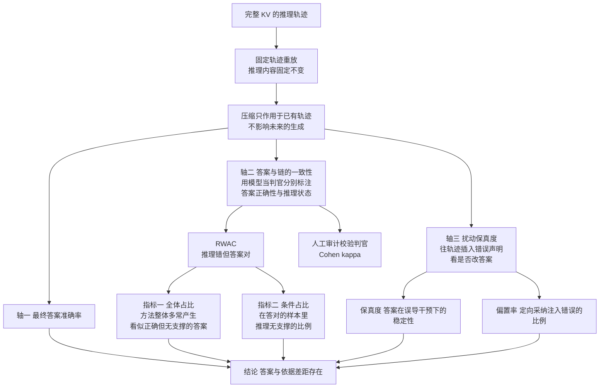

# Does Accuracy Equal Evidence? Reasoning Faithfulness under KV Cache Compression

## 基本信息

| 项 | 内容 |
|---|---|
| 链接 | https://arxiv.org/abs/2608.01631 |
| 代码 | 论文声明代码已公开（链接在摘要内） |
| 作者 | 未明确标注机构 |
| 发布时间 | 2026-08-03 |
| 一句话总结 | 证明压缩下「答案正确」与「支撑答案的依据仍然有效」可以以不同速率保持，并把这一现象命名为答案与依据的差距 |

## 置信度评估

| 维度 | 评估 |
|---|---|
| 发表场所 | 预印本，覆盖 10 种逐出式压缩方法加 1 种量化方法、3 个模型、4 类任务 |
| 引用影响 | 新近工作，2026-08 发布 |
| 代码可用 | 论文声明已公开 |
| 来源机构 | 未明确标注 |
| 综合置信度 | 高。方法学完整（固定轨迹重放隔离变量、三个人工校验的评判一致性、含端到端与重放的对照）、结论有反直觉价值、**主动区分了主证据与部署相关性检查** |
| 需谨慎点 | 对象是 KV 缓存的 token 逐出，不是文本摘要压缩。机制不同，但测量方法可迁移 |

## 它解决了什么问题

KV 缓存压缩通常用**最终答案准确率**来评测，这隐含一个假设：保住答案就保住了支撑答案的推理。

论文检验这个假设，发现它会失效：在压缩下，**正确答案与它们可见支撑理由的有效性，可以以不同的速率被保持**。

论文把这种现象命名为 **answer-evidence gap（答案与依据的差距）**。

## 方法核心

三个部件：固定轨迹重放隔离变量，三个测量轴互补，一个人工校验保证判据可信。

### 关键设计一：固定轨迹重放

这是方法学上最重要的一步。论文**把推理内容固定住**，只让压缩作用于已经存在的轨迹。这样测出来的差异可以归因到压缩本身，而不是归因到「这次生成的轨迹恰好更难」。

论文明确说明为什么主证据用重放而不是端到端：端到端生成**同时改变轨迹构造、轨迹长度、中间错误与 KV 保留**，所以它是「部署相关性的检查」，不是「定位保留失败的依据」。

### 关键设计二：RWAC 与两个分母

论文用模型当判官**分别**标注最终正确性与推理状态。定义一个关键类别：

**RWAC（Reasoning Wrong Answer Correct，推理错但答案对）**：最终答案正确，但推理不完全正确。

推理被判为不完全正确的情形包括：用了错误的设定、应用了无效的公式或定理、做了无支撑的代数或逻辑跳跃、与自己的最终答案矛盾、或者干脆无理由地幻觉出答案。

基于这个类别给出两个指标：

- **全体占比**：衡量**基准层面的普遍性**，即一个方法在整体上多常产生看起来正确但无支撑的答案
- **条件占比**：衡量**条件可靠性**，即在那些能过最终答案判据的样本里，推理无支撑的比例

论文专门解释了为什么要两个都给：**第一个指标低可能只是因为准确率低，而第二个才真正检验「结果为正的输出是否有效」。**

这个论证值得完整抄下来。它说明「百分之多少的答案是对的」和「在对的答案里有多少是侥幸的」是两个不同的问题，而后者才是可靠性判断需要的。

### 关键设计三：扰动保真度

前两个轴评估的是**静态输出**。第三个轴测的是压缩后的状态是否仍然对无支撑的中间声明**鲁棒**：往共享的推理轨迹里插入一个错误的答案，看模型会不会改自己的最终答案或者采纳这个错误。

插入位置有三处：**开始**（紧跟问题之后）、**中间**（长轨迹的中点）、**结束**（模型转向最终答案之前）。

两个指标：

- **保真度**：答案在误导性干预下的稳定性
- **偏置率**：定向采纳注入错误的比例

论文对这一步的定位很克制：因为扰动是一个明确的答案式声明，这个指标是「对无支撑推理内容鲁棒性的受控探针」，**不是完整的对抗鲁棒性基准**。这种不过度声张的说法值得学。

### 关键设计四：判据本身被人工作为参照校验

论文用一个独立的人工审计者按同样的二元推理判据标注，计算 Cohen kappa。400 个分层样本上，人与模型的 kappa 在 0.8 左右；换一个模型当判官，模型间一致性 0.7 到 0.8，人与该模型的一致性 0.7 上下；第二个人工标注 50 个样本，标注者间一致性也在这个区间。

判据可信度被显式量化，这是判据能用的前提。

## 实验结果

- 在数学推理、科学问答、临床计算、长上下文检索四类任务上，**逐出式方法可以保持有竞争力的最终答案准确率，同时显著降低链支撑或扰动保真度**
- **覆盖率保持型的量化对照受影响小得多**。论文由此推断：这个失败**与 KV 内存的减少本身关系不大，而更在于「失去了对推理轨迹某些部分的访问」**
- 端到端（部署式）压缩生成同样脆弱：即使给更大的预算，压缩的端到端运行在最终准确率与扰动保真度上仍远低于完整基线
- 论文区分了两类设置的失效性质：重放设置里所有方法看到同样的推理内容，所以 RWAC 直接探测「压缩表示是否保留了支撑已有轨迹的依据」；端到端设置里压缩会**先改变轨迹**，所以有些方法 RWAC 低不是因为正确答案可靠，而是**只有少量正确答案存活下来**

最后这条区分很重要：同一个指标在两种设置下的含义不同，不能混着解读。

### 第四问：加预算能不能消除差距

结论是不能：

> 更大的预算通常能改善压缩模型的准确率，但答案与链的一致性、扰动保真度仍然存在很大差距。**准确率是第一个恢复的指标。**
>
> 更大的预算可以在消除答案与依据差距之前先改善最终答案。它能恢复足够的信息去回答，有时也足够给出一个看起来合理的解释，**但仍然无法保留稳健推理所需的依赖与验证结构。**

瓶颈还因任务而异：在数学推理上持续瓶颈是链的有效性（证明证据分散在许多中间状态里，更大的预算改善保真度但逐步推导仍然困难）；在科学问答与临床计算上显式依据恢复得更容易，但扰动保真度始终低于基线，即**模型能给出看似合理的理由，却仍然容易被一个误导性注入带偏**。

论文提出对该任务类型的一个解释：如果任务不需要一段长的、需要被审计的中间推导（例如指令遵循类任务，只看是否满足格式、长度、内容等表面约束），那么 RWAC 类失效的空间就小。论文据此说明**答案与依据的差距不是所有任务上的普遍退化模式，它在任务需要保留长证据链时最明显**。

## 局限与注意

- **对象是 KV 缓存的 token 逐出与量化，不是文本摘要压缩**。机制不同：前者是注意力状态的选择性保留，后者是内容的删减或改写。测量方法可迁移，具体结论需要重新验证
- 论文自己把端到端结果定位为「部署相关性检查而非主证据」，引用它的端到端数字时要保持这个层级
- 判据依赖模型当判官，虽然做了人工校验，但仍有判官偏差的风险
- 「扰动」是人为构造的错误声明，与真实的压缩损伤形态不完全一致
- 任务都是推理类（数学、科学、临床、检索），**没有代码或文档生成任务**

## 对我们项目的启发 ⭐

### 解决哪个环节的什么问题

这是本目录「信息损耗测量」方案的**方法学核心**。对应 DocGen 的读取压缩策略选型环节，以及 `evaluation` 的判据扩展。

项目现在的处境与本篇的前提完全对应：门禁测的是「结果」（重建相似度是否 ≥ 80%），隐含假设是「过了门禁就说明知识文档的信息保住了」。本篇证明了**这个假设会失效**：结果与依据可以以不同速率保持。

### 方案要点

**加一个「依据」轴，与结果轴分开测。** 项目的版本是「门禁通过但知识文档其实有依据问题」的文档比例。这个数字现在没有，而它回答的是「门禁表现有多好是靠下游模型补全能力撑着的」。

用论文的两个分母结构：一个是**全体占比**（有多普遍），一个是**条件占比**（在通过门禁的文档里占多少）。**第二个才是关键**，因为门禁通过率本身可以被低质量的文档拉低而掩盖问题。

**用固定轨迹重放隔离压缩的贡献。** 先做一份不压缩的基准知识文档，然后把它按不同压缩策略降级，再测重建相似度的变化。差异归因到压缩策略，而不是归因到「这次 DocGen 恰好写得好」。

**把扰动做成一个探针。** 往知识文档注入一处明确的错误陈述，看重建结果是否沿用。这一步测的是**知识文档的实际权威性**：如果下游跟着错，说明文档确实在指导实现；如果下游不受影响，可能意味着重建其实是靠模型自身知识完成的，文档的作用被高估了。

### 提供了什么思路

**「加预算是第一个恢复结果指标、最后恢复依据指标」这一条要写进项目的调参纪律。** 遇到知识质量不足时，最自然的反应是给模型更多源码。本篇说明这个反应会先让门禁通过率上升，而依据的完整性可能仍然很差。两个指标必须分开看，否则会被先恢复的那个骗过去。

**「条件可靠性」这个指标形状可以推广。** 项目里凡是有「通过与否」的地方，都可以问一句「通过的里面有多少是侥幸的」。比如 `maxTestRepairs` 默认 1：修复后通过的测试，有多少是真的修正了断言而不是把断言放宽到能过？这个问题的答案同样能揭示门禁的可信度边界。

**覆盖率保持型的量化对照受影响小**这个发现也有含义：损伤的来源不是「空间变小」，而是「丢掉了某些内容」。所以压缩策略的选择标准应该是**保住哪一部分**，而不只是压掉多少。这支持本目录其他论文的同一立场：按信息价值分层，不按体积分层。

### 需要注意的

**本篇证明问题存在，不给解法。** 它测出了答案与依据的差距，但没有提出如何避免。所以它对本项目的价值在于**建立测量的必要性**，具体压缩机制仍要从前面的六条路线里选。

「不是所有任务上都有这个差距」这一条对本项目是好消息：项目的下游是「重建实现」，这是一个需要长证据链的任务（必须覆盖接口、边界、调用关系），所以差距应该明显，**测得出来**。但反过来说，这意味着项目的任务属于风险较高的那一类。

**扰动注入与项目的知识文档纪律需要协调。** 知识文档禁止包含源码原文，注入的错误陈述必须符合文档的表达形式，否则模型可能因为它明显异常而忽略它，测出来的保真度会虚高。

## 关联

- 对应环节：`doc_gen` 压缩策略选型、`evaluation` 判据扩展、`candidate_knowledge` 质量记录
- 对应缺口：本目录 README 的「研究缺口」；DocGen 自认「上下文预算……仍是待论文调研的方案」
- 相关论文：[信息损耗测量方案](README.md)（本篇是它的方法学核心）、ETF `2410.14748`（依据判据怎么做）、SONAR `2608.04195`（代理指标与下游有用性的相关性）、[LCM](../LCM无损上下文管理.md)（压缩机制一侧）
- 本项目代码路径与验收命令：
  - `docs/specs/domainFunction/evaluation/Evaluation.md`：门禁只看结果判据，且明确「相似度只用于归因」
  - `docs/specs/domainFunction/agents/docGenAgent/DocGenAgent.md`：第 83 行缺口
  - `docs/specs/schemas/KnowledgeLineage.schema.json`：`qualityScore` 与 `qualityOutcome` 的并列位置
