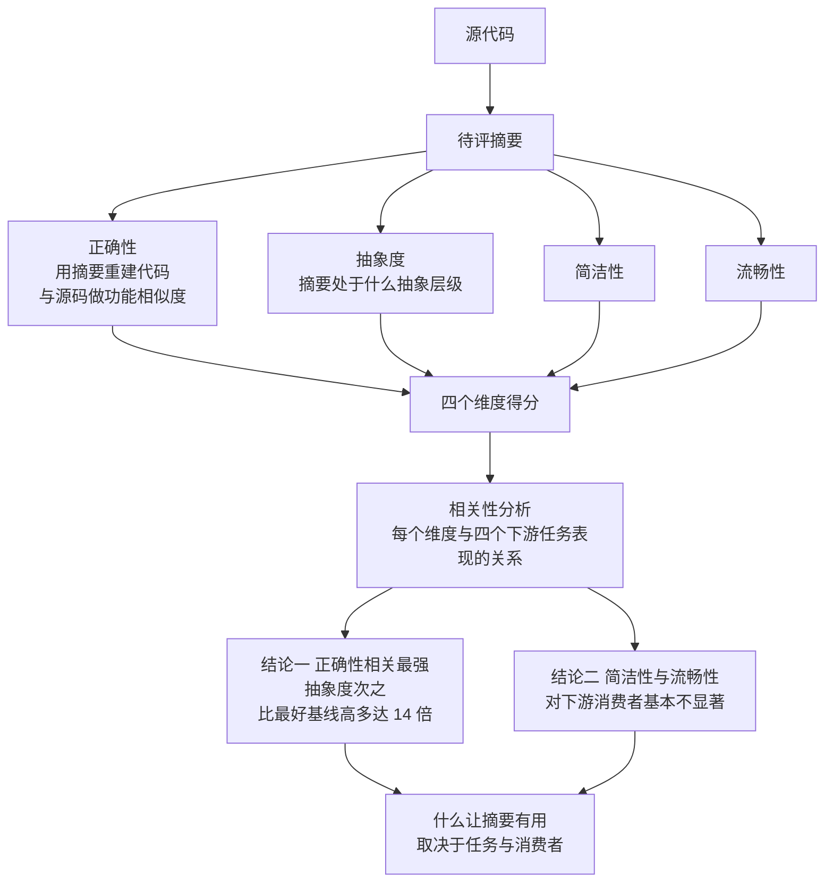

# SONAR: Task-Aware Code Summary Evaluation for LLM Consumers Without References

## 基本信息

| 项 | 内容 |
|---|---|
| 链接 | https://arxiv.org/abs/2608.04195 |
| 代码 | 未明确提供 |
| 作者 | 未明确标注机构 |
| 发布时间 | 2026-08-04 |
| 一句话总结 | 无参考的代码摘要评测框架，用「摘要能否重建出功能等价的代码」当质量信号，并实测四个质量维度与下游任务表现的相关性 |

## 置信度评估

| 维度 | 评估 |
|---|---|
| 发表场所 | 预印本，覆盖 11 个流行模型、四个下游软件工程任务 |
| 引用影响 | 新近工作，2026-08 发布 |
| 代码可用 | 未明确提供 |
| 来源机构 | 未明确标注 |
| 综合置信度 | 高。相关性分析有量化结果（比最好基线高多达 14 倍），结论明确且对实践有直接指导，主动指出人类看重但机器不关心的维度 |
| 需谨慎点 | 四个维度里正确性依赖差分模糊测试，在被测对象无法独立运行时需要退到基于参考的指标 |

## 它解决了什么问题

代码摘要传统上从**人类开发者**的视角评测：质量取决于摘要与人类写的参考有多像、与人类偏好有多一致。

论文指出这忽视了一个新现实：**基于 LLM 的工具与 agent 越来越多地把代码摘要当作软件工程任务的输入**，而「什么样的摘要对消费它的 agent 在一个任务上有用」基本没被研究过。

## 方法核心

四个评分维度加一个重建式的质量信号，然后用相关性分析检验这些维度是否真的预测下游表现。

### 关键设计一：用重建当质量信号，不用参考

正确性维度的直觉是：**摘要重建出的代码与源码功能越相似，摘要就越正确**。

形式化：给定源码、摘要、以及从摘要重新生成的代码，正确性定义为重生成代码相对源码的功能相似度。

论文明确说这是对既有的 **Round-Trip-Correctness（往返正确性）** 思想的延伸。这个思想的形状是：代码生成自然语言描述，再从描述合成代码，然后与原始代码比较。

### 关键设计二：功能相似度用差分模糊测试

论文给出了选择理由，这部分很有价值：

- **单元测试不可行**：可用的代码摘要数据集里**几乎没有附带测试用例**的
- **基于参考的指标（如 CodeBLEU）有表层偏差**，无法推理更深的代码语义

所以改用差分模糊测试：现场生成测试输入集，两边都跑，**功能相似度定义为输出相同的输入比例**。

论文也留了退路：当源码没有足够上下文无法独立运行时，基于参考的代码评测指标可以充当功能相似度的代理。

### 关键设计三：四个维度分开评，不合成总分

论文刻意保持四个独立维度（正确性、抽象度、简洁性、流畅性），然后用相关性分析回答「哪个维度真的有用」。这个结构让「人类看重什么」与「机器消费者需要什么」可以被分别观察。

## 实验结果

- **正确性相关性最强，抽象度次之**，与下游表现的相关性**比最好的基线高出多达 14 倍**
- **简洁性与流畅性虽然被人类开发者广泛看重，对 LLM 消费者基本不显著**
- 论文的结论：「什么让摘要有用，取决于任务与消费者」
- 用该框架对 11 个流行模型做了大规模评测，识别出各模型在每个质量维度上的强项与弱项

最后一条发现的实践含义值得单独说：如果按人类偏好给摘要打分并据此优化，会把资源投入到**对下游消费者无关**的维度上。

## 局限与注意

- **正确性维度依赖差分模糊测试**，这要求代码能独立运行。论文自己承认当上下文不足时要用基于参考的指标兜底，而基于参考的指标恰恰是它批评的「有表层偏差」的那一类
- **相关性是统计观察，不是因果**。论文测的是「维度得分与任务表现相关」，不是「提升这个维度会提升任务表现」
- 场景是代码摘要，不是知识文档。摘要通常是函数级的短文本，而项目的知识文档是模块级的解释型文档
- 未提供代码
- 四个下游任务的类型会影响结论的普适性

## 对我们项目的启发 ⭐

### 解决哪个环节的什么问题

两个环节。第一，它是「信息损耗测量」方案里**代理指标有效性**的验证依据：在把某个维度写进判据之前，必须先确认它与下游表现相关。第二，它直接印证了项目飞轮的形状在文献里有依据。

### 方案要点

**重建作为质量信号是有文献依据的，项目方向正确。** 论文把「摘要能否重建出功能等价的代码」当成摘要正确性的度量，这正是项目飞轮的主循环（知识文档 → Coder 重建实现 → 与源码比较）。区别是项目把它做成了**生成流程**，而论文用它做**评测**。这个对照说明项目的门禁设计踩在了正确的思路上。

**区分「人类看重」与「机器消费者需要」的维度，不要平均加权。** 论文的实测是简洁性与流畅性对下游消费者基本不显著。项目的消费者是 Coder（一个 LLM），所以：

- 正确性类维度（描述与源码一致、意图没写错）应当进判据
- 形式类维度（行文简洁、表达流畅）不该进判据，尽管它们让文档更好读

更重要的是：**项目的知识文档最终是给人看的**（人手要读、要维护）。所以这不是说形式维度不重要，而是说**要分清哪些维度服务哪个消费者**。给人看的维度可以保留为写作规范，但不该影响门禁判定。

**相关性要先验证再使用。** 如果项目打算引入某个新的质量指标（比如覆盖率、抽象度），应当先验证它与重建相似度的相关性，再决定是否进门禁。这一条与「代理指标可能与有用性无关」是同一个纪律。

### 提供了什么思路

**项目的门禁可以比论文做得更强。** 论文用差分模糊测试做功能相似度，理由之一是「单元测试不可行」。**这个理由在项目里不成立**：TestGen 就是专门生成测试集的，而且项目的机制做得比一般做法严格（参考校验、外部监督器逐项观察、不信任 stdout 自报）。

所以项目的重建比对可以用**有针对性的测试集**，而不是随机生成的输入。前者能覆盖接口契约与边界条件，后者只能覆盖随机输入碰到的路径。这是一个项目相对论文的实质优势，值得在文档里说清楚。

**「不合成总分、保留独立维度」这个做法可以借鉴。** 项目现在把多个质量维度压进一个 `qualityScore`。SONAR 的结构说明：先保留独立维度，再用相关性分析决定哪个维度该被重视，比一开始就合成加权总分更合理。这也与父代选择专题里 Pareto 结论一致（不依赖单一标量总分）。

### 需要注意的

**知识文档与代码摘要是两种不同的产物**，这个区别影响判据设计。摘要是函数级的紧凑描述，需要「抽象度」这个维度来衡量它是否停留在合适的层次。项目要的是**能重建实现的解释型文档**，它必须包含比摘要更多的实现细节（边界条件、数据结构、调用关系）。所以项目的「抽象度」目标与论文相反：不是越抽象越好，而是要**恰好包含重建所需的信息**。

**Round-Trip 的失效模式要警惕。** 如果 Coder 和 DocGen 都用同一个模型，那么「重建成功」可能只说明两者共享同样的理解偏差，而不是文档真的完整。TestGen 的现有设计已经注意到这类问题（刻意不读候选知识与重建代码，避免文档与测试用同一个错误答案），这条纪律同样适用于用重建做质量信号时要小心的地方。

**相关性结论有任务依赖性。** 论文自己强调「取决于任务与消费者」。项目引入任何维度前，应当在自己的下游任务上重测相关性，不要照搬论文的结论。

## 关联

- 对应环节：`evaluation` 的判据设计、`candidate_knowledge` 的质量维度、`test_gen` 的功能相似度
- 对应缺口：「历史版本评分与可比性细节仍需细化」；本目录「信息损耗测量」的代理指标有效性缺口
- 相关论文：[信息损耗测量方案](README.md)、Does Accuracy Equal Evidence `2608.01631`（为什么需要独立的结果与依据两轴）、ETF `2410.14748`（另一条依据判据路线）、[CheckAgent 目录](../../CheckAgent/README.md)（比较判据与相似度替代路线）
- 本项目代码路径与验收命令：
  - `docs/specs/domainFunction/evaluation/Evaluation.md`：门禁判据与「相似度只用于归因」的边界
  - `docs/specs/domainFunction/agents/testGenAgent/TestGenAgent.md`：从原始源码与公开接口生成测试、参考校验、外部监督器
  - `docs/specs/schemas/KnowledgeLineage.schema.json`：`qualityScore` 单值字段（多维度未拆开）
