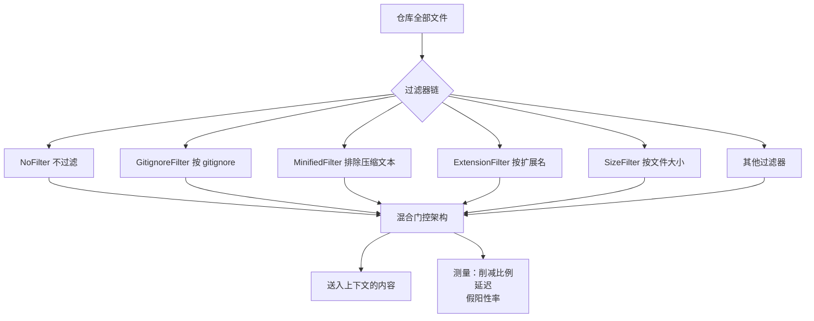

# Correctness-Aware Repository Filtering Under Maximum Effective Context Window Constraints

## 基本信息

| 项 | 内容 |
|---|---|
| 链接 | https://arxiv.org/abs/2605.14362 |
| 代码 | 未明确提供 |
| 作者 | 未明确标注机构 |
| 发布时间 | 2026-05-14 |
| 一句话总结 | 在最大有效上下文窗口约束下做仓库级文件过滤，实测按文件大小过滤优于按扩展名过滤，且发现真正的 token 成本来自被提交进仓库的数据文件 |

## 置信度评估

| 维度 | 评估 |
|---|---|
| 发表场所 | 预印本，含阈值敏感度、文件大小分布、逐仓分析、假阳性率与统计检验 |
| 引用影响 | 新近工作，2026-05 发布 |
| 代码可用 | 未明确提供 |
| 来源机构 | 未明确标注 |
| 综合置信度 | 中高。实验维度齐全（八种过滤器对比、阈值敏感度、逐仓分析、统计检验），且给出了反直觉的实测结果 |
| 需谨慎点 | 引用的核心前提（有效窗口远小于标称窗口）来自他人工作；语料构成会影响结论，换语料需重测 |

## 它解决了什么问题

上下文窗口效率是编码工具的实际约束。论文引用同类研究指出：所有被测模型都在远早于其宣称的上下文上限时就出现准确率下降。

论文把这个问题形式化为：在最大有效上下文窗口的约束下，怎么从仓库中筛掉不该送的代码，同时不误伤真正需要的内容。

## 方法核心

把「送什么进上下文」当成一个独立的过滤问题，用八种过滤器做对比。

### 关键设计一：先承认有效窗口远小于标称窗口

论文的前提是两个数字不同：模型宣称的窗口和它实际能可靠推理的窗口。所有预算设计都应该按后者算。

这一点决定了整个问题的紧迫性：如果按标称窗口做预算，实际已经在退化区间里工作了。

### 关键设计二：八种过滤器对比

论文对比了八种过滤器，包括不过滤、按 gitignore、按压缩文本、按扩展名、按文件大小等。对比维度有削减比例、延迟、标准差、假阳性率。

### 关键设计三：混合门控

论文的最终架构是混合过滤，而不是单用某一种。这暗示没有单一过滤器足够，需要组合。

## 实验结果

**按大小过滤性价比最高**：

- `SizeFilter` 在某个阈值下达到 **79.6% 的平均削减**，开销仅 **0.30 毫秒**，是所有实质性过滤器里延迟最低的
- 它的标准差 **13.2%**，比 `ExtensionFilter` 的 29.3% **低 55%**。论文的解释是：**文件大小是比文件扩展名更稳定的 token 成本代理**

**三个过滤器完全无效**：

`NoFilter`、`GitignoreFilter`、`MinifiedFilter` 在这个语料上**削减为零**。原因很具体：主要的 token 成本来自**被有意提交的数据文件**（CSV、HDF5、Pickle），而这些文件

- 不被 `.gitignore` 覆盖
- 不是压缩后的文本
- 也不在初始的魔数表里

所以三个看似合理的过滤器都抓不到它们。

论文还报告了假阳性率分析、阈值敏感度与逐仓分析。

## 局限与注意

- **结论依赖语料构成**。「真正开销来自被提交的数据文件」是在其语料上测出来的，换一个语料（比如纯代码仓）结论会变。论文的做法值得学（先测量），但具体数字不能照搬
- **核心前提是引用的他人工作**（有效窗口远小于标称窗口）。如果那个测量在项目的实际模型上不成立，整个问题的紧迫性会下降
- 只解决「扔掉不该读的」，**不解决「剩下的怎么读」**。过滤之后的读取策略不在论文范围内
- 语料规模、过滤器的具体阈值需要按项目重测
- 未提供代码

## 对我们项目的启发 ⭐

### 解决哪个环节的什么问题

对应本目录 README 里 Option B 的核心，也是整个读取流程的**第一步**：在切分之前先扔掉不该读的。

项目的三十万行仓里，真正吃掉 token 预算的未必是业务代码。构建产物、测试数据、快照文件、生成的类型定义、随仓库提交的二进制数据，都可能占据远超代码本身的体积。**先测量再设计过滤规则**，这是本篇最直接的教导。

同时对应 DocGen 的「材料检查」步骤与 TestGen 的读取范围界定。

### 方案要点

**第一步做一次真实的成本测量**，不要凭直觉设计过滤器。统计一次完整代码库的 token 分布，按文件类型、按目录、按大小分桶看哪一类占了大头。

过滤规则优先用文件大小，因为它是比扩展名更稳定的成本代理（标准差低 55%）。扩展名会因为同一种扩展名下内容差异巨大而失效。

不要只依赖 `.gitignore`。本篇实测三个看似合理的过滤器削减为零，因为它们都抓不到「被有意提交进仓库的数据文件」这一类。项目需要单独识别这类文件：大体积、非代码、通常有固定魔数或数据格式特征。

过滤要记录被扔掉了什么。项目的知识文档需要说明「仍未解决的问题」，如果某个文件因为体积被排除，这本身就是一条应记录的缺口。

### 提供了什么思路

**「先测量再优化」这条纪律可以直接抄。** 项目现在的做法是文件均分，等于默认了每个文件的成本相同。但本篇显示成本分布是高度不均的，且不均匀的方式与直觉不符。

**有效窗口与标称窗口要分开对待。** 项目在做上下文预算时，如果按模型宣称的窗口算，实际已经在退化区间。建议按有效窗口算（同类研究给的区间是标称值的 30% 到 60%），把这个折扣写进设计参数。

**过滤器完全可以做成一个独立可测的组件。** 它不涉及模型调用，纯程序化，因此可以用单元测试完整覆盖，测削减比例、延迟、假阳性率。这比把过滤逻辑藏在读取流程里更可靠。

### 需要注意的

**过滤与「信息不损耗」直接冲突。** 过滤掉的文件就是丢了的信息。所以过滤规则必须可解释、可审计、可回退：为什么这个文件被排除、排除后影响了什么判断，都要能回答。

项目的场景比论文更严格，因为项目要求知识文档能支撑实现重建。论文的下游任务是问答和代码补全，丢掉一个数据文件可能无所谓；项目的下游是重建，丢掉一个被引用的接口定义就会直接失败。所以过滤要用**保守规则**：宁可多留，不可错删。

「按大小过滤」有一个明显风险：**一个体积很小但语义关键的接口定义文件，和一个体积很大但无关的测试固件，在大小上可能很接近**。所以大小只能用第一层，之后还要结合依赖关系判断（见 README 的 Option C）。

论文语料里的数据类型（CSV、HDF5、Pickle）与项目的技术栈不完全重合。项目是 TypeScript 加 C/C++，需要自己看一遍实际的分布，尤其是 `node_modules`、构建输出、类型声明文件这类。

## 关联

- 对应环节：`doc_gen` 的材料检查与读取范围、`test_gen` 的源码范围界定
- 对应缺口：DocGen 自认「上下文预算……尚未实现」
- 相关论文：Maximum Effective Context Window `2509.21361`（有效窗口怎么测，本篇的核心前提）、LCM `2605.04050`（过滤之后怎么读）、Hierarchical Context Pruning `2406.18294`（层级剪枝）、Practical Code RAG at Scale `2510.20609`（算力预算下的检索取舍）
- 本项目代码路径与验收命令：
  - `docs/specs/domainFunction/agents/docGenAgent/DocGenAgent.md`：材料检查与 Worker 分配
  - `docs/specs/domainFunction/agents/testGenAgent/TestGenAgent.md`：`allowedTestPaths` 与 `sourceEvidence` 的范围限定
