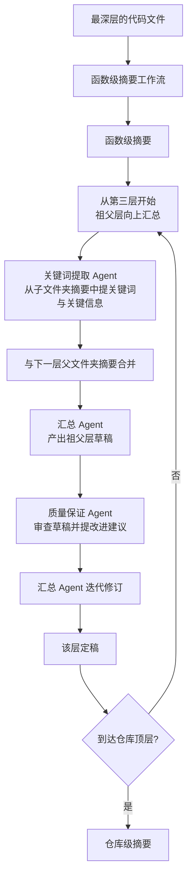

# Agent4cs: A Multi-agent System for Code Summarization in Large Hierarchical Codebases

## 基本信息

| 项 | 内容 |
|---|---|
| 链接 | https://arxiv.org/abs/2607.01425 |
| 代码 | 未明确提供 |
| 作者 | 未明确标注机构 |
| 发布时间 | 2026-07-01 |
| 一句话总结 | 面向大型层级代码库的多 agent 代码摘要系统，用祖父-父-子三层滑动框架逐层向上汇总，并用关键词桥接替代全量子摘要以绕过上下文限制 |

## 置信度评估

| 维度 | 评估 |
|---|---|
| 发表场所 | 预印本，7 个模型、多层级、含双基线对比 |
| 引用影响 | 新近工作，2026-07 发布 |
| 代码可用 | 未明确提供 |
| 来源机构 | 未明确标注 |
| 综合置信度 | 中高。实验覆盖 7 个模型、逐层报告相似度与关键词覆盖率，**并主动报告了对自己不利的混淆因素** |
| 需谨慎点 | 评测用语义相似度与关键词覆盖率，是代理指标；「摘要控制在约 200 词」是模型行为不是方法设计 |

## 它解决了什么问题

理解大型、复杂的代码库仍然是个难题，尤其是那些结构混乱、文档不全的库。已有的代码摘要方案通常依赖平面结构：对单个文件或函数生成摘要，或对整个仓库生成一个笼统的摘要。前者丢了跨文件关系，后者信息密度太低。

论文要做的是**层级摘要**：在仓库的多层文件夹树上，逐层向上构造摘要，让每一层都有一份与其粒度匹配的描述。

## 方法核心

两个工作流：函数级摘要，然后是层级摘要。

### 关键设计一：祖父-父-子三层滑动

不是一次性汇总所有子目录，而是**每次只看相邻三层**。从第三层（祖父层）开始，用这套框架逐层向上构造，直到仓库顶层。

这个设计限制了单次汇总的输入范围：无论仓库多大，每次汇总只看三个相邻层次的内容。这是把「输入规模随仓库规模爆炸」变成「输入规模恒定」的关键。

### 关键设计二：关键词提取充当层间桥接

论文对这一步的解释是本篇最有价值的部分。

直接把所有子文件夹摘要放进提示词是**不可能的**（上下文窗口限制）。所以引入一个关键词提取 Agent，从子文件夹摘要中提取关键词与关键信息，与下一层的父文件夹摘要合并后再交给汇总 Agent。

论文的定性是：相比单纯使用父文件夹摘要，**通过关键词聚合子文件夹信息，提供了更浓缩的表示，同时保持输入规模可控**。

这里有一个隐含的取舍：用关键词替代子摘要，信息必然丢失。论文承认这是被上下文限制逼出来的做法。

### 关键设计三：每层配质量保证 Agent

草稿产出后，质量保证 Agent 审查并提改进建议，汇总 Agent 据此迭代修订。这是生成与验证分离的常见做法，本项目的 Review Agent 是同一个思路。

### 关键设计四：函数级摘要作为最底层的起点

层级汇总的输入是函数级摘要，不是源码原文。也就是说源码只在最底层被读一次，之后各层都在摘要之上做聚合。

## 实验结果

在 7 个模型上评测，逐层报告语义相似度与关键词覆盖率：

- **语义相似度**：Agent4cs 在 7 个模型中的 5 个上超过两个基线。GPT-5 最好，加权平均 0.794；Gemini-2.5-flash 提升最大，超过 10%；Qwen3-8B 提升 8%
- **逐层下降**：相似度分数**从低层到高层逐渐降低，各模型降幅 10% 到 20%**。论文的解释是更高层的汇总要在受限字数内捕捉更抽象的概念，任务更难
- **关键词覆盖率**同样逐层下降，反映随文件夹数量指数增长，捕捉全部关键信息越来越难
- 关键词覆盖率上 GPT-4o 提升最显著，从 0.682 到 0.829

论文报告的一个意外发现值得单独看：**紧凑模型表现领先**，Qwen3-8B 达到 0.872，LLaMA-3.1-8B 达到 0.846。进一步分析发现**token 长度是混淆因素**：

- 大模型（GPT-5、GPT-4.1、Gemini-2.5-flash）无论用哪种方法，摘要都约 200 词
- 紧凑模型产出长度变化更大且更啰嗦：Qwen3-8B 平均超过 800 词，Gemma3-4B 约 600 词
- 这解释了紧凑模型为什么关键词覆盖率高

论文自己把这条列成「潜在的混淆因素」，这种诚实值得记下来。

## 局限与注意

- **评测用代理指标**：语义相似度与关键词覆盖率，都不是「下游任务能不能用」。本项目已经有更直接的门禁信号（重建相似度）
- **层级汇总的损耗被量化了，但没有被解决**：逐层下降 10% 到 20% 是论文自己的实测。这意味着多层汇总是有损的，且损失随层数累积
- **关键词桥接是被迫的妥协**。论文明说「由于上下文窗口限制，把所有子文件夹摘要直接放进提示词是不可能的」，所以退而用关键词。这不是最优解，是可行解
- **摘要长度受模型行为影响**，约 200 词这个数字不是方法设计的，是模型的默认行为。换模型或换提示词都会变
- 未提供代码
- 函数级摘要工作流的细节在正文，本目录关注的是层级部分

## 对我们项目的启发 ⭐

### 解决哪个环节的什么问题

直接对应 DocGen 的第 83 行缺口：「按业务主题分批汇总、保存中间摘要」。本篇给的是这套机制的完整形状，以及**损耗的实测数字**。

项目现状是文件均分给 Worker 后**一次汇总**。本篇指出的是：如果要处理整个三十万行仓，「一次汇总」不可能装下，必须分层；而分层会带来可量化的损耗。

也对应 IO-08 业务分组这个未实现项：本篇的祖父-父-子三层框架就是一种业务分组方式，只不过它按文件夹层级分，不按业务主题分。

### 方案要点

如果要做层级汇总，**每次只看相邻三层**，不要试图一次汇总所有下层内容。这个约束让单次输入规模与仓库规模解耦。

层与层之间的连接用浓缩表示，不用全量子摘要。项目可以用比关键词更结构化的形式：每个模块的摘要加上它对外暴露的接口清单、它依赖的上游模块、它被哪些模块依赖。这些是代码里本来就有的结构信息，比从自然语言摘要里提关键词更可靠。

**每层都要记录损耗**。既然逐层下降是必然的，就该让它可测量：每层汇总后记录该层的覆盖情况（哪些子单元的信息被保留、哪些被丢弃），这样最终文档缺了什么是可追溯的，而不是事后不知道丢在哪一层。

考虑到项目已有溯源设计（每段知识标注对应源码位置），层级摘要的每一层都应当保留向下的引用链，让顶层摘要能一路回溯到源码位置。

### 提供了什么思路

**「输入规模与仓库规模解耦」这个目标值得单独作为设计原则。** 祖父-父-子三层滑动做到的正是这件事：无论仓库多大，每次汇总的输入都是三层的内容量。项目在设计读取源码时，应当明确要求每个处理步骤的输入规模都是常数或可控的，而不是随仓库增长。

**摘要长度要显式控制。** 本篇的元发现说明，摘要长度会显著影响覆盖率类指标，而长度是模型的默认行为不是设计。项目如果把「覆盖了多少要点」当成一个判据，必须先固定或规范化摘要长度，否则测的是啰嗦程度而不是信息量。这一条对 DocGen 的输出规范直接有用：项目已有「正文至少 200 字符」的下界，可能还需要一个上界或目标长度。

### 需要注意的

**层级汇总是有损的，且损耗会累积。** 逐层降 10% 到 20%，三层下来就不是小数。项目的门禁是「重建相似度 80%」，如果知识文档经过多层汇总，可能单是汇总损耗就吃掉了大部分预算。**建议先测一层汇总的损耗**，再决定要不要做多层。

本篇的关键词桥接方案**不建议直接照搬**。它的动机是上下文装不下子摘要，而项目如果用了 LCM 那类按需展开的机制，可以用结构化引用替代关键词，信息损失更小。

函数级摘要作为起点这个设计，与项目的「按代码单元迭代」是同一个粒度，可以对齐。

## 关联

- 对应环节：`doc_gen` 的业务分组与分批汇总（IO-08 / IO-10）、`candidate_knowledge` 的摘要与索引
- 对应缺口：DocGen 自认「按业务主题分批汇总、保存中间摘要……仍是待论文调研的方案」
- 相关论文：LCM `2605.04050`（按需展开替代关键词桥接）、渐进式披露该做几层 `2607.17598`（层级该做几层）、Hierarchical Repository-Level Summarization `2501.07857`（面向本地模型的分层汇总）、[Remember Your Trace](../../知识生成/Remember%20Your%20Trace一致的仓库级代码文档.md)（层级文档的一致性维护）
- 本项目代码路径与验收命令：
  - `docs/specs/domainFunction/agents/docGenAgent/DocGenAgent.md`：第 31 行现状、第 83 行缺口、第 91 行 IO 归属
  - `docs/specs/domainFunction/knowledge/Knowledge.md`：IO-22 索引与渐进式加载
  - `tests/integration/DocGenSubAgents.test.ts`：Worker 批次与片段交接
