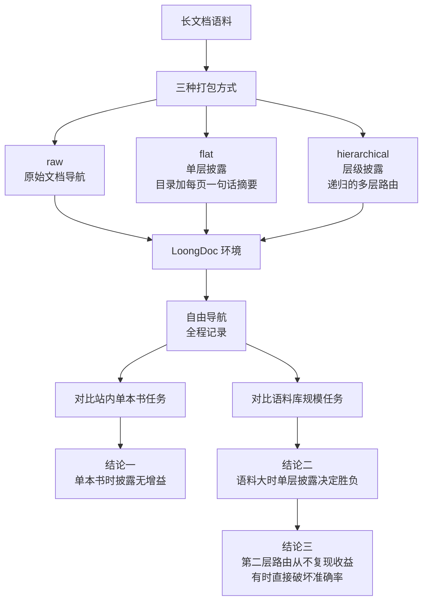

# Is Progressive Disclosure All You Need for Long-Context Agents?

## 基本信息

| 项 | 内容 |
|---|---|
| 链接 | https://arxiv.org/abs/2607.17598 |
| 代码 | 未明确提供，环境代号 LoongDoc |
| 作者 | 未明确标注机构 |
| 发布时间 | 2026-07-20 |
| 一句话总结 | 首个针对 agent 长文档推理的渐进式披露受控研究，结论是披露只买到上下文不买到智能，且一层就够、第二层路由有害 |

## 置信度评估

| 维度 | 评估 |
|---|---|
| 发表场所 | 预印本，横跨三个 harness、三个模型家族的受控对比 |
| 引用影响 | 新近工作，2026-07 发布 |
| 代码可用 | 未明确提供，但环境与任务构造描述完整 |
| 来源机构 | 未明确标注 |
| 综合置信度 | 中高。受控设计严谨（同一基准、同三 harness、同三模型、含混合检索基线）、有成本-精度平面分析、结论明确且与直觉相反 |
| 需谨慎点 | 场景是长文档问答（书籍），不是代码库；「一层够用」的结论在代码场景是否成立需要验证 |

## 它解决了什么问题

长文档问答一直面临一个二选一：把整份文档塞进上下文，或者外挂一个独立的检索器。

agentic 的做法提供了第三个选项：把文档路径交给 agent，让它自己决定读什么、怎么读。配合 Agent Skills 这类「把专业知识打包成文件夹、按需加载」的标准，就有了渐进式披露这个机制：只暴露查询需要的那部分内容。

但这个机制**缺一个受控验证**：它到底有没有用、该做几层、什么时候有用。论文就是来填这个空。

## 方法核心

把同一批书用三种方式打包，在同一个环境里对比。

### 关键设计一：三种打包方式，隔离出「披露层级」这一个变量

- **raw**：原始文档导航，agent 直接面对文档
- **flat**：单层披露。一个紧凑目录加每页一行摘要，agent 只加载需要的部分
- **hierarchical**：层级披露。递归的多层路由

三者在同一个环境、同一批书、同一批问题上跑，所以差异可以归因到披露结构本身。

### 关键设计二：把导航过程完整记录

论文强调「自由导航，全程记录」。这很重要：如果只记录最终答案，就无法区分「因为找不到所以答错」和「找到了但推理错」。记录导航轨迹才能判断披露机制到底在哪一步起作用。

### 关键设计三：评分同时充当奖励

论文的评分设计让它同时可以作为奖励信号使用。这让环境可以被用于后续的强化学习类工作。

### 关键设计四：成本-精度平面

论文把结果画在成本与精度构成的平面上，用**真实 token 用量**算每个问题的成本。这个视角比单看准确率有用：它区分了「准确率高但贵」与「准确率略低但便宜」。

## 实验结果

**单本书问答**：三种做法（raw / flat / hierarchical）**没有差别**。论文的解释是：一个强 agent 本来就会 grep 它需要的段落，所以披露机制加不了任何东西。

**语料库规模**：语料从单本扩到多本后，三种做法的差别才出现。

- 随着语料扩大，前沿向右下移动：**准确率下降，且买到任何固定准确率的成本都在上升**。论文的措辞是「更大的语料严格地更低效，而不只是更难」
- 最优配置的归属发生迁移：从 Codex raw 转为 Codex flat。**技能包只有在语料足够大时才接管前沿**
- **原始文档导航在语料规模上会崩塌**，而单层披露退化得更慢并最终领先
- **第二层（更深的路由）从不复现这个收益，有时甚至直接破坏准确率**

论文的措辞很硬：「progressive disclosure buys context, not intelligence」（渐进式披露买到的是上下文，不是智能）。

**给打包材料的具体建议**：把一本书打包成**一个技能、分层渐进披露**，而不要打包成**多个并列的子技能包加始终加载的描述**。

## 局限与注意

- **场景是书籍问答，不是代码库。** 代码的结构性比自然语言文本强得多，这个结论需要在新场景验证
- 任务是**问答**（找到信息并作答），不是**生成文档**（把信息组织成解释性文本）。后者需要通读而非定位，披露机制的收益结构可能不同
- 三个 harness 与三个模型家族覆盖了主流配置，但**未覆盖开源小模型**
- 结论「一层够用」是在其语料规模下得出的。「从不复现收益」是强结论，但语料规模再上一个量级是否仍成立，论文没有测
- 未提供代码

## 对我们项目的启发 ⭐

### 解决哪个环节的什么问题

对应 DocGen 的一个重要设计决策：**读取结构该做几层**。项目的缺口里写了「按业务主题分批汇总、保存中间摘要」，这句话隐含着一个多层的结构（代码到文件、文件到模块、模块到业务主题），而本篇给出了「别做太多层」的实测依据。

也对应本目录 README 里 Option A 的第 4 步（汇总按需分层）。

### 方案要点

**只做一层披露**。给模型一个目录加每个单元的一行摘要，让它按需加载，不要在目录之上再套一层路由。

论文的实测结论是第二层从不复现收益、有时直接破坏准确率。这个「破坏」是重点：第二层不是无效，而是有害。多一层路由就多一次模型判断，而这次判断可能把查询路由到错误的子树，然后模型在错误的子树里再努力也找不到正确内容。

在语料小的时候，不需要披露机制。这是省成本的一条：如果某个模块的源码能整个放进有效预算，直接读原文，别套目录。论文证明强 agent 自己就会定位。

只有在语料大到原生导航装不下时，披露才产生价值。项目的三十万行仓显然是后者，所以披露机制是需要的，但层的数量应当少。

### 提供了什么思路

**「买到上下文，不买到智能」这句话值得当成本目录的中心判断。** 任何压缩与披露机制的收益上限是让模型看得见该看的东西，它不会让模型更会推理。所以指望靠披露机制提升知识文档质量是错的方向：质量要靠别的手段（比如项目已有的门禁与 Review）。

**成本-精度平面**这个分析视角值得借。项目的门禁只看质量（相似度是否过线），不看成本。而本篇显示「买到固定准确率的成本」是一个独立且会恶化的维度。项目已经有 `IterationBudget` 管轮次，但轮次不等于 token 成本。可以考虑把每个知识版本的 token 消耗也记下来，这样父代选择（见 `../../版本管理/父代选择/README.md`）就能偏好「更容易收敛的起点」。

**记录导航轨迹**这个做法可以搬。现在是按 Worker 结果引用记录「这份文档依据了哪些分析」，可以考虑再记一层「读取的先后顺序与取舍」，用于事后分析某个知识缺口是定位失败还是推理失败。

### 需要注意的

**这条结论在代码场景是否成立，论文没验证。** 书是线性结构，代码是图结构（有调用、有继承、有共享状态），按目录结构做的单层披露在代码上可能不如按依赖关系做的披露。这是本项目需要自己验证的点。

「语料小时披露无增益」有一个重要前提：**agent 本身要强**。论文说的是「a strong agent already greps what it needs」。项目的模型约束是公司本地部署的 GLM 5.1，如果它的自主导航能力弱于论文测试的模型，披露机制在小语料上可能也是必要的。这一条要按实际模型能力判断。

论文测试的是问答任务，需要通读并生成文档的任务可能从披露中获益更多，因为这恰恰是「装不下」的场景。

## 关联

- 对应环节：`doc_gen` 的读取结构设计（IO-08 业务分组、IO-10 分批汇总）
- 对应缺口：DocGen 自认「按业务主题分批汇总、保存中间摘要……仍是待论文调研的方案」
- 相关论文：LCM `2605.04050`（阈值外置与算子级递归，与本篇的披露层级互补）、Agent4cs `2607.01425`（层级汇总的具体做法与损耗量化）、Maximum Effective Context Window `2509.21361`（有效窗口怎么测）、Correctness-Aware Repository Filtering `2605.14362`（在有效窗口约束下怎么过滤）
- 本项目代码路径与验收命令：
  - `docs/specs/domainFunction/agents/docGenAgent/DocGenAgent.md`：第 83 行缺口原文
  - `docs/specs/domainFunction/knowledge/Knowledge.md`：IO-22 的渐进式加载索引设计
  - `docs/specs/domainFunction/agents/docGenAgent/subAgents/docWorkerAgent/DocWorkerAgent.md`：Worker 的读取范围
