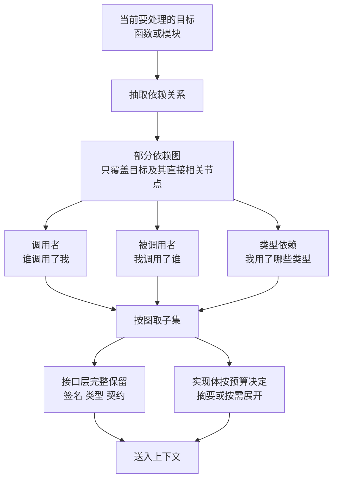

# 跨模块依赖怎么取：部分依赖图与调用链感知

## 基本信息

| 项 | 内容 |
|---|---|
| 论文 | Effective and Efficient Context Retrieval via Partial Dependency Graph for Repository-Level Code Generation |
| 链接 | https://arxiv.org/abs/2608.01927 |
| 代码 | 未明确提供 |
| 发布时间 | 2026-08-03 |
| 关联论文 | RepoScope（调用链感知多视图上下文）https://arxiv.org/abs/2507.14791 |
| 一句话总结 | 用部分依赖图而非完整依赖图来取仓库级上下文，在覆盖依赖关系的同时控制抽取与检索开销 |

## 置信度评估

| 维度 | 评估 |
|---|---|
| 发表场所 | 预印本，两篇各有实验支撑 |
| 引用影响 | 新近工作，2026-08 与 2025-07 发布 |
| 代码可用 | 均未明确提供 |
| 来源机构 | 均未明确标注 |
| 综合置信度 | 中。机制思路清晰，但两篇都未提供代码，且下游任务是代码生成不是知识文档 |
| 需谨慎点 | 项目要覆盖 C/C++ 与 TypeScript 两套技术栈，依赖抽取的可行性需要单独验证 |

## 它解决了什么问题

仓库级代码生成要求模型在复杂依赖之上推理，但上下文窗口有限，仓库上下文又往往不足。已有的检索增强方法按文本相似度取上下文，会漏掉「语义上是这个函数行为一部分、但文本上不相似」的依赖。

完整依赖图能覆盖这些关系，但构建与维护成本高，而且图一大就重新遇到「装不下」的问题。两篇论文分别从这个方向入手：一篇用**部分**依赖图控制开销，一篇用**调用链**组织多视图上下文。

## 方法核心

核心是把「取哪些文件」这个问题，从按目录结构或文本相似度，改成按依赖关系。

### 关键设计一：用部分图而不是完整图

这是题目里的核心取舍。完整依赖图信息最全，但抽取成本与规模都难以控制。部分依赖图只覆盖当前目标及其直接相关节点，换来开销可控。

对项目而言这个取舍的关键问题是：**「部分」的边界怎么定**。论文的做法是围绕目标节点取子图，但取几层、哪些边类型算相关，需要按场景调。

### 关键设计二：调用链作为组织上下文的一个视图

第二篇的题目就是「调用链感知的多视图上下文」。它把上下文按多个视图组织，调用链是其中一个视图。这意味着同一个函数可以同时以「它的实现」、「它在调用链中的位置」、「它相关的测试」等多个视图进入上下文。

对 TestGen 尤其相关：写测试需要知道这个函数被谁调用（决定测试怎么调用它）、它调用了谁（决定要不要 mock）、它的边界条件由哪些参数组合决定（决定测试数据）。

### 关键设计三：接口层与实现体分开处理

两篇都隐含同一个分层：**接口（签名、类型、契约）与实现体是两类不同的信息**，前者的信息密度高、体积小，后者体积大。合理的做法是接口层尽量完整保留，实现体按预算决定。

这一条与本目录其他论文的结论一致（LCM 的代码文件做结构分析、cAST 的语法单元对齐边界）。

## 实验结果

两篇论文各自在仓库级代码生成任务上报告了效果提升。本目录关注的是「跨模块依赖怎么取」这个机制，具体数值不在此逐项抄录。

（两篇的实验设置针对代码生成，与本项目的下游任务不同，参考重点在机制而非数字。）

## 局限与注意

- **下游任务是代码生成**，不是知识文档生成。取依赖上下文是为了写出能编译的代码，而项目是为了写出能重建实现的解释文档，信息需求不同
- 两篇都**未提供代码**，实现细节依赖论文描述
- **依赖抽取的可行性未验证**。项目要覆盖 TypeScript 与 C/C++：TypeScript 的类型系统让依赖抽取相对容易，C/C++ 因为宏与条件编译会复杂得多
- 「部分的边界」这一关键参数论文没有给出通用判据
- 完整依赖图在大型仓库上可能有严重的规模问题，这一点论文用「部分」回避了但没有量化

## 对我们项目的启发 ⭐

### 解决哪个环节的什么问题

直接对应 DocGen 第 83 行缺口里的第三项：「跨模块依赖处理尚未实现」。

也对应 TestGen 的一个具体困难：TestGen 只能读「原始源码和公开接口」，不能读候选知识或重建代码。它要写出能通过编译并正确断言的测试，必须知道被测函数的调用关系与类型约定，而这需要跨模块的依赖信息。

### 方案要点

把依赖关系当成取上下文的**依据**，而不只是文档里要描述的内容。现在项目是按文件均分，等于是按目录结构取；改成按依赖关系取，可以让一个 Worker 拿到语义上完整的一组代码，而不是文件相邻的一组代码。

接口层与实现体分级处理。签名、类型定义、公开契约完整保留，实现体按预算决定是给原文、给摘要还是只给引用。这个分级让「跨模块的调用关系」可以在不付出实现体代价的情况下带过来。

依赖图只建**部分**的，覆盖当前模块及其直接的调用者与被调用者。不建全库图，避免规模失控。

对 TestGen 单独设计视图：它需要的不是「完整实现」，而是「函数签名加调用关系加边界条件」。这三个视图的信息密度远高于源码原文，可以显著降低预算压力。

### 提供了什么思路

**「接口与实现分级」这个思路可以推广到整个读取流程。** 项目现在的读取是「把源码给模型」，没有区分信息的价值密度。但代码里的信息分布是高度不均的：一个函数的签名可能三行、实现可能三百行，而签名承载的语义（输入输出的类型与契约）往往比实现细节更关键。

按这个思路，读取流程应该是：先按信息密度分层（接口层、结构层、实现层），再按预算决定每层给到什么程度。这比「按文件大小过滤」更精细，因为它是按信息价值过滤而不是按体积。

**依赖关系可以同时用于两个目的**：取上下文（决定给模型看什么）和验证完整性（判断知识文档有没有漏掉关键关系）。后者与项目的源追溯设计天然契合。

### 需要注意的

**依赖抽取本身是有成本的新组件。** 项目当前没有依赖分析能力，这需要新建。TypeScript 可以用现成的类型系统与语言服务，C/C++ 需要单独的方案（编译数据库或轻量静态分析）。建议先在一个模块上验证可行性，再决定覆盖范围。

**这一条应该放在切片之后做。** 依赖图需要节点，而节点粒度取决于切片粒度。如果切片还没做，依赖图的节点就只能是文件级，粒度太粗。

**C/C++ 的依赖抽取风险最高。** 宏与条件编译意味着「依赖什么」可能取决于编译配置。如果项目只做静态分析，需要在文档里明确说明这是哪个配置下的依赖关系，否则生成的测试可能在另一种配置下失败。

引入依赖图后，知识的组织单位可能从「模块文档」变成「模块文档加依赖关系」。这与项目当前「单次飞轮以一份文档为修订对象」的设计需要协调：依赖关系是文档的一部分，还是独立的元数据。

## 关联

- 对应环节：`doc_gen` 的跨模块依赖处理（IO-08）、`test_gen` 的源码与接口读取
- 对应缺口：DocGen 自认「跨模块依赖处理尚未实现」；TestGen 的源码取证与调用关系需求
- 相关论文：cAST `2506.15655`（切片粒度，依赖图的节点基础）、LCM `2605.04050`（按需展开）、LARGER 词法锚定图探索 `2605.16352`、Agent Retrieval Bench `2607.24882`（定位阶段单独评测）、RepoNav `2609.08355`（文件级导航）
- 本项目代码路径与验收命令：
  - `docs/specs/domainFunction/agents/docGenAgent/DocGenAgent.md`：第 83 行缺口
  - `docs/specs/domainFunction/agents/testGenAgent/TestGenAgent.md`：`sourceEvidence` 限定、`allowedTestPaths` 白名单
  - `docs/specs/domainFunction/knowledge/Knowledge.md`：源追溯与索引设计
