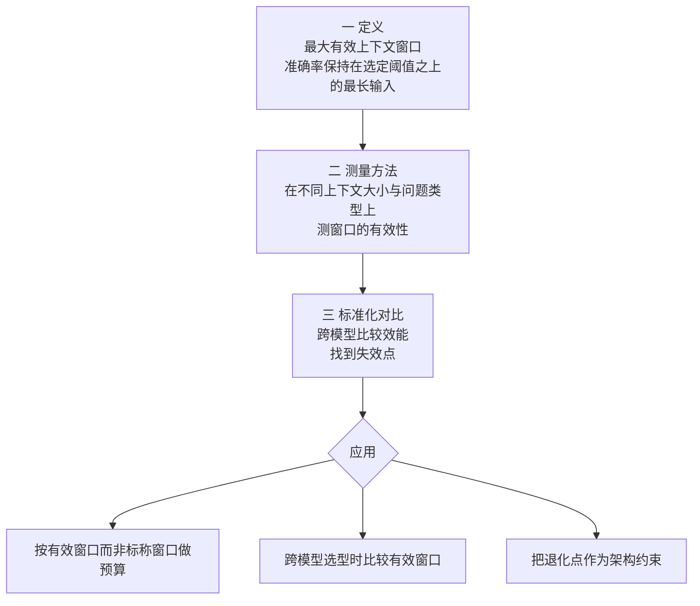

# Context Is What You Need: The Maximum Effective Context Window for Real World Limits of LLMs

## 基本信息

| 项 | 内容 |
|---|---|
| 链接 | https://arxiv.org/abs/2509.21361 |
| 代码 | 未明确提供 |
| 作者 | 未明确标注机构 |
| 发布时间 | 2025-09-21 |
| 一句话总结 | 定义并测量最大有效上下文窗口，发现模型在远未达到宣称上限时准确率就开始下降 |

## 置信度评估

| 维度 | 评估 |
|---|---|
| 发表场所 | 预印本，提出了概念定义、测试方法与标准化对比流程 |
| 引用影响 | 被后续仓库过滤类工作直接引用为前提（如 `2605.14362`） |
| 代码可用 | 未明确提供 |
| 来源机构 | 未明确标注 |
| 综合置信度 | 中高。贡献在于给出可操作的定义与测量方法，而不是单点数字 |
| 需谨慎点 | 具体数值随模型与任务变化；论文的场景是通用问答，不是代码 |

## 它解决了什么问题

模型提供方宣传的上下文窗口数字越来越大，但这个数字描述的是「能装进去」，不是「能可靠推理」。

论文指出这个差距有实际后果：开发者按标称窗口设计系统，实际已经在模型的退化区间里工作。这在长上下文任务上表现为准确率下降，而下降的位置远早于窗口上限。

## 方法核心

论文做了三件事，这个三段结构本身就是可复用的方法：

### 关键设计一：把「有效窗口」定义成一个可测量的量

定义是：模型的**任务准确率保持在某个选定阈值之上的最长输入长度**。

这个定义有两个可调参数，都值得注意：一是「准确率」用什么任务测，二是「阈值」取多少。两者都会改变结论。所以有效窗口不是一个模型的固有常数，而是「在什么任务上、要求多高的准确率」这样一组条件下的结果。

### 关键设计二：在不同问题类型上测

论文强调在上**不同大小的上下文与不同问题类型**上测窗口有效性。这一步很重要，因为退化速度与任务类型相关：简单检索类任务退化慢，需要跨段推理的任务退化快。

### 关键设计三：找失效点，而不只是给平均分

论文的目标是「找到失效点」，即在哪个长度上效能跌破可接受水平。这个输出形状比一个平均分更有用：它是一个可以写进设计参数的阈值。

## 实验结果

论文的核心结论是：**所有被测模型都在远早于其宣称上下文上限时就出现准确率下降**。

具体的「有效窗口占标称窗口的比例」随模型与任务变化，本目录其他论文引用的经验区间是 **30% 到 60%**（简单检索类任务偏上，需要推理的任务偏下）。

（论文给出了跨模型跨长度的对比数据与失效点，本目录关注的是方法论与结论方向。）

## 局限与注意

- **具体数字不能跨模型套用**。有效窗口取决于模型、任务类型与准确率阈值三者，换任一个都要重测
- 论文的场景是通用长上下文问答，**不是代码**。代码任务因为结构性强，退化模式可能不同
- 论文给的是**测量方法**，不是「在有效窗口约束下该怎么做」的策略。策略层面的答案在其他论文里（过滤、切分、按需展开、算子级递归）
- 未提供代码
- 本项目的模型约束是公司本地部署的 GLM 5.1，论文测的模型不是它，需要自己测

## 对我们项目的启发 ⭐

### 解决哪个环节的什么问题

这是本目录所有其他方案**共同的参数基础**。无论选哪种切分、披露或汇总策略，都要先知道预算的上限在哪。本篇给的是确定这个上限的方法。

对应 DocGen 的「上下文预算」这一未实现项：预算不能拍脑袋定，也不能直接取模型的标称窗口。

### 方案要点

**把有效窗口当成一个需要测量与记录的项目参数**，而不是一个可以从模型文档抄来的常数。至少记录三项：在什么任务上测的、要求多高的准确率、得出的长度是多少。

预算按有效窗口算，不按标称窗口。经验上先取标称值的保守下界（如同类研究给的 30%），然后在自己场景里往回调。

**把退化点纳入验收。** 项目的门禁测的是知识质量，但如果某次生成失败的原因是上下文超了有效窗口，这应该是一个可区分的失败原因，而不是笼统的「生成质量不达标」。建议在评测报告里记录本次的上下文占用与是否接近退化点。

### 提供了什么思路

**「有效 X 窗口」这个思维模式可以推广。** 项目里还有别的「标称值」与「有效值」分离的地方：比如 `maxIterations` 是标称轮次上限，但模型在多少轮之后开始重复而非改进，是另一个数字；`maxTestRepairs` 默认 1，但真实能有效修复的比例可能更低。凡是有「可设上限」的地方，都值得问一句「有效上限在哪」。

**测量方法比结论更可迁移。** 论文的三段结构（定义可测量量 → 在不同条件下测 → 找失效点）可以直接用在项目自己身上：定义一个可测量的量（比如重建相似度），在不同条件下测（不同的切片大小、不同的汇总层数），找到失效点。本目录 README 里建议的「把压缩策略当自变量、把重建相似度当因变量」，用的就是这个结构。

### 需要注意的

**30% 到 60% 这个区间是别人场景下的经验值，不是项目可以照抄的参数。** 项目的模型（GLM 5.1）、任务（读代码写文档）、评测口径（重建相似度）都不同，必须自己测。

**「不同问题类型退化速度不同」这一条对项目有直接含义。** DocGen 读源码生成文档，属于需要跨段推理的任务，退化应该偏快；TestGen 找接口与边界条件，可能更接近检索类任务，退化偏慢。两者的预算不该用同一个数。

测这个参数需要一点工程投入（构造不同长度的输入、测准确率、找跌破点），但它是所有后续优化的前提。**建议在切分与汇总机制之前先做这一步**，否则那些机制的参数没有依据。

## 关联

- 对应环节：`doc_gen` 与 `test_gen` 的上下文预算（DocGen 的 IO-10）
- 对应缺口：DocGen 自认「上下文预算……尚未实现」
- 相关论文：Correctness-Aware Repository Filtering `2605.14362`（本篇的直接使用者，在有效窗口约束下做过滤）、LCM `2605.04050`（在预算内怎么读）、渐进式披露该做几层 `2607.17598`（披露在多大语料上才有用）、Agent4cs `2607.01425`（汇总损耗的量化）
- 本项目代码路径与验收命令：
  - `docs/specs/domainFunction/agents/docGenAgent/DocGenAgent.md`：第 83 行缺口
  - `docs/specs/domainFunction/evaluation/Evaluation.md`：`stability` 与阈值判据，可参照其形式设计上下文相关的判据
  - `docs/specs/schemas/KnowledgeLineage.schema.json`：`qualityScore` 的位置，若记录上下文占用可考虑并列字段
