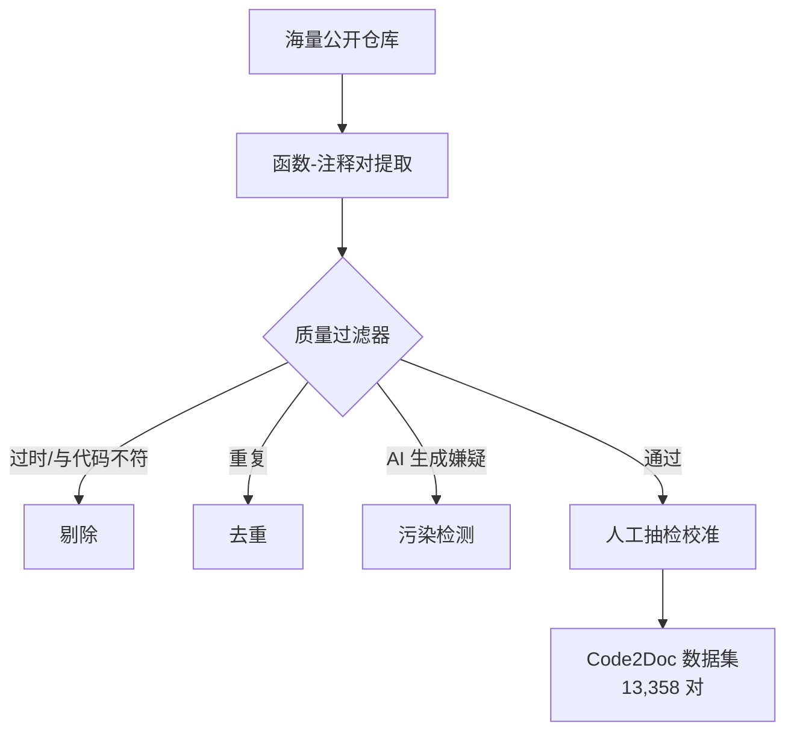

# Code2Doc — 质量优先的代码文档数据集

> 论文：https://arxiv.org/abs/2512.18748
> 名称：Code2Doc: A Quality-First Curated Dataset for Code Documentation

## 基本信息

| 项目 | 内容 |
|------|------|
| **链接** | https://arxiv.org/abs/2512.18748 |
| **发布时间** | 2025-12 |
| **一句话总结** | 指出现有代码文档数据集"量大质劣"的问题，构建质量优先的函数级文档数据集：13,358 对高质量（函数, 文档）对 |
| **核心创新** | 把"文档质量"作为数据集构建的第一优先级，而不是规模 |

## 置信度评估

| 信号 | 评估 |
|------|------|
| 发表场所 | arXiv 预印本（2025-12） |
| 引用/影响 | 低-中（新发布） |
| 代码可用 | 数据集公开 |
| 来源机构 | 学术机构 |
| **综合置信度** | **🟡 中**（数据集是实体产出，可验证） |
| 需谨慎点 | 质量筛选标准是人工设计的规则，可能引入偏好偏差 |

## 它解决了什么问题

自动代码文档生成模型的效果**取决于训练数据的质量**。但现有文档数据集大多是"大规模爬取公开仓库"的产物，存在三个致命问题：

1. **噪声多**：爬取的注释可能过时、不完整、与代码不符
2. **重复严重**：公开仓库互相拷贝，同一段代码+注释出现几十次
3. **AI 污染**：越来越多的仓库注释是 AI 生成的，用 AI 生成内容训练 AI 生成文档，质量螺旋下降

这导致：监督信号弱 → 模型学到的是"生成看起来像注释的东西"，而非"准确描述代码的东西"。同时评测也被污染：模型在噪声数据上刷分，实际文档质量存疑。

Code2Doc 的立场：**文档生成要质量优先，宁可数据少而精，不可多而滥。**

## 方法核心

### 质量过滤的多道关卡

- **时效性检查**：注释与代码版本是否匹配
- **一致性检查**：注释描述的行为与代码实际行为是否一致
- **重复检测**：跨仓库去重，保留最优质来源
- **AI 污染检测**：识别并剔除 AI 生成嫌疑的注释

最终产出 13,358 对高质量（函数, 文档）对，规模远小于大型爬取数据集，但质量显著更高。

## 关键洞察

1. **数据质量决定模型上限**：文档生成模型的瓶颈在数据，不在模型架构
2. **评测污染是隐形的**：爬取数据集的"高分"可能是噪声拟合的结果
3. **质量过滤是可工程的**：时效性、一致性、去重、污染检测都是可自动化实现的规则

## 局限与注意

- 函数级粒度，不含文件级/仓库级文档
- 质量过滤器的人工规则可能偏向特定风格的注释（如 Google 风格 vs JSDoc 风格）
- 13,358 对规模较小，训练大模型可能不够

## 对我们项目的启发

### 直接借鉴 ✅

1. **门禁评测要防"文档污染"**：如果我们用"文档质量"作为门禁信号，评测集必须像 Code2Doc 一样做质量过滤，否则噪声文档会污染门禁判断（对应 docs/gate.md 的防作弊原则）
2. **知识质量的四道过滤器**：时效性、一致性、去重、AI 污染检测，可以直接移植为**知识文档的入库检查**（cannbot 的 knowledge-lint 思路 + Code2Doc 的质量关卡）
3. **"少而精"原则**：知识库宁可每份文档高质量，不可贪多求全。这与我们"解释型 Markdown 而非源码搬运"的定位一致

### 需要改造 🔧

- 我们的知识是解释型 Markdown，而非函数级注释。质量过滤器要相应改造：一致性检查变成"知识描述与源码行为是否一致"，这正好是飞轮门禁的雏形

### 需要注意 ⚠️

- 人工质量标注的成本：Code2Doc 靠规则+抽检，我们的大规模知识库要设计自动化质量信号（多信号组合，见 docs/gate.md）

## 关联

- [代码问答基准与文档记忆区分.md](代码问答基准与文档记忆区分.md) — 代码推理 vs 文档记忆分离（评测防污染的另一角度）
- docs/gate.md — 门禁评测设计（防作弊、多信号组合）
- [../知识格式/../知识格式/Cannbot知识库插件.md](../知识格式/../知识格式/Cannbot知识库插件.md) — knowledge-lint 治理流程
- [从程序文档生成自动化测试.md](从程序文档生成自动化测试.md) — 用测试验证文档质量（下游任务间接验证）
