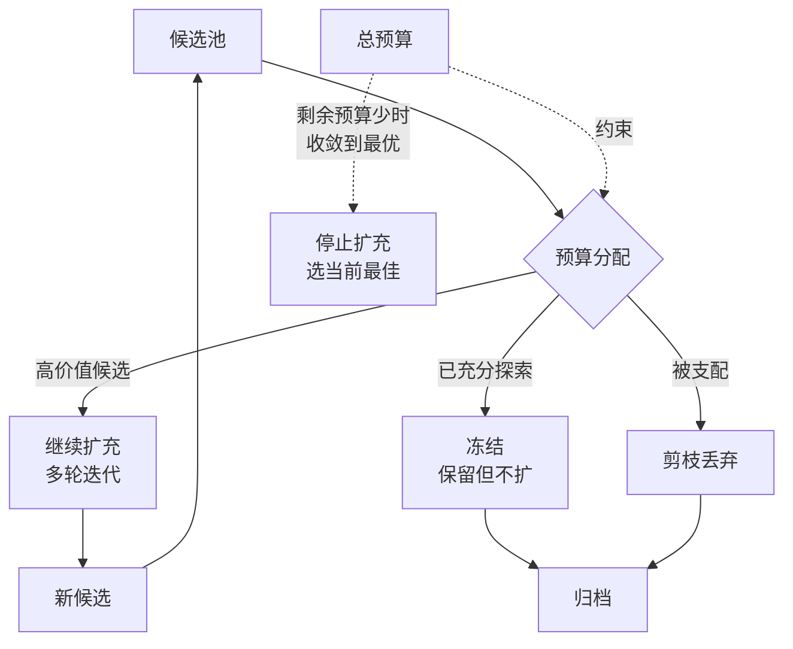

# 搜索预算与候选剪枝：控制进化路径爆炸

## 基本信息

| 项目 | 内容 |
|------|------|
| **主题** | 进化搜索中的预算控制与候选剪枝 |
| **核心论文** | Inference-Time Budget Control（[2605.05701](https://arxiv.org/abs/2605.05701)）、Spend Less Reason Better（[2603.12634](https://arxiv.org/abs/2603.12634)）、What Makes an LLM a Good Optimizer（[2604.19440](https://arxiv.org/abs/2604.19440)）、SkillMOO（[2604.09297](https://arxiv.org/abs/2604.09297)） |
| **发布时间** | 2026（均为新工作） |
| **一句话总结** | 候选池与归档随轮次膨胀时，怎么决定哪些继续扩、哪些冻结、怎么在预算耗尽前收敛到可用的解 |

---

## 置信度评估

| 信号 | 评估 |
|------|------|
| 发表场所 | 均为 arXiv 预印本（2026） |
| 引用/影响 | 较新，待观察 |
| 代码可用 | 需逐一核实 |
| 来源机构 | 高校与工业界研究团队 |
| **综合置信度** | **🟡 中** |
| 需谨慎点 | 均为新工作；本方向的概念基础（归档、Pareto、quality diversity、步进石）源自进化算法经典文献，需追溯源头理解 |

## 它解决了什么问题

采用归档与多候选的进化框架后，会出现一个新的资源问题：**搜索空间随轮次指数增长**。

每轮产生 N 个候选，每个候选都要评测。保留 M 个作为后续父代。如果 M 与 N 都不加控制，第 k 轮的评测次数是 N 的 k 次方量级。实际系统中这是不可承受的。

同时还有另一个方向的问题：候选池膨胀后，**有限的预算会被分散到大量低价值候选上**，反而拖慢收敛。

这个方向要回答三个具体问题：

1. 哪些候选继续扩充，哪些冻结
2. 怎么在预算耗尽前收敛到可用解，而不是半途停在一个未完成的探索状态
3. 怎么判断某个候选值得投入更多评测预算

---

## 方法核心

### 四个方向的核心设计

**① 推理时预算控制**

Inference-Time Budget Control 处理的是单次搜索的预算分配：给定总预算，怎么在探索与利用之间分配。核心思路是把预算视为一等约束，搜索策略根据剩余预算调整行为：预算充足时多探索，预算紧张时快速收敛。

**② 预算感知的树搜索**

Spend Less Reason Better 把预算感知嵌入价值树搜索。节点扩展时考虑该分支的预期收益与剩余预算，优先扩展高收益分支。与普通树搜索的区别在于：不是搜索到自然终止，而是在预算约束下选择最优的终止点。

**③ 理解 LLM 在进化搜索中的实际作用**

What Makes an LLM a Good Optimizer 做的是轨迹分析：拆解 LLM 引导的进化搜索中，哪些环节真正带来改进。这个分析的价值在于识别浪费：如果某类变异几乎从不产生有效候选，就可以从搜索策略中移除，直接节省预算。

**④ 多目标下的候选选择**

SkillMOO 处理的是软件工程场景下的多目标优化，涉及技能的多个维度（效果、成本、泛化性等）之间怎么权衡。多目标下不存在单一最优，需要维护 Pareto 前沿。

### 经典概念溯源

归档、Pareto 前沿、quality diversity、步进石这几个概念源自进化算法领域。做机制设计时应理解源头，否则容易误用。

| 概念 | 来源 | 链接 |
|------|------|------|
| Quality Diversity 与归档 | MAP-Elites 系列 | [2012.04375](https://arxiv.org/abs/2012.04375) |
| 步进石 | Behavior Domination 方法 | [1704.05554](https://arxiv.org/abs/1704.05554) |
| 新颖性搜索 | Novelty Search 系列 | [1207.6682](https://arxiv.org/abs/1207.6682) |
| 归档的加速证明 | 归档能带来可证明的加速 | [2406.02118](https://arxiv.org/abs/2406.02118) |
| 双归档约束优化 | Two-Archive 算法 | [1711.07907](https://arxiv.org/abs/1711.07907) |

**注意**：这些是进化算法领域的经典文献，早于 2025 年。用它们是为了理解概念源头，不作为方法选型依据。

---

## 实验结果

各论文报告了各自场景下的结果，具体数值需查阅原文。方向性结论：

- 预算感知的搜索策略在预算受限时优于不感知预算的基线
- 部分变异算子对最终结果的贡献极低，识别后可移除
- 多目标场景下维护 Pareto 前沿优于加权单一目标

---

## 局限与注意

- **概念迁移风险**。经典进化算法的结论建立在特定假设上（适应度函数稳定、评估成本低），LLM 场景下这些假设不总成立
- **预算口径不统一**。不同论文的「预算」定义不同（rollout 次数、token 数、评测调用次数），不能直接比较
- **多目标权重仍需人为设定**。Pareto 前沿避免权重设定，但最终选取哪个点仍需决策
- **均为 2026 年新工作**，结论待复现

---

## 对我们项目的启发 ⭐

### 可以直接借鉴的

**① 预算耗尽时的行为要明确定义**

项目文档写着「达到最大轮次仍未达标或预算耗尽时停止」。这里需要明确「停止」的具体行为：是停止后进入人工治理（项目已有这个设计），还是选当前最优版本发布。

建议明确为：**预算耗尽时，从归档中选择综合评分最高的版本作为输出，同时标记为未完全收敛**。这比直接失败更有价值，因为部分改进仍然可用。

**② 冻结策略比剪枝策略更实用**

候选池膨胀时，直接剪枝（删除）会丢失历史信息。更实用的做法是**冻结**：候选保留在归档中但不再扩充。这样既不消耗预算，又保留了回滚与参考的可能。

项目已有 SUPERSEDED 状态表示被后继发布替代的版本。可以把「冻结」实现为一种状态标记，而不是删除。

**③ 识别低价值变异算子**

What Makes an LLM a Good Optimizer 的轨迹分析思路可以应用到项目：统计各类知识修改（补充条目、修正描述、细化约束）对最终门禁通过率的实际贡献。如果某类修改几乎从不带来改善，就从候选生成策略中移除。

这需要项目记录每轮修改的类型与结果，属于观测能力建设。

**④ 归档需要索引，不只是存储**

归档变大后，从归档选父代需要检索。没有索引的归档退化为线性扫描。需要按知识模块、修改类型、评分区间建立索引。

### 需要改造的

**① 把抽象预算换算成项目约束**

项目层面的预算是「多少轮」「每轮多少用例」。需要把论文的 rollout 口径换算过来，制定可执行的预算策略。例如：总轮次上限 R，每轮候选数 N，评测用例数 T，总评测次数上限为 R × N × T。

**② 多目标维度需要定义**

SkillMOO 处理多目标优化的思路可以用，但项目的目标维度需要自己定义。候选的可能维度包括：门禁通过率、覆盖的测试用例数、改动幅度（小改动优先）、可审查性。

注意：门禁通过率与覆盖用例数是 GEPA 式的样本级互补指标，改动幅度与可审查性是工程性约束。两类指标的合并方式需要设计。

**③ Pareto 前沿的维护成本**

维护 Pareto 前沿需要在每轮评测后计算支配关系。候选数不多时是 N 平方的比较，可接受；候选数上百时需要优化。

### 需要注意的

- **不要过早引入复杂机制**。项目当前处于补齐基础缺口的阶段，先把「归档 + 父代选择 + 预算上限」做出来，Pareto 前沿与多目标优化可以在候选规模扩大后再引入
- **经典文献的假设要检查**。MAP-Elites / Novelty Search 假设适应度评估相对廉价，LLM 场景下每次评测都要调用模型或跑测试，成本高得多，直接套用会导致预算失控
- **预算策略需要可配置**。不同项目的代码规模与知识复杂度差异大，硬编码的预算上限不适用
- **冻结版本也需要过门禁**。冻结的版本应该是通过门禁的版本，否则回滚等于引入未验证的知识

---

## 关联

- **对应飞轮环节**：评测门禁（evaluation 阶段的预算约束）、轮次路由（workflow_router 的停止条件）
- **相关论文**：DGM（2505.22954）：，归档机制，本文件讨论其规模膨胀问题
- **相关论文**：GEPA（2507.19457）：，父代选择的加权采样，本身是一种预算分配策略
- **相关论文**：MOAE（2609.05992）：，多目标 agent 进化与 Pareto 保留搜索
- **相关论文**：One Policy, Any Budget（2609.00813）：，强化学习内化预算感知
- **项目缺口对应**：项目标注「达到最大轮次仍未达标或预算耗尽时停止」，本文件讨论「停止」后的具体行为定义
