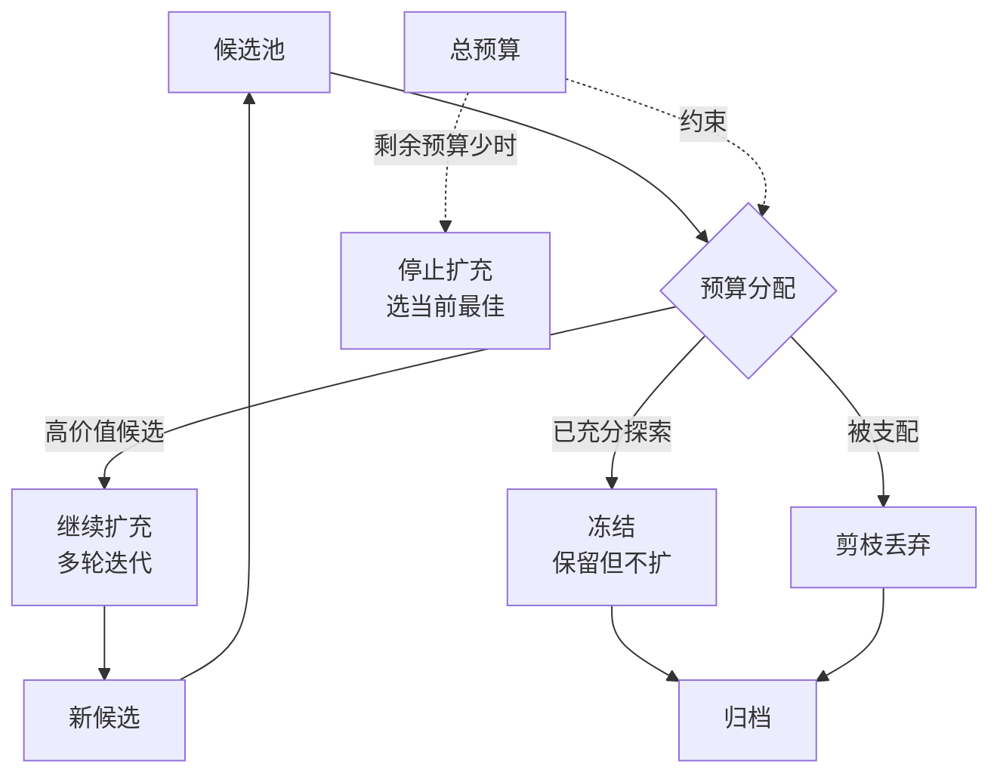

# 搜索预算与候选剪枝：控制进化路径爆炸

## 基本信息

| 项目 | 内容 |
|------|------|
| **主题** | 进化搜索中的预算控制与候选剪枝 |
| **核心论文** | Inference-Time Budget Control（[2605.05701](https://arxiv.org/abs/2605.05701)）、Spend Less Reason Better（[2603.12634](https://arxiv.org/abs/2603.12634)）、What Makes an LLM a Good Optimizer（[2604.19440](https://arxiv.org/abs/2604.19440)）、SkillMOO（[2604.09297](https://arxiv.org/abs/2604.09297)） |
| **发布时间** | 2026（均为新工作） |
| **一句话总结** | 候选池与归档随轮次膨胀时，怎么决定哪些继续扩、哪些冻结、怎么在预算耗尽前收敛到可用的解 |

---

## 置信度评估

| 信号 | 评估 |
|------|------|
| 发表场所 | 均为 arXiv 预印本（2026） |
| 引用/影响 | 较新，待观察 |
| 代码可用 | 需逐一核实 |
| 来源机构 | 高校与工业界研究团队 |
| **综合置信度** | **🟡 中** |
| 需谨慎点 | 均为新工作；本方向的概念基础（归档、Pareto、quality diversity、步进石）源自进化算法经典文献，需追溯源头理解 |

## 它解决了什么问题

采用归档与多候选的进化框架后，会出现一个新的资源问题：**搜索空间随轮次指数增长**。

每轮产生 N 个候选，每个候选都要评测。保留 M 个作为后续父代。如果不加控制，第 k 轮的评测次数是 N 的 k 次方量级。实际系统中这是不可承受的。

同时还有另一个方向的问题：候选池膨胀后，**有限预算会被分散到大量低价值候选上**，反而拖慢收敛。

这个方向回答三个具体问题：

1. 哪些候选继续扩充，哪些冻结
2. 怎么在预算耗尽前收敛到可用解，而不是半途停在一个未完成的探索状态
3. 怎么判断某个候选值得投入更多评测预算

---

## 方法核心



### 四个方向的核心设计

**① 推理时预算控制**

Inference-Time Budget Control 处理单次搜索的预算分配：给定总预算，怎么在探索与利用之间分配。核心思路是把预算视为一等约束，搜索策略根据剩余预算调整行为。预算充足时多探索，预算紧张时快速收敛。

**② 预算感知的树搜索**

Spend Less Reason Better 把预算感知嵌入价值树搜索。节点扩展时考虑该分支的预期收益与剩余预算，优先扩展高收益分支。与普通树搜索的区别在于：不是搜索到自然终止，而是在预算约束下选择最优的终止点。

**③ 理解 LLM 在进化搜索中的实际作用**

What Makes an LLM a Good Optimizer 做轨迹分析：拆解 LLM 引导的进化搜索中，哪些环节真正带来改进。这个分析的价值在于识别浪费。如果某类变异几乎从不产生有效候选，就可以从搜索策略中移除，直接节省预算。

**④ 多目标下的候选选择**

SkillMOO 处理软件工程场景下的多目标优化，涉及技能的多个维度（效果、成本、泛化性等）之间怎么权衡。多目标下不存在单一最优，需要维护 Pareto 前沿。

### 经典概念溯源

归档、Pareto 前沿、quality diversity、步进石这几个概念源自进化算法领域。做机制设计时应理解源头。

| 概念 | 来源 | 链接 |
|------|------|------|
| Quality Diversity 与归档 | MAP-Elites 系列 | [2012.04375](https://arxiv.org/abs/2012.04375) |
| 步进石 | Behavior Domination 方法 | [1704.05554](https://arxiv.org/abs/1704.05554) |
| 新颖性搜索 | Novelty Search 系列 | [1207.6682](https://arxiv.org/abs/1207.6682) |
| 归档的加速证明 | 归档能带来可证明的加速 | [2406.02118](https://arxiv.org/abs/2406.02118) |
| 双归档约束优化 | Two-Archive 算法 | [1711.07907](https://arxiv.org/abs/1711.07907) |

这些是进化算法领域的经典文献，早于 2025 年。用它们是为了理解概念源头，不作为方法选型依据。

---

## 实验结果

各论文报告了各自场景下的结果，具体数值需查阅原文。方向性结论：

- 预算感知的搜索策略在预算受限时优于不感知预算的基线
- 部分变异算子对最终结果的贡献极低，识别后可移除
- 多目标场景下维护 Pareto 前沿优于加权单一目标

---

## 局限与注意

- **概念迁移风险**。经典进化算法的结论建立在特定假设上（适应度函数稳定、评估成本低），LLM 场景下这些假设不总成立
- **预算口径不统一**。不同论文的「预算」定义不同（rollout 次数、token 数、评测调用次数），不能直接比较
- **多目标权重仍需人为设定**。Pareto 前沿避免权重设定，但最终选取哪个点仍需决策
- **均为 2026 年新工作**，结论待复现

---

## 对本项目的启发 ⭐

本项目在轮次预算上已经有一套明确实现，比多数同类系统更严谨。

`src/domain/workflow/IterationBudget.ts`：

```
canStartIteration(iteration, maxIterations)
canContinueIteration(iteration, maxIterations)
```

`Workflow.md` 的 AC-AGENT-105 规定了语义：

> maxIterations 表示包含首轮的最大业务轮数；内部 iteration 保持从 0 开始。进入每轮生成前统一检查 `0 <= iteration < maxIterations`，当前轮结束时仅当 `iteration + 1 < maxIterations` 才允许继续。质量拒绝、测评失败及恢复必须使用相同 Domain 规则，不能分支各自判断。

并且明确了不计入轮数的操作：模型格式重试、TestGen 有限修复、同轮节点重放。

`Evaluation.md` 的 IO-20 规定了结束行为：

> 完成验收后自动结束并交付达标文档，不新增人工确认；达到最大轮次仍未达标或预算耗尽时停止并转人工治理。

同时列出未完成项：

> 成本预算、停滞策略、历史最佳回退和自动清理仍未完成。

**所以本文件要回答的是：轮次预算已经做好，还缺的「成本预算」和「停滞策略」具体要补什么。**

### 解决哪个环节的什么问题

**环节：`evaluation` 阶段的停止判定与 `workflow_router` 的停止路径。**

### 缺口一：成本预算

当前 `maxIterations` 约束的是**轮数**，不约束**每轮的实际开销**。

问题在于不同轮次的开销差异可能很大。一篇文章可能需要多轮 DocGen 修订，每轮都调用模型生成文档加代码加测试；另一篇可能一轮就过。如果只限制轮数，单个 Run 的总成本波动很大。

**具体补法**：在 `IterationBudget` 之外增加成本维度。参考 Inference-Time Budget Control 的思路，把成本预算作为独立约束，与轮数预算并列：

| 预算维度 | 当前状态 | 补法 |
|---|---|---|
| 轮数 | 已实现（`IterationBudget`） | 保持 |
| 成本（模型调用次数或 token） | 未实现 | 增加计数器，在 `canStartIteration` 同级增加 `canAffordIteration` |
| 时间 | 未实现 | 可选，视运维需求 |

注意 `EvaluationReport.schema.json` 已有 `modelConfigSummary` 与 `promptDigest`，可用于成本归因。

**关键约束**：成本预算耗尽时的行为应与轮数耗尽一致（转人工治理），不应引入新的停止语义。否则 `workflow_router` 的 PASS / ITERATE / STOPPED 三分支会被打破。

### 缺口二：停滞策略

`Evaluation.md` 提到「停滞转 LOW_CONFIDENCE」是目标要求，但未实现。

停滞的判定需要定义。本项目可用的程序化事实包括：

- 连续若干轮 `GateDecision` 都是 ITERATE，且 `criticalFailures` 数量没有下降
- `stability` 连续若干轮在阈值附近波动，没有收敛趋势
- `MarkdownDiff` 显示连续两轮的修订涉及同一段落（同一处反复改）

**具体补法**：借鉴 What Makes an LLM a Good Optimizer 的轨迹分析思路，先做观测再定策略。记录每轮的 GateDecision 事实与修订位置，观察是否存在「反复修改同一段落但分数不提升」的模式。确认模式存在后，再定义停滞阈值与转 LOW_CONFIDENCE 的条件。

这样做的理由是：停滞阈值如果拍脑袋定，可能误判正常的多轮收敛过程。先有观测数据，再定阈值。

### 缺口三：归档的存储成本

DGM 式的归档会随轮次增长。本项目 `Knowledge.md` 的 IO-19 已经规定了资料保留策略：

| 结束状态 | 过程资料处理 |
|---|---|
| 文档质量达标 | 最终文档及验收记录保存成功后，立即清理中间候选文档、生成代码及编译产物，不设额外保留期 |
| 需要人工治理 | 后台暂存解决问题所需的相关版本和完整证据，人工默认只看精简治理清单 |
| 人工治理完成 | 达标后保留最终文档、验收记录及治理结论；未解决问题的证据继续暂存 |

这个策略本身就限制了归档规模：**只保留最终版本与被替换的上一版**（用于回退），中间候选清理。

需要注意与回退机制的配合：如果 IO-19 清理了中间候选，那么回退目标只能是「被替换的上一版」或更早的已发布版本，不能是任意中间候选。这一点在实现回退逻辑时要对齐。

### 提供了什么思路

**① 冻结优于删除**

候选池膨胀时，直接剪枝会丢失历史信息。本项目 `KnowledgeStatus` 中的 `SUPERSEDED` 正是冻结语义：表示被后继发布替代，本身是有效版本，保留但不继续扩充。这个状态可以直接用于归档的冻结策略，不需要新状态。

**② 停止后的行为要明确定义**

`Evaluation.md` 的 IO-20 已经明确「达到最大轮次仍未达标或预算耗尽时停止并转人工治理」。本文件补充的是：**停止时应确保当前最佳版本已保存，并进入 STOPPED 的精简交接**（`ReviewHandoffPrepared` 事件，含 `summary`、`historySummary`、`evidenceRefs`、`handoffRef`）。这个机制已实现，不需要新增。

**③ 不要过早引入 Pareto 前沿**

SkillMOO 的多目标优化思路可以用，但本项目当前处于补齐基础缺口的阶段。先把「归档 + 父代选择 + 成本预算」做出来，多目标优化可以在候选规模扩大后再引入。

**④ 引入新预算维度时保持单一判定入口**

AC-AGENT-105 强调「质量拒绝、测评失败及恢复必须使用相同 Domain 规则，不能分支各自判断」。增加成本预算时应遵循同一原则：在 Domain 层统一判定，不在各分支各自检查。

### 需要注意的

- **轮数预算的既有语义不能破坏**。`maxIterations` 含首轮、内部 iteration 从 0 开始、模型格式重试与同轮重放不计入轮数。增加成本预算时不要改变这些语义
- **成本预算需要新的验收**。现有验收 `tests/integration/WorkflowIterationLimit.test.ts` 覆盖轮数上限。成本预算需要对应的验收，且应包含「已耗尽预算直接重入生成入口时必须在模型调用前拒绝」这类边界（与轮数的既有验收对齐）
- **清理策略与回退策略有耦合**。IO-19 清理中间候选后，回退可用的版本范围缩小。两者需要在实现前一起设计
- **经典文献的假设要检查**。MAP-Elites / Novelty Search 假设适应度评估相对廉价。本项目每次评测要跑生成代码与固定测试，成本高得多，直接套用会导致预算失控
- **停滞阈值需要数据支撑**，不要凭直觉设定

---

## 关联

- **对应环节**：`evaluation` 阶段的停止判定与预算约束；`workflow_router` 的停止路径；`knowledge` 的资料保留与回退
- **对应缺口**：`Evaluation.md` 的「成本预算、停滞策略、历史最佳回退和自动清理仍未完成」；`Knowledge.md` 的「自动资料清理和完整治理展示仍未完成」
- **相关论文**：DGM（2505.22954）：归档机制，本文件讨论其规模控制与 IO-19 清理策略的配合
- **相关论文**：GEPA（2507.19457）：父代选择的加权采样，本身是一种预算分配策略
- **相关论文**：MOAE（2609.05992）：多目标 agent 进化与 Pareto 保留搜索
- **相关论文**：One Policy, Any Budget（2609.00813）：强化学习内化预算感知
- **本项目代码**：`src/domain/workflow/IterationBudget.ts`、`src/domain/Domain.ts`（KnowledgeStatus 与业务状态机）
- **本项目验收**：`tests/integration/WorkflowIterationLimit.test.ts`（轮数上限）、`tests/integration/WorkflowRouterReplay.test.ts`（路由跨存储恢复）、`tests/integration/StoppedHandoff.test.ts`（四类停止交接）
