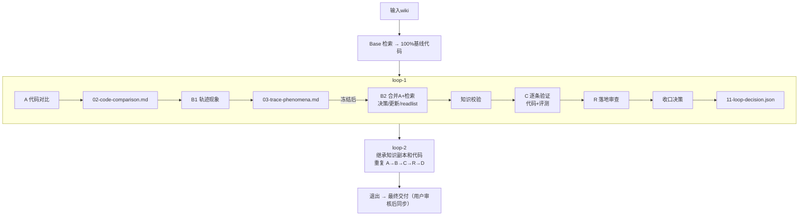

# 算子团队实现方案（知识飞轮案例参考实现与技术细节）

> 来源：别的团队实现方案（2026-08-21 由用户提供，忠实记录，未改动原文内容）。
> 定位：知识飞轮理念在算子团队业务场景的落地形态。**参考案例**，非本项目当前设计；与本项目设计的映射见第一部分 §11。
> 本文档由《知识飞轮案例》与《知识飞轮技术细节补充》合并而成（2026-08-24），含案例主文档、技术细节、对本项目的启示与不足分析三部分。

---

## 第一部分：案例主文档

## 1. 总体目标

通过"知识 → 代码 → 反馈"的闭环迭代，使基于知识文档生成的算子代码持续趋近官方参考实现，同时反向验证并提升知识文档质量。

## 2. 退出条件（满足任一）

| 条件 | 说明 |
|------|------|
| 完美达标 | 正确率100% + avg_speedup >= target（默认1.0）+ Evolver声明"本轮无待实现知识" |
| 达到上限 | 循环轮次达到 max_loops（最大20） |
| 基础设施阻塞 | 加速硬件或远程环境形成有证据的阻塞 |

## 3. 三阶段顺序执行

阶段一：准备（prepare） → 阶段二：Base 算子开发 → 阶段三：飞轮循环（loop-1, loop-2, ...）

不可跳步，不可并行。

## 4. 核心角色与职责

| 角色 | 代号 | 核心职责 | 可读官方源码 | 可改代码 | 可检索知识 |
|------|------|---------|------------|---------|-----------|
| Base Developer | Base | 从知识生成100%精度基线代码 | ❌ | ✅ | ✅（审计） |
| Comparator | A | 静态代码对比，找出未吸收的优化点 | ✅（只读） | ❌ | ❌ |
| Evolver | B | 轨迹驱动知识演进，产出readlist | ❌ | ❌ | ✅（审计） |
| Verifier | C | 知识驱动代码验证，逐条实现优化 | ❌ | ✅ | ✅（审计） |
| Landing Reviewer | R | 落地审查纠偏，判断知识是否正确落地 | 弱（仅偏离点） | ❌ | ❌ |
| 主调度 | — | 状态管理、校验关卡、循环决策 | — | — | — |

**信息隔离**：每个角色在独立的新上下文中运行，不共享历史会话。

## 5. 阶段一：准备（Prepare）

输入参数：实验名、算子名、最大循环数、平台（平台A/B/C）、Wiki路径列表、远程环境信息。

关键步骤：

1. 解析输入：固定配置，写入 run_meta.json
2. 固定官方源码：从Wiki的 frontmatter.resource 解析内部代码托管 URL，sparse checkout到固定commit
3. 设置评测任务：准备cases定义、精度期望输出
4. 远程preflight（可选）：检查加速硬件可见性、工具路径
5. 初始化版本控制：生成 00-input-facts.md

产物：run_meta.json、_e2e_sources/（官方源码）、task/（评测任务）

## 6. 阶段二：Base 算子开发

角色目标：仅从知识文档产出精度100%的基线代码，不做性能优化探索。

硬约束：

- 设计前必须完成知识检索（discover → preflight → get）
- 禁止读取官方源码
- 核心计算必须在自定义内核内（禁止桩代码或host代算）

执行顺序：

1. 审计检索 → 读wiki → 写定义文档 + 设计文档
2. 实现算子代码
3. 小步构建 + correctness-only调测
4. 精度100%后冻结代码，创建commit
5. 执行且仅一次完整correctness+performance评测，生成canonical报告

必须产物：算子定义、设计文档、调测证据、基线结果（baseline.json）、STATE.md（全部勾选）

## 7. 阶段三：飞轮循环（Loop-1, Loop-2, ...）

### 7.1 循环目录结构

```text
loop-N/
├── 00-STATE.md              # 责任制状态清单（A/B/C/D四节）
├── 02-code-comparison.md    # A产出
├── 03-trace-phenomena.md    # B1产出
├── 04-knowledge-decisions.md # B2产出
├── 05-failed-mechanism-ledger.md
├── 06-knowledge-updates.md
├── 07-verifier-readlist.md  # B产出（核心）
├── 08-knowledge-validation.json
├── 09-verifier-progress.md  # C产出
├── 10-verifier-checklist.md
├── 11-loop-decision.json    # 主调度产出
├── 12-landing-review.md     # R产出
├── 13-correction-packet.md  # R产出（可选）
├── updated-knowledge/       # Verifier必读知识包（L<N>-K<n>.md）
├── knowledge_worktree/      # 可编辑知识副本（增量更新）
├── traces/                  # 各角色JSONL轨迹
├── evals/                   # 评测报告
└── csrc/                    # 代码快照
```

知识副本继承：

- loop-1：从输入wiki复制
- loop-N（N>1）：复制上一轮完整 knowledge_worktree，禁止重新读原始wiki

### 7.2 循环固定顺序

prepare_loop → A → B1 → B2 → 知识校验 → C → R → (可选verifier retry) → 收口决策

无匹配官方源码时A标记 skipped，直接进入B。

### 7.3 阶段A：Comparator（代码对比）

- 输入：本轮初始代码 + 官方源码 + 精简输入包（comparator-input/）
- 输出：02-code-comparison.md，每条候选含：维度、源码证据、差异描述、候选类型、模板/实现、命中条件、平台适用性等
- 硬边界：禁止读wiki/设计文档/verifier产物；每次读源码不超过150行

### 7.4 阶段B：Evolver（知识演进）

**B1：轨迹现象**（独立完成，禁止读A产物，禁止检索）

- 读输入轨迹（Base轨迹或上一轮Verifier轨迹）
- 输出 03-trace-phenomena.md，每条含稳定 B1-* ID、类别、证据、置信度

**B2：决策与知识更新**（B1冻结后进入）

1. 读A产物（若启用），逐条复核平台适用性
2. 审计检索（preflight + get）补足缺口
3. 模板/实现执行矩阵审计
4. 逐项决策（更新知识/已有知识无需改/证据不足/平台不适用等）
5. 更新失败机制总账 05-failed-mechanism-ledger.md
6. 按条目级delta更新 knowledge_worktree/
7. 输出 06-knowledge-updates.md
8. 输出 07-verifier-readlist.md（每条严格三字段：ID + 知识片段路径 + 验证判据）
9. 输出 08-knowledge-validation.json

**校验关卡**（B完成后主调度独立运行）：

- 增量知识校验（Markdown格式、resource不可变、版本差分、知识树hash）
- Loop gate（A/B必选来源闭合、readlist三字段完整、packet与副本一致）

### 7.5 阶段C：Verifier（代码验证）

- 输入：readlist + updated-knowledge + 审计检索
- 逐条验证（K1, K2, K3...顺序，不可重排/并行）：
  - 读packet → 冻结设计 → 编码 → 构建 → 全量correctness+performance → 调测/快照 → 终态
- 四种终态：
  - 已实现（精度100% + 性能判据达标）→ accepted benefit
  - 部分实现（精度100%但性能未达标）→ 保留为中间基线
  - 实现失败 → 回滚到可用基线
  - 基础设施阻塞 → 保存证据停止
- 硬约束：禁止 --no-perf；禁止读官方源码/原始wiki；核心计算必须在自定义融合内核内

### 7.6 阶段R：Landing Reviewer（落地审查）

- 审查内容：每条verifier条目是否真正落地知识语义、模板/tiling、融合路径、路由边界
- 输出：12-landing-review.md，含 landing_review: pass/correction_needed/evidence_insufficient
- 若需retry：额外输出 13-correction-packet.md（偏离点 + 纠偏依据 + 最小retry范围 + 成功判据）

### 7.7 收口与循环决策（主调度）

1. 复算写保护哈希（wiki/官方源码/task/知识文件/构建输入）
2. 校验知识树hash不变
3. 校验所有产物闭合
4. 提交本轮代码与知识
5. 写 11-loop-decision.json + progress.md

三种决策：

| 决策 | 条件 |
|------|------|
| stop | max_loops达到；或正确率100% + 性能达标 + no-pending |
| continue | 目标未达且还有额度；或目标已达但readlist仍有待验证方案 |
| infrastructure_blocked | 加速硬件/远程阻塞 |

## 8. 核心机制与约束

### 8.1 写保护机制

- 原始wiki、官方源码、评测逻辑、task/cases 不可修改
- 每角色启动前快照受保护路径的SHA-256，运行后校验
- STATE按A/B/C/D四节分割，角色只改自己的小节

### 8.2 知识检索审计

- Base/Evolver/Verifier的知识检索必须通过审计wrapper
- 只允许确定性子命令（discover/preflight/get等），禁止dense/reranker/llm-judge
- 每次调用记录到角色专属JSONL

### 8.3 增量知识版本维护

- 按Markdown标题作用域维护版本号（Vn）
- 内容变化时版本号精确加一；新增条目从V0开始

### 8.4 融合路径验收不变量

- 性能收益必须来自 csrc/kernels/<name>/ 内自定义融合内核
- 禁止framework组合算子承接核心计算
- 每个"已实现"候选须提供融合路径证明 + 非抄代码证明

## 9. 最终交付

交付物（不自动同步回原知识库，用户审核后决定是否采纳）：

- 00-input-facts.md
- base/（Base全部产物）
- progress.md
- 最后一轮 knowledge_worktree/（演进后的知识副本）
- 最近一次Verifier评测证据
- 最终算子代码

## 10. 数据流总览图



---

## 11. 与本项目设计的对照（参考价值 ⭐）

> 本案例是知识飞轮理念在另一个团队业务场景的完整落地，与本项目（通用知识工程）的设计高度同构。以下是角色与机制的映射：

### 11.1 角色映射

| 本案例 | 本项目设计（知识飞轮流程设计.md §3.1） | 对应关系 |
|--------|------------------------------|---------|
| Base Developer | 知识生成 Agent（首版生成阶段） | 同构：从知识产出初始代码/文档，不读官方源码 |
| Comparator (A) | Review Agent（差异对比环节） | 同构：只读源码做对比，产结构化差异 |
| Evolver (B) | 知识飞轮（编排层，决策）+ 知识生成 Agent（修订执行） | 同构：决策知识更新 + 执行更新，产出验证清单 |
| Verifier (C) | Coder Agent（迭代执行） | 同构：按清单逐条实现，评测驱动 |
| Landing Reviewer (R) | Review Agent（归因/落地审查环节） | 扩展：多了"知识是否正确落地"的语义审查 |
| 主调度 | 知识飞轮（编排层，状态机） | 同构：循环决策 + 校验关卡 |

### 11.2 机制对照（哪些可直接借鉴 ⭐）

| 本案例机制 | 本项目现状 | 借鉴价值 |
|-----------|-----------|---------|
| **信息隔离**：每角色独立新上下文，不共享历史会话 | 三角色分离（知识飞轮流程设计.md §3） | ✅ 更强：连"历史会话"都不共享，彻底防串扰 |
| **写保护 + SHA-256 快照校验** | 评测集独立 + 防作弊（门禁与评测机制.md §3.5） | ✅ 可直接借鉴：启动前快照、运行后校验受保护路径 |
| **STATE.md 四节分割，角色只改自己小节** | 知识生成 Agent 唯一执笔 | ✅ 可借鉴：状态文件分节，明确每角色写权限 |
| **增量知识版本（标题作用域 Vn）** | 溯源链接 + 按段落迭代（知识飞轮流程设计.md §4/§6） | ✅ 同构：版本号精确到段落级 |
| **知识副本继承（knowledge_worktree）** | 防污染回滚（知识飞轮流程设计.md §9.5） | ✅ 更强：每轮复制完整副本，禁止重读原始 wiki，天然防污染 |
| **知识检索审计 wrapper**（确定性命令白名单） | 未细化 | ⭐ 新增借鉴点：检索行为可审计，防 LLM 乱检索 |
| **readlist 三字段**（ID+路径+判据） | 反馈两层结构（知识飞轮流程设计.md §5） | ✅ 同构：验证清单结构化，比自然语言更可执行 |
| **B1 冻结后才进 B2** | 无对应 | ⭐ 新增借鉴点：阶段产物冻结，防止后续阶段污染前序结论 |
| **失败机制总账（failed-mechanism-ledger）** | 薄弱点地图（知识飞轮流程设计.md §4.3） | ✅ 同构：失败机制积累，辅助决策 |
| **Landing Review（知识是否正确落地）** | 仅差异对比 | ⭐ 扩展点：增加"知识语义落地"审查维度，防"行为对但没按知识实现" |
| **逐条验证不可并行（K1,K2,K3顺序）** | 无对应 | ✅ 借鉴：控制任务顺序（知识飞轮流程设计.md §9.2 顺序效应） |

### 11.3 差异与本项目要注意的点

1. **场景差异**：本案例是算子开发（有加速硬件评测、性能指标、融合内核硬约束），本项目是业务代码仓库（每仓几十万行，文档滞后失真，需从代码回推解释型文档）。性能评测（speedup）是本案例独有，本项目用相似度/测试通过率
2. **知识来源差异**：本案例 wiki 是**输入**（已存在），飞轮只演进知识副本；本项目范围与案例一致（知识库输入、飞轮演进副本），首版生成由上游负责，不在本项目范围
3. **max_loops = 20** 比本项目默认 5 轮宽松，与本项目 9.1 重复评测（≥5 次）不冲突——一个是轮次上限，一个是单轮评测次数
4. **退出条件含"Evolver 声明无待实现知识"**：本项目暂无此信号，可考虑加入编排层决策规则

---

## 12. 参考意义与自研清单

> 读完案例后，我们吸收什么、刻意不抄什么、必须自己做什么，逐项说明。落点对应 [知识飞轮MVP实现方案.md](知识飞轮MVP实现方案.md) 与 [知识飞轮CodeAgent迁移方案.md](知识飞轮CodeAgent迁移方案.md)。

### 12.1 直接吸收（附落点）

| # | 案例机制 | 落点 | 具体改动 |
|---|---------|------|---------|
| 1 | 信息隔离：每角色独立新上下文，不共享历史会话 | codeagent-migration §2.1 | 明确角色每次调用独立构造上下文（Agent tool 无状态调用）；历史会话只属于编排层，角色间不传递 |
| 2 | 写保护 + SHA-256 快照校验 | implementation-plan §3 新增 `gate/hashcheck.py` | 受保护路径（知识文档/评测集/源码快照）启动前快照，运行后校验，篡改即失败 |
| 3 | STATE.md 四节分割，角色只改自己小节 | `flywheel/state.py` | 状态文件按角色分节，编排层校验各节闭合 |
| 4 | knowledge_worktree 副本继承，禁止重读原始 wiki | orchestrator 决策 + `storage/repo.py` | 迭代变更全在副本上进行，过门禁才合并回主知识库 |
| 5 | readlist 三字段（ID+路径+判据） | `review/feedback.py` | 修订指令结构化：ID + 知识段落路径 + 验证判据 |
| 6 | Landing Review：判断知识是否正确落地 | Review Agent 职责扩展 | 差异对比+归因之外，增加"代码是否真正按知识实现"的语义审查 |
| 7 | 失败机制总账 | flywheel §4.3 薄弱点地图 | 升级为结构化 ledger：机制名+证据+失败轮次+置信度 |
| 8 | B1 冻结后才进 B2 | orchestrator 状态机 | 阶段产物加冻结标志，后续阶段只读前序产物 |

### 12.2 刻意不抄（场景差异）

| 项 | 案例 | 本项目 | 原因 |
|----|------|--------|------|
| 评测次数 | 仅一次 canonical 报告 | ≥5 次取均值±方差 | 案例加速硬件评测昂贵；本项目评测便宜，flywheel §9.1 重复评测优先 |
| 退出指标 | 正确率100% + avg_speedup | 相似度≥80% + 测试通过率 | 案例有性能维度；本项目无性能要求 |
| 迭代上限 | max_loops=20 | 默认 5 轮 | 案例单轮信息量大；本项目先小规模验证收敛性 |

### 12.3 必须自己实现（案例未覆盖）

1. **首版知识生成**。案例 wiki 是输入，飞轮只演进副本；本项目范围相同（知识库输入、飞轮演进知识副本），首版生成由上游负责，不在本项目范围
2. **溯源链接与反向映射归因**。案例用轨迹驱动（读 Verifier JSONL）；本项目靠 sources 反查定位段落
3. **相似度与置信度计算**。案例用正确率+speedup；本项目要定义文本→AST 相似度与置信度公式
4. **防背源码**。案例算子场景天然私有；本项目 PoC 必须选私有/变换代码，评测集独立
5. **OKF 知识格式与门禁定义**。案例 wiki 格式未公开；本项目按 知识形态定义.md 自定义

---

## 13. 待澄清问题（问案例作者）

1. **轨迹 JSONL 的字段结构**。Evolver 读的 Verifier 轨迹包含哪些字段？想对齐 session.py 的记录格式
2. **评测集来源与规模**。正确率100% 的 cases 从哪来？多少条？golden 期望输出如何生成？
3. **Landing Review 的实现机制**。判断"知识是否正确落地"靠 LLM 还是规则？偏离点如何提取？
4. **知识树 hash 算法**。校验关卡里的"知识树hash"按目录结构还是内容计算？
5. **写保护快照范围**。受保护路径具体清单？"构建输入"指什么？
6. **非抄代码证明**。每个"已实现"候选的证明怎么出？人工还是自动化？
7. **实际收敛数据**。max_loops=20 的真实项目平均几轮收敛？单轮耗时与成本？
8. **Comparator 的 150 行限制**。大算子源码如何对比？分块策略？

> 以上 8 问的逐条回答见[第二部分](#第二部分技术细节补充对第一部分-13-的逐条回答)（2026-08-21）。

---

## 第二部分：技术细节补充（对第一部分 §13 的逐条回答）

## 1. 轨迹 JSONL 的字段结构

角色轨迹 JSONL 由 run_role.py 生成，每行一条 JSON 记录，共有三种类型。

### 1.1 Attempt Start 记录

| 字段 | 含义 |
|------|------|
| type | 固定为 knowledge_e2e_role_attempt |
| event | start |
| attempt_id | UUID，唯一标识本次角色会话 |
| role | 角色名：base-developer / knowledge-code-comparator / knowledge-evolver / knowledge-verifier / knowledge-landing-reviewer |
| platform | 规范化平台 |
| model | 固定模型标识 |
| reasoning_effort | 固定推理强度 |
| knowledge_commit | 固定知识库 commit |
| prompt_sha256 | 渲染后 prompt 的 SHA-256 |
| started_at | ISO-8601 时间戳 |

### 1.2 Attempt End 记录

| 字段 | 含义 |
|------|------|
| type | 固定为 knowledge_e2e_role_attempt |
| event | end |
| attempt_id | 与 start 对应 |
| role | 同上 |
| codex_return_code | 编码 CLI 会话原始退出码 |
| return_code | 最终退出码（有越权写入时为 3） |
| boundary_changes | 被越权修改的受保护路径列表 |
| finished_at | ISO-8601 时间戳 |

### 1.3 中间行

编码 CLI 的 --json 输出原样追加（stdout 逐行转发到 JSONL 文件）。这些是 CLI 自身的会话事件格式，由 CLI 控制，不是飞轮脚本定义的。

**与 session.py 的对齐**：飞轮不使用 session.py，也不定义 CLI 内部会话格式。attempt_id + started_at/finished_at + prompt_sha256 是飞轮层面的会话标识，可以用来与 CLI 的 session 记录做外键关联。

**Evolver 读的 Verifier 轨迹**：Evolver 的 B1 阶段读的是上一轮 verifier 的完整 JSONL（路径在 input.json 的 input_trace 字段中），包含上述所有记录类型。B1 从中提取构建/精度/性能/纠偏等事实，方式是 LLM 直接阅读 JSONL 中的会话事件，而非脚本预处理。

## 2. 评测集来源与规模

### 2.1 Cases 来源

由评测框架提供，存放在 task/cases.csv 或 task/cases.yaml 中，与评测任务绑定。每个算子的 cases 数量不同，由评测框架按算子语义（dtype/shape/layout 组合）自动生成。

### 2.2 "正确率 100%" 的含义

从 canonical_eval.py 的校验逻辑看，评测报告中有 correctness.passed 和 correctness.total 两个字段，正确率 100% = passed == total。

日志中出现的实际数据：transpose 算子 20/20 cases。

### 2.3 Golden 期望输出

task/golden.py 是精度评测参考，它计算每个 case 的期望结果，与待测实现的实际输出对比。golden.py 本身不属于"官方实现源码"（这是飞轮的术语边界：官方实现源码专指 Comparator 对比的官方实现仓源码）。Golden 的生成方式由评测框架决定，通常是 PyTorch 参考实现。

### 2.4 规模

没有一个统一数量，取决于算子。从日志中看到的实际运行数据是 20 个 cases。复杂算子（多模板/多 dtype）可能有更多。

## 3. Landing Review 的实现机制

判断"知识是否正确落地"靠 LLM，不是规则。

### 3.1 靠规则的部分（确定性关卡在 R 之前已检查）

| 检查项 | 实现方式 |
|--------|---------|
| readlist 每条 K<n> 在 checklist 恰有一行 | prepare_loop.py 的 readlist 解析器检查 |
| 终态只能是四种之一 | review_loop.py 的 TERMINAL 集合校验 |
| 已实现必须精度 100% | canonical_eval.py 校验 passed == total |
| 评测数字来自 canonical 报告 | 脚本验证 canonical 路径和 hash |

### 3.2 靠 LLM 的部分（R 的核心价值）

- 实现是否收敛到知识指定的语义（不是代码是否一致，是语义方向对不对）
- 已实现/部分实现是否朝官方实现路线收敛（可以走不同路径，但不能走偏）
- 路由条件是否来自语义而非硬编码 case ID
- 是否存在 harness debt / 无脑复制官方源码
- direct-launch unlocker 是否真的建立了桥接能力

### 3.3 偏离点提取

R 读取 02-code-comparison.md（A 的官方路线证据）、04/07（B 的决策和 readlist）、verifier 的设计/progress/checklist、当前代码 diff。偏离点是 LLM 通过交叉比对这些材料自行判定的，没有预定义的偏离模式列表。

如果发现偏离，R 写入 13-correction-packet.md，格式固定（偏离点 + 纠偏依据 + 最小 retry 范围 + 成功判据 + 不允许事项），然后触发 fresh verifier retry。

## 4. 知识树 hash 算法

按文件内容计算，不是按目录结构。从 validate_evolved_knowledge.py 的实现看：

| 步骤 | 说明 |
|------|------|
| 文件集合校验 | 比较 source_manifest.json 登记的相对路径集合与 knowledge_worktree/ 下实际存在的文件集合，必须完全一致（不能新增也不能删除） |
| 逐文件 SHA-256 | 对 knowledge_worktree/ 下每个文件计算 SHA-256，结果存入 08-knowledge-validation.json 的 validated_tree_sha256 字段（key 是相对路径，value 是 SHA-256） |
| 校验关卡用法 | review_loop.py 在收口时重新计算知识树的 hash 并与 Evolver 校验时固定的 hash 比对。这里的"hash"是整个 validated_tree_sha256 字典的完整性，每个文件的 SHA-256 都被记录并比对，任何一个文件内容变化都会被检测到 |
| 特殊点 | _digest_path（run_role.py 中的写保护快照）对目录类型的路径递归计算所有子文件的 SHA-256，并且把相对路径名也纳入哈希输入（先 update 路径字符串，再 update 文件内容字节），所以文件重命名也会被检测到 |

总结：SHA-256，逐文件计算，路径名 + 文件内容字节共同输入哈希，排除 __pycache__/.pytest_cache/.pyc 等临时文件。

## 5. 写保护快照范围

受保护路径的具体清单（按角色分组，来自 run_role.py 的 _protected_paths 函数）：

### 5.1 所有角色共同保护

- task/（评测任务目录）
- run_meta.json
- 00-input-facts.md
- access_policy.json
- progress.md

### 5.2 除 Base 外额外保护

- base/（Base 全部产物）

### 5.3 Comparator / Evolver / Landing Reviewer 额外保护

- csrc/（目标代码，这三个角色不能改代码）

### 5.4 Loop 级别保护

| 角色 | 额外保护的路径 |
|------|---------------|
| 所有循环角色 | input.json、source_manifest.json、source_manifest.md、11-loop-decision.json |
| Evolver / Verifier / Landing Reviewer | 02-code-comparison.md |
| Verifier（不能碰 B 产物） | 03/04/06/07/08/12/13/updated-knowledge/ |
| Landing Reviewer（不能碰 A/B/C 产物） | 00-STATE.md/03/04/05/06/07/08/09/10/updated-knowledge//evals//csrc/ |
| Evolver（不能碰上一轮轨迹） | input_trace 指向的文件 |
| Comparator / Verifier / Landing Reviewer | knowledge_worktree/（不能碰知识副本） |

### 5.5 源码和原始 wiki 保护

- 所有 golden.sources[].operator_dir（官方源码 checkout）
- 所有 wiki_files[].path（原始 wiki 文件）

### 5.6 知识库根保护（可检索角色）

- 知识库根下的 kernels/、runbooks/、reference/、graph/、schemas/
- .agents/skills/knowledge-query

### 5.7 "构建输入"指什么

指 csrc/ 目录下参与目标构建的所有源文件。source_hash.py 的计算方式：递归遍历工作目录下所有文件（排除 .git/build/dist/__pycache__/.pytest_cache/*.egg-info/*.so/*.whl/*.pyc 等，排除 docs/ 目录），对每个文件的相对路径 POSIX 字符串和原始字节内容一起喂入 SHA-256。Comparator 和 Evolver 运行前后各算一次，不一致则视为越权修改。

## 6. 非抄代码证明

靠 LLM 自己写，不是自动化验证。

从 Verifier 角色契约看，每个"已实现"候选必须写出两份证明：

| 证明 | 内容 |
|------|------|
| 融合路径证明 | 优化 case 的命中条件（dtype/shape/k/layout/tiling/resource 等语义条件）、host launch 函数名、device kernel 符号名、关键 file:line、softmax/top-k/sort/reduce 等核心计算位于该 kernel 内的说明 |
| 非抄代码证明 | 说明候选是基于 readlist/知识检索的局部自定义 kernel 实现 |

### 6.1 为什么不是自动化的

没有脚本去 diff 生成的代码和官方源码然后判断"相似度"。原因有两层：

1. 概念上：飞轮允许实现路径与官方不同，只要语义方向收敛。相似度低不代表抄了，相似度高也不一定抄了（必要 API/模板形态可能一致）
2. 实践上：如果 Verifier 的 diff 呈现官方源码大段原样搬运且不能解释为必要 API/模板形态，它不能进入"已实现"，这个判断需要语义理解，是 LLM 做的

### 6.2 自动化部分

Landing Reviewer 和 review_loop.py 会检查 canonical 报告中的 file:line 证据链、source_hash 与 build_hash 一致性、source_commit 可验证等，但这些验证的是"评测证据是否真实"，不是"代码是否抄了"。

## 7. 实际收敛数据

本仓库中没有完整的收敛统计。能从日志中提取到的有限数据：

### 7.1 已知实际运行

| 算子 | 实验 | 结果 |
|------|------|------|
| transpose | 0717 实验 | 20/20 正确率、score 62.66、avg_speedup 0.42，未达到 1.0 目标 |
| 8 算子 | 本地飞轮实验（07-18 日志提及） | 没有性能结果记录 |
| 某 MoE 门控算子 | Wiki 卡中有 avg_speedup 字段 | 具体数值未在日志中披露 |

### 7.2 关于收敛轮次

- 日志中提到 max_loops 曾从 10 提升到 20，暗示 10 轮不够收敛
- transpose 的 avg_speedup=0.42 远低于 1.0 目标，说明该算子在已有轮次内未收敛
- 目前没有"平均几轮收敛"的数据，从日志看，可能大部分算子在常用轮次内未达到 1.0 目标

### 7.3 单轮耗时与成本

日志中没有记录。但可以推算：

- 每轮 5 个角色（A/B/C/R + 主调度），每个角色是一个完整编码 CLI 会话
- Verifier 是最耗时的角色（需要实际加速硬件构建+评测，每条 readlist 项都要 build-eval）
- 平台C 算子涉及寄存器 API 审查，Verifier 更慢
- 远程模式还有 SSH 延迟和远程构建时间

结论：本仓库没有公开的系统化收敛数据，只有零散的单算子实验记录。要获得系统数据需要实际跑多个算子的完整飞轮实验。

## 8. Comparator 的 150 行限制与大算子对比策略

150 行是建议值，不是硬限制。从 Comparator 角色契约的原文："每次只读符号附近或切片给出的行段，单次读取建议不超过 150 行。"

### 8.1 大算子的分块策略（三层渐进披露）

**第一层：源码切片计划（comparator-input/source-slices/）**

这是 Evolver 的 B2 为下一轮 A 准备的导航信息，内容包括：

- 按模板/实现组织的最小读取计划
- 每个模板需要读的文件、符号、行段
- 必要注意点

A 先读切片计划，然后按计划逐个模板定位，不需要全文件展开。

**第二层：符号搜索 + 小范围读取**

切片缺失时，A 用符号搜索（如函数名/类名）从官方源码中定位入口，然后只读取入口附近小范围行段。每次读取控制在建议范围内。

**第三层：多模板分解**

如果官方实现呈现多 tiling key / 多模板类 / 多 kernel 入口 / 多分发路径，A 必须按模板/实现维度拆分，每个差异单独一条候选，每条候选只覆盖一个模板/实现。这意味着大算子的对比本身就是拆成多个小对比完成的。

### 8.2 大算子的实际处理

- 官方源码的 _source_index/<name>.md 提供按模板组织的源码导航（只有 Comparator 可以读），每个模板小节只列关键符号和行段
- 禁止 cat / 完整展开大文件 / 把完整官方实现灌入上下文
- 确需扩大读取范围时，A 必须先写明缺口并拆成多个小范围

总结：大算子对比按模板分块、按切片导航、按符号定位、每次只读必要行段。150 行是控制单次读取量的软约束，实际策略的核心是"渐进披露"，先读导航信息，再定向小范围读取，避免上下文爆炸。

---

## 附录：与主文档的对应关系

> 主文档指该团队完整版《知识飞轮》设计文档（本文档为对其内容的补充说明）。

| 本文档章节 | 对应主文档章节 |
|-----------|---------------|
| 1. 轨迹 JSONL 字段结构 | 第 19 章（产物清单）、第 12 章（检索审计） |
| 2. 评测集来源与规模 | 第 17 章（评测体系） |
| 3. Landing Review 实现机制 | 第 9 章（阶段 R） |
| 4. 知识树 hash 算法 | 第 13 章（增量知识校验） |
| 5. 写保护快照范围 | 第 11 章（写保护机制） |
| 6. 非抄代码证明 | 第 8.5 节（融合路径验收不变量） |
| 7. 实际收敛数据 | 无对应（补充数据） |
| 8. Comparator 150 行限制 | 第 6.4 节（硬边界） |

---

## 对本项目的启示（2026-08-21 分析）

> 项目边界澄清：本项目范围 = **飞轮演进知识副本**（知识库输入，首版生成由上游负责，不在本项目范围）；项目背景 = **业务代码仓库**（每仓几十万行），文档滞后失真，需从代码回推解释型文档。以下启示基于此定位。

### 1. 轨迹 JSONL 直接可借鉴（对齐 session.py）

attempt_id + started_at/finished_at + prompt_sha256 作为飞轮层会话标识，外键关联编码 CLI 内部会话。对应到我们的 session.py：

- 每次角色调用记录：attempt_id、prompt_sha256、时间戳、退出码
- 增加 boundary_changes 字段：越权修改的受保护路径名单，对应它们的 return_code=3 机制（有越权写即失败）

### 2. Landing Review 是纯 LLM 判断，规则只做确定性关卡

确定性部分（readlist 完整性、终态枚举、精度 100%、canonical 校验）在 R 之前由脚本检查；R 的 LLM 部分判断：语义方向对不对、是否朝官方路线收敛、路由条件是否来自语义、是否有 harness debt / 无脑复制。

对我们：印证 §12.1 第 6 条（Review Agent 增加"知识是否正确落地"审查维度），且拿到具体输入清单：02-code-comparison.md（A 证据）+ 04/07（B 决策与 readlist）+ verifier 设计/progress/checklist + 当前代码 diff，交叉比对后 LLM 自行判定偏离点。

### 3. hash 算法与写保护细节可抄

- 逐文件 SHA-256，**路径字符串也入哈希**（先 update 路径再 update 内容，重命名可检测）
- 排除 __pycache__/.pytest_cache/.pyc 等临时文件
- 写保护清单分三层：角色级（按角色分组）、loop 级（input.json/source_manifest/loop-decision）、知识库根（kernels/、runbooks/、reference/、graph/、schemas/）
- 对应我们的 gate/hashcheck.py 设想，比现有粒度细得多

### 4. 收敛数据警示：正确率与相似度是两条线

transpose 实测 20/20 正确率但 avg_speedup 0.42 远未达标（目标 1.0），max_loops 从 10 提到 20 暗示收敛慢。对照我们的门禁：

- 测试通过率（正确率）和相似度是独立信号，测试全过不代表相似度达标
- PoC 阶段必须分开记录两条曲线，避免"正确率提升"误判为"知识合格"
- 收敛慢是常态：该团队无"平均几轮收敛"的系统数据，我们 PoC 的 5 轮上限可能偏紧，需预留扩展

---

## 案例实现的不足（论文视角审视，2026-08-21）

> 用检索论文的结论审视案例实现，列出不足与论文依据。这些不足同时是 PoC 设计要规避的坑。

### 1. 收敛性未被证明（最致命）

- **表现**：transpose 20/20 正确率但 avg_speedup 0.42（目标 1.0）；max_loops 从 10 提到 20，暗示收敛慢或未收敛；7.2 自认无系统化收敛数据。它跑通了工程骨架，但可能是在"跑轮子"而非"收敛"，靠轮次上限硬停
- **论文依据**：[On the Fragility of Self-Improving Agents](https://arxiv.org/abs/2608.18066)（2608.18066）：记忆型自改进 agent 同配置重复方差巨大、规格模糊时"自信地改进到错误方向"；[A Survey of Self-Evolving Agents](https://arxiv.org/abs/2507.21046)（2507.21046）：演进机制有效性缺乏系统验证是领域通病
- **对我们**：PoC 收敛曲线报告是第一验证目标，优先级高于任何模块优化

### 2. 自我评估偏见在关键环节未防住

- **表现**："非抄代码证明"由 LLM 自证、无自动化验证；"Evolver 声明本轮无待实现知识"作为完美达标条件之一，是 LLM 自我声明；Landing Review 判断"语义方向对不对"同样纯靠 LLM 交叉比对。写保护防篡改防得很细，但"合法范围内的坏知识更新"恰是它最依赖 LLM 判断的地方
- **论文依据**：[Teaching LLMs to Self-Debug](https://arxiv.org/abs/2304.05128)（2304.05128）：执行反馈最有效，但依赖外部信号；[ConSelf](https://arxiv.org/abs/2603.29292)（2603.29292）：内部信号只能作辅助，不能替代外部锚点；[ReVeal](https://arxiv.org/abs/2506.11442)（2506.11442）：可靠自验证是自演进 agent 的公认难点
- **对我们**：外部锚点（独立评测集、私有/变换代码）不可省；退出条件不依赖 LLM 自我声明

### 3. 单次评测不可信

- **表现**："执行且仅一次完整评测"，continue/stop 决策建立在单次数值上
- **论文依据**：[On the Fragility of Self-Improving Agents](https://arxiv.org/abs/2608.18066)（2608.18066）：同配置重复实验方差巨大，单次结论不可信
- **对我们**：保持 ≥5 次重复评测取均值±方差（flywheel §9.1）

### 4. 退出条件可能永远达不到

- **表现**：正确率100% + speedup≥1.0 双维度；transpose 正确但性能远不达标，只能靠 max_loops 硬停。性能优化是 LLM 生成最不稳定的部分
- **论文依据**：规格模糊导致改进跑偏（[Fragility](https://arxiv.org/abs/2608.18066) 2608.18066）
- **对我们**：门禁定义到可执行级；预留"部分达标"中间态，避免二值化卡死

### 5. 工程成本高

- **表现**：每轮 5 个完整 CLI 会话；信息隔离彻底但每轮全量重载材料；Verifier 需真实构建+评测（每条 readlist 项都要 build-eval）
- **对我们**：控制 max_rounds、单模块起步、产物落盘可断点续跑（我们的 JSONL 会话存储正好支持）

### 6. 知识质量无独立信号

- **表现**：知识好坏只看最终代码正确率/速度，知识本身没有连续的质量度量
- **论文依据**：[Code-QA-Bench](https://arxiv.org/abs/2605.29277)（2605.29277）：仓库级 QA 需区分"代码推理"与"文档记忆"，防作弊归因
- **对我们**：相似度分数作为知识的连续信号 + 溯源归因定位薄弱段（flywheel §4.3）

### 7. 写保护防不了"合法范围内的坏知识"

- **表现**：写保护/哈希只防越权篡改；知识更新由 Evolver（LLM）决策，决策错时只能靠下一轮 C/R 事后发现
- **论文依据**：[On the Fragility of Self-Improving Agents](https://arxiv.org/abs/2608.18066)（2608.18066）：记忆型自改进的污染风险
- **对我们**：防污染回滚（门禁分数下降自动回退）+ 版本控制（flywheel §9.5）
