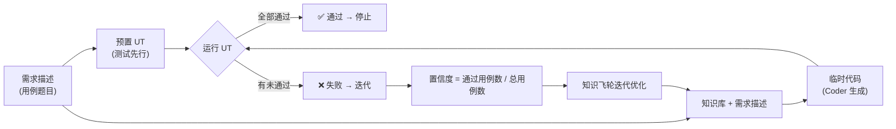

# 门禁 / 评测机制（Gate）

> 最后更新：2026-08-20

## 1. 目的

为知识文档设置**质量门槛**：只有通过评测的知识，才被认为是合格、可信的知识。

## 2. 基本机制

- **评测方式**：让 Agent 根据某份知识文档生成代码，与原始源码进行对比。
- **阈值**：生成的代码与原始源码相比达到 **80% 的正确率 / 相似度**（阈值可配置），即认为该知识**通过门禁**。
- **未通过**：进入飞轮反馈循环继续优化知识（见 [知识飞轮流程设计.md](知识飞轮流程设计.md)）。

## 3. 评测维度（待定）

> ⚠️ 目前 80% 的具体衡量方式尚未最终确定，以下为候选方向：

| 方向 | 说明 | 优点 | 缺点 |
|------|------|------|------|
| 代码 diff 相似度 | 文本/行级 diff | 简单直接 | 对写法差异敏感，功能等价但写法不同会误判 |
| AST 结构比对 | 忽略格式比结构 | 更接近逻辑等价 | 实现成本较高 |
| 测试通过率 | 用源码的测试套件跑生成代码 | 功能等价强证据 | 依赖测试覆盖，无测试模块难评 |
| LLM 打分 | 用模型评估语义等价 | 灵活 | 打分稳定性依赖模型 |

**可能的组合**：如"测试通过 + 相似度 ≥ 阈值"双门槛。

## 3.5 门禁评测的可靠性约束 ⚠️

> 依据：*On the Fragility of Self-Improving Agents*（arXiv 2608.18066，2026-08）

门禁是飞轮的"裁判"，裁判不可靠则飞轮方向不可靠。评测必须遵守：

- **重复评测**：知识是否通过门禁，以多次重复评测（建议 ≥ 5 次）的均值 ± 方差为准，不以单次结果判定。
- **防作弊（防背源码）**：评测用代码必须是 Agent 无法靠预训练记忆"背"出来的——优先用私有代码，公开代码需做变换（改命名/结构调整）。否则高分可能来自"见过源码"而非"读懂知识"（参考 Code-QA-Bench）。
- **多信号组合**：建议门禁 = 源码对比（结构）+ 编译检查（环境）+ 测试（结果，有则用）多信号组合，单一指标会误判（功能等价但写法不同的代码会被相似度误杀）。
- **评测集独立**：用于评测的知识/代码，不得参与知识生成时的上下文——保证门禁测的是"知识本身能否还原代码"。
- **定义到可执行级别**：80% 怎么算、对齐粒度、允许差异类型，必须写成可执行规则，防止规格模糊导致飞轮跑偏。

## 3.6 评测闭环（用例集驱动）⭐

> 来源：项目讨论共识（2026-08-20）。目标：**用测试用例驱动知识库迭代，提升知识库生成代码的质量。**

### 输入输出定义

| 要素 | 内容 |
|------|------|
| **输入** | 需求描述（用例的题目） |
| **标准输出** | 标准代码（用例集 golden answer，即"标准答案代码"） |
| **实际输出** | 需求描述 + 知识库生成的临时代码 |
| **对比方式** | 临时代码 vs 标准代码做**相似度对比** |

### 判断逻辑

```
相似度 ≥ 门限  →  通过  →  停止
相似度 < 门限  →  失败  →  进入知识迭代
```

### 置信度计算与用途

- **置信度**：根据**通过的用例数量**计算（如 通过用例数 / 总用例数，具体公式待定，见 §6 待确认）
- **用途**：提供给**知识飞轮**做迭代——置信度高的知识稳定保留，置信度低的知识优先进入优化
- 与 §3.5 的关系：每个用例的"通过/失败"判断仍须遵守重复评测等可靠性约束

### 职责边界（只读原则）⭐

| 参与者 | 职责 | 是否允许修改知识 |
|--------|------|-----------------|
| **评测过程** | 执行用例、相似度对比、置信度计算 | ❌ **只读**，不修改知识 |
| **coder agent** | 把知识库转成代码，**不承担迭代逻辑** | ❌ 不修改知识 |
| **知识飞轮**（编排层） | 读置信度与归因 → 决策改哪段、怎么改 | ✅ 允许（决策权，不执笔） |
| **知识生成 Agent**（加载"知识生成 skill"） | 知识库首版生成 + 按反馈修订文档 | ✅ 允许（执行者） |

> 原则：**谁评测谁不改，谁生成谁可改**。评测与生成分离（依据：[CRITIC工具交互式自我纠错.md](../研究/反馈闭环/CRITIC工具交互式自我纠错.md)）。
> 概念分层：skill 是操作手册，agent 是执行者；动文档的始终是知识生成 Agent，知识飞轮只决策不执笔（详见 [知识飞轮流程设计.md §3.1](知识飞轮流程设计.md)）。

## 4. 已确认 / 待定

- ✅ 阈值形式：80%（可配置）
- ✅ 评测对象：单份知识文档（Agent 基于该知识生成的代码 vs 原始源码）
- ✅ 评测闭环：用例集驱动（需求描述 + 知识库 → 临时代码 vs 标准代码）
- ✅ 职责边界：评测只读，不修改知识；可改知识的只有知识飞轮（决策）+ 知识生成 Agent（执行）
- ❓ 具体相似度指标：**待定**
- ❓ 对比粒度（模块/文件/函数级）：**待定**
- ❓ 上亿行代码的切分策略与优先级：**待定**

## 5. 待细化事项

- [ ] 确定相似度指标（调研后决定）
- [ ] 定义"正确率/相似度"的计算口径
- [ ] 门禁通过后的知识如何发布 / 纳入知识库

## 6. 待确认事项（项目讨论遗留）⭐

| # | 事项 | 状态 |
|---|------|------|
| 1 | **"AI 推荐路径"的具体内容**未展开，功能归属不明确（目前无人负责） | 待补充说明 |
| 2 | **相似度门限如何确定**（80% 的依据、是否按用例类型区分） | 待定 |
| 3 | **置信度计算公式**（通过用例数 → 置信度的映射方式） | 待定 |
| 4 | **用例集来源、规模、覆盖场景范围**（谁来维护、多少用例、覆盖哪些场景） | 待定 |
| 5 | **知识飞轮与知识生成 Agent 的迭代机制**（决策与执行如何协作迭代知识） | 待定 |

## 7. TDD 评测方案（探讨，未定稿）⭐

> 状态：**探讨中**，未替换上面 §2/§3/§3.6 的既有设计。若采纳，需同步更新 §2/§3/§3.6/§4/§5/§6。
> 📎 支撑证据（papers.cool 检索）：[Spec-Driven Test Gen（Google）](../研究/候选论文池.md)（规格契约→测试，bug 检出 +9.8pp）、[TDD-Agent](../研究/候选论文池.md)、[Scaling TDD](../研究/候选论文池.md)、[TDD for Code Generation](../研究/候选论文池.md)；关联见 [调研与飞轮关联映射.md](调研与飞轮关联映射.md)

### 7.1 思路

评测方式改为 **TDD（测试驱动）**：用例集 = **需求描述 + 预置单元测试（UT）**，Coder 生成代码后直接运行 UT，以通过率作为评测信号，替代"临时代码 vs 标准代码"的相似度对比。

### 7.2 流程



### 7.3 优劣分析

| 维度 | 相似度对比（现设计） | UT 测试（TDD 方案） |
|------|---------------------|---------------------|
| 判定 | 模糊（80% 怎么算待定） | 二值：通过/失败，客观无歧义 |
| 语义 | 看"长得像不像" | 看"行为对不对"（行为等价） |
| 误杀 | 功能等价但写法不同会被误杀 | 不误杀 |
| 置信度 | 公式待定 | 天然 = 通过用例数 / 总用例数 |
| 盲区 | 无覆盖概念 | 只验证测到的行为，边界/性能测不到 |
| 还原度 | 直接验证"还原源码" | 行为对 ≠ 实现方式对，还原度弱 |
| 工程成本 | 需要定义相似度口径 | 需要维护测试集（谁写 UT） |

### 7.4 可能的组合

- **UT 为主信号**（行为等价）+ **相似度辅助**（仅 UT 覆盖盲区时启用，验证还原度）
- 依据：[大语言模型自调试.md](../研究/反馈闭环/大语言模型自调试.md)（执行反馈最有效）、门禁与评测机制.md §3.5 多信号组合（测试本就是建议信号之一）
- 证据参考：[从程序文档生成自动化测试.md](../研究/评测/从程序文档生成自动化测试.md)（从文档生成测试）

### 7.5 待决策点（若采纳需确认）

1. 相似度是否完全废弃，还是保留为辅助？
2. UT 由谁编写（从需求描述生成？从标准代码派生？人工维护？）
3. UT 覆盖率要求（覆盖到什么程度算"足够"）
