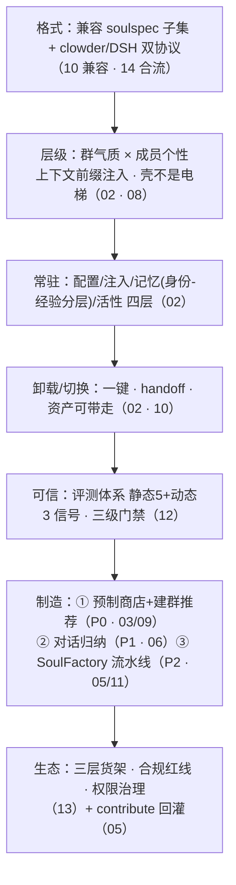

# 收束：落地路线与风险（全系列 v2）

> 快照 2026-08-23（v2：并入 08–14 章结论，统一 SKU 命名）。把 14 篇调研收成一条可执行路线，并亮出风险清单。

---

## 1 · 一张图看懂答案（全系列版）

## 2 · 落地路线（三阶段，附各章入口）

| 阶段 | 内容 | 验收 |
|---|---|---|
| **P0 · 壳 + 商店雏形**（随下一版） | soul 包格式（借 soulspec 子集，[09](09-设计：首发soul货架与建群推荐参考.md)）、绑定/注入/切换/卸载（[02](02-设计：加载层级、常驻与一键卸载.md)）、**首发集 8 款**（6 工程 + 2 MBTI；12 SKU 全量货架中的其余 4 款 P1 补齐）、**建群推荐**（[03](03-设计：soul类型、场景推荐与建群预制.md)）、评测起步：checklist 版门禁（[12](12-评测：soul的可靠性评测体系.md)）、**CLI × 注入方式矩阵**完成（[02](02-设计：加载层级、常驻与一键卸载.md)） | ① P0a（格式+绑定+注入+卸载-不导出）→ ② P0b（切换+handoff+导出+推荐）各自可发布；建群时 3 选 1 组合可用；切换不丢上下文；卸载后任务不受影响；上架都过 checklist；导出的 soulspec 包可过 `clawsouls validate`（兼容性验收） |
| **P1 · 长 + 兼容**（对话归纳） | 周期蒸馏 + 人在环确认 + 团队/项目气质 soul（[06](06-制造：长期对话归纳soul.md)）、版本化/回滚；**clowder 一键入伙**（[10](10-兼容：clowder猫咖的猫如何一键入伙.md)） | 一个群跑 2 周收到"气质草稿卡片"（**数据不足时顺延并告知**）；`clowder-import` 跑通首批 6 猫入伙样例 |
| **P2 · 厂 + 生态**（流水线） | 预制群组体系 + SoulFactory（[11](11-设计：SoulFactory预制群组模板.md)）、soul 商店（经济与权限，[13](13-生态：soul商店的经济模型与治理权限.md)）、contribute 回灌、评测 harness 自动化（[12](12-评测：soul的可靠性评测体系.md)）、**soul×DSH 双向导出**（[14](14-合流：soul×DSH的agent-preset映射.md)） | 官方第 3 个 soul 不再靠人手；社区能发布；soul2dsh 导出的预设跑通 |
| **P2.5 · 跨站 soul**（随 Connecter 生产化后第一波） | GroupRef 绑定 + 目录 soul 卡 + **site-to-site 记忆同步新组件**（Connecter 明确不做长期团队记忆，需独立设计，见 [08](08-概念：soul在ohMyAGI中的位置.md) 剧本 1） | 双站点同一群气质、成员 soul 跨站一致；"出差带灵魂"剧本跑通 |

> 段顺序理由不变（壳验证假设 → 长补产能 → 厂开生态），且三阶段都不阻塞 Connecter 生产化与 A2A 服务器面（[04](04-判断：soul在下一版本的优先级.md)）。

## 3 · 风险清单（v2）

| 风险 | 等级 | 缓解 |
|---|---|---|
| **人格化放大负面体验**（soul 在不稳定的产品上=加倍招黑） | 高 | soul 排在可靠性之后；P0 只做"壳"不做"进化"（[04](04-判断：soul在下一版本的优先级.md)） |
| **合规红线：国内深度陪伴监管收紧** | 高 | soul 定位"工作人格/团队气质"，禁止情感陪伴定位；娱乐化按"创意娱乐化"处理（[13](13-生态：soul商店的经济模型与治理权限.md)） |
| **关系资产不可回收** | 高 | 卸载=保留+导出；export/import 从 P0 就要有（clowder 教训，[02](02-设计：加载层级、常驻与一键卸载.md)） |
| **用户画像的隐私与伦理**（对话归纳触到人） | 高 | 本地默认、人在环确认、可删除、符伦理规范（[06](06-制造：长期对话归纳soul.md)） |
| **生态格式内卷** | 中 | 直接兼容 soulspec + clowder/DSH 双协议，写进 P0 验收（[01](01-市场调研：soul加载概念图谱.md)/[10](10-兼容：clowder猫咖的猫如何一键入伙.md)/[14](14-合流：soul×DSH的agent-preset映射.md)） |
| **人格漂移 / 记忆侵蚀身份** | 中 | 身份 T0 人授权才改；记忆分层+衰减+晋升；immutableTraits 边界（[08](08-概念：soul在ohMyAGI中的位置.md)） |
| **跨平台/跨模型保真不足**（注入点不同导致人格走样） | 中 | 12 章保真评测抽检；soul2dsh 导出打"待评"标（[12](12-评测：soul的可靠性评测体系.md)/[14](14-合流：soul×DSH的agent-preset映射.md)） |
| **soul 质量不可评测 / 内容工程低估** | 中 | 评测 harness 自动化；"工具便宜标准贵"，样例题库从 P0 就开始攒（[12](12-评测：soul的可靠性评测体系.md)） |
| **预制群组生态治理** | 中 | 先官方 2 个预制群组再开放；商店带 validate/soulscan 门禁（[11](11-设计：SoulFactory预制群组模板.md)） |

## 4 · 一句话收束（v2）

> **若"人格化能留人"的假设经 P0 对照实验成立，则 soul 是 ohMyAGI 的"名字"，不是它的"骨头"**：骨头是总机（A2A/Connecter）与客厅（群聊可靠性）；名字要起得早（格式兼容、首发 8 款、建群推荐、能带走），但不能没规矩（评测门禁、合规红线、权限治理）。两条线并行：下一版既立住名（正文 01–15），又立住身（Connecter 生产化 + A2A 服务器面）。