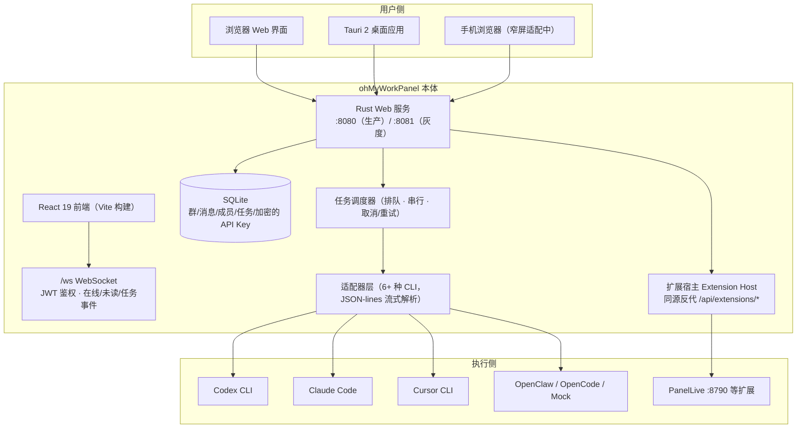
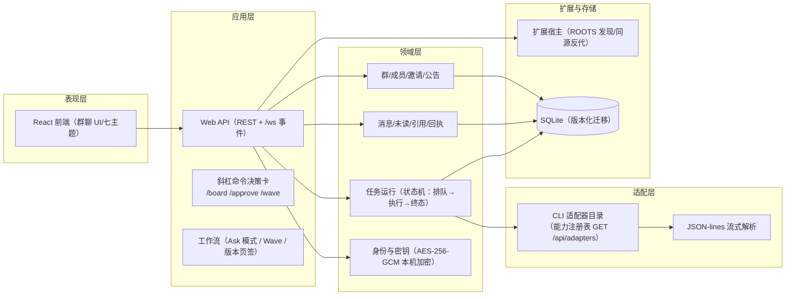
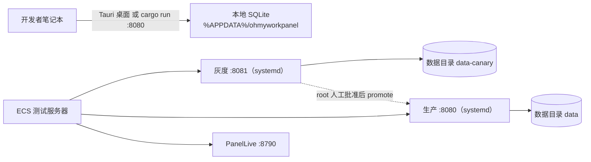

# 1 · 4+1 架构视图：哦，原来你是这么跑的

> 总分总：先给一张全貌图，再从五个视角拆开看（场景 / 逻辑 / 进程 / 开发 / 物理），最后回到"这套结构想清楚的三件事"。

---

## 总：一张图看懂 ohMyWorkPanel



一句话版：**Rust 是大脑（服务+调度+存储），React 是脸（群聊界面），CLI 是手（干活的人），扩展是口（接外部能力）**。

---

## 分：五个视角

### 视角 1 · 场景视图（它服务谁、解决什么事）

| 场景 | 用户 | 系统怎么响应 |
|------|------|------------|
| 群里 @Codex 让他修个 bug | 开发者 | 发消息 → 调度器排队 → Codex CLI 在本机工作区执行 → 任务状态实时推送到群里（流式输出） |
| 同时跑 3 个 Agent 任务 | 开发者 | 每任务独立队列，同一 Agent CLI 串行，界面显示运行状态/输出轨迹/结果 |
| 老板想看 Agent 干了啥 | 任何人 | 任务的排队/执行/完成/取消/重试全周期可见，可点开轨迹回看 |
| 语音跟 Agent 说话 | 移动用户 | PanelLive 扩展（:8790）经同源代理接入，短回复/语音会话 |
| 把另一个 AI 平台接进来 | 集成方 | 扩展宿主（页签/右栏/状态/消息动作四个贡献点）+ A2A 技能白名单 |

### 视角 2 · 逻辑视图（系统分几层）



要点：**领域层不依赖任何具体 CLI**——换适配器只动适配层；**任务状态机是整个产品的骨架**，界面、API、扩展都围绕它转。

### 视角 3 · 进程视图（它怎么运行）

| 进程 | 说明 |
|------|------|
| `ohmyworkpanel-server`（:8080 / 灰度 :8081） | Rust Web 服务：API + /ws + 调度 + 扩展代理；生产/灰度双槽位、systemd 管理（`ohmyworkpanel*.service`） |
| Tauri 桌面进程（dev :1420） | 桌面壳 = 同一前端 + Rust 后端，WebView2 渲染 |
| CLI 子进程 | 调度器 spawn 本机已登录 CLI，读 stdout JSON-lines 流式发文；**同 Agent 串行**，可取消/重试 |
| Extension Host | 独立扩展进程（如 PanelLive :8790），只经同源反代 `/api/extensions/{extId}/*` 触达，禁止 iframe 直连 |
| Codex 代理 shim（:18888 生产 / :18889 灰度） | 转发 Codex 工具调用（`codex-deepseek-proxy.cjs`） |

### 视角 4 · 开发视图（仓库怎么长）

```
ohMyWorkPanel/
├── src/                  # React 19 前端（Vite，TS 5.8）
├── src-tauri/            # Rust 后端（约 37 个模块）
│   ├── src/commands/     # Web API 命令
│   ├── src/scheduler/    # 任务调度状态机
│   ├── src/adapters/     # CLI 适配器 + JSON-lines 解析
│   ├── src/extensions/   # 扩展宿主
│   ├── src/a2a/          # A2A 技能白名单
│   └── src/db/           # SQLite 版本化迁移
├── docs/                 # Diátaxis 四类文档（教程/指南/解释/参考）
├── scripts/              # 发布门禁、deploy/promote、扩展纯净度检查
└── deploy/               # 灰度/生产部署产物
```

工程纪律：**发布先过门禁**（51+ 项文档一致性 + 契约锁测试）、**扩展代码禁止进平台仓**（`check-extension-purity.sh`）、**版本流水线单一事实源**（`docs/version-pipeline.md`）。

### 视角 5 · 物理视图（它住在哪）



边界声明：**不承诺多节点高可用/自动灾备**；跨机互通留给 workpanelConnecter（独立组件）。

---

## 总：这套结构想清楚的三件事

1. **本地优先不是妥协，是卖点**：数据不离开设备、复用本机已登录的 CLI 授权，用户获得的是"零托管成本 + 完全可控";
2. **群聊是比任务面板更好的协作界面**：任务状态、输出、结果都长在聊天流里，人用最自然的方式监督 AI;
3. **适配器与扩展是它未来生态的种子**：核心只做状态机与协议，CLI 和扩展都是可插拔的——这让"接入更多 Agent、更多平台"成为可能。