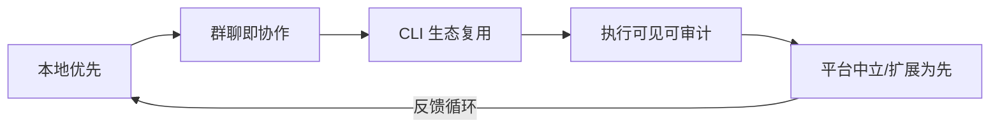

# 2 · 核心设计理念：为什么长成这样

> 总分总：先一句话点明理念核心，再逐条展开"理念 → 为什么 → 现在的样子"，最后看理念之间如何互相咬合。

---

## 总：一句话理念

> **把「管理一群 AI 员工」这件事，做得像「在一个群里和人协作」一样自然，同时保证每一步都看得见、管得住、留得住。**

理念不是拍脑袋来的，它长在五个设计决策里：

| # | 理念 | 一句话解释 | 代码里的证据 |
|---|------|-----------|------------|
| 1 | 本地优先 | 数据不离开你的机器 | 纯本地 SQLite；无托管云端 Agent/数据库；README 明确"非 SaaS" |
| 2 | 群聊即协作协议 | @ 就是路由，消息就是任务 | `@成员` 触发 Agent；斜杠命令决策卡 `/board /approve /wave` |
| 3 | CLI 生态复用 | 不重造轮子，复用已登录的 CLI | 6 种适配器（Mock/Codex/Claude Code/OpenCode/OpenClaw/Cursor），JSON-lines 流式解析 |
| 4 | 执行可见可审计 | AI 干了什么，一眼能看穿 | 任务状态机：排队/执行中/取消/重试；轨迹视图；`/approve` 内联审批 |
| 5 | 平台中立、扩展为先 | 核心做协议，能力做插件 | 适配器目录（GET /api/adapters）+ 扩展宿主（4 类贡献点）+ A2A 技能白名单 |

---

## 分：逐条展开

### 理念 1 · 本地优先 —— "我的 AI 团队住在我家"

**为什么**：托管 SaaS 意味着数据出境、密钥托管、网络依赖和持续费用。对个人开发者/小团队来说，很多 AI 任务（读代码、改代码、跑测试）本质上发生在本地仓库里，云端绕一圈反而更慢更危险。

**现在的样子**：
- Web + Tauri 双形态，但服务端永远跑在用户自己控制的机器上；
- API Key 用 AES-256-GCM + 本机密钥文件加密落库（不是明文躺在配置里）；
- 工作区 = 服务器绝对路径，Agent 在真实文件系统上干活，不虚拟化隔离——**信任交给"本地"这层边界 + 人工确认**（破坏性操作需要人点头）。

### 理念 2 · 群聊即协作协议 —— "@ 一下，任务就出去了"

**为什么**：任务面板、工单系统都是"第二界面"——你得离开聊天去开单、去查状态。而真实团队协作的最小单位就是对话：一句"帮我看看这个 bug"，人就知道该做什么。

**现在的样子**：
- 消息流里直接 `@成员名称` 触发任务，任务状态（排队/执行/流式输出/结果）作为消息的一部分回流；
- 决策类交互做成斜杠命令卡片：`/board` 上会、`/approve` 批准、`/wave` 打招呼——Agent 也能理解这些卡片；
- 未读角标/在线 presence 让"群里现在有谁在忙"一目了然。

### 理念 3 · CLI 生态复用 —— "不造模型，只造舞台"

**为什么**：模型能力日新月异、各家 CLI（Codex/Claude Code/Cursor…）都沉淀了深厚的工程集成（上下文、工具、审批）。重写一个"内置 Agent"既追不上又锁死用户。聪明的做法是**让用户已经付费/已经配置好的 CLI 直接登台**。

**现在的样子**：
- 适配器 = 轻量能力注册表：声明 name/adapter/能力，Rust 侧 spawn CLI 并解析 stdout JSON-lines 流式输出（类型化 parts）；
- 同一 Agent 串行执行，避免同一个 CLI 实例并发打架；Mock 适配器让没装 CLI 的人也能体验完整流程；
- v2.0.0 的 Cursor 脱敏环境包把"CLI 集成该长什么样"做成了可复制的配方。

### 理念 4 · 执行可见可审计 —— "AI 的每一步都要过得了人权检"

**为什么**：黑盒执行是 AI 协作最大的信任杀手。"它到底跑了什么命令、为什么没成功"必须能回答。

**现在的样子**：
- 任务状态机完整暴露：排队 → 执行 → 终态（成功/失败/取消/需审批），支持取消与重试（幂等语义收敛）；
- run 阶段轨迹视图：看 Agent 每步在做什么；
- 危险操作走内联审批（awaiting_review 状态），人点了 `/approve` 才继续；
- 发布门禁覆盖文档一致性与契约（51+ 项检查），防止"静默漂移"。

### 理念 5 · 平台中立、扩展为先 —— "核心是舞台，不是演员"

**为什么**：想通"打通所有 Agent 平台"的第一步，就是核心不假设任何具体 Agent：模型、CLI、面板、渠道都该是可替换的。

**现在的样子**：
- 扩展宿主（V1.3.0 起）：ROOTS 自动发现扩展目录，页签/右栏/状态/消息动作四个贡献点，同源反代隔离端口（禁 iframe 直连），扩展纯净度作为发布门禁；
- A2A：技能按 `prefix.*` 白名单校验，stop→cancel 语义；
- Connecter 关系：跨站/跨机的"局域网"由独立组件 workpanelConnecter 承担，平台本体不越界。

---

## 总：理念之间的咬合

- **本地优先让群聊协作可信**：因为数据不出本机，"群里派活"才敢派；
- **CLI 复用让平台中立可落地**：因为核心不锁定任何厂商，才有空间做协议与扩展；
- **执行可见让一切成立**：没有可审计的轨迹，上面任何一条都会变成"嘴上说说"。
- 最终，这五个理念共同支撑一个更大的愿景：**ohMyWorkPanel 成为 Agent 生态里"中立、开放、看得见"的那一层**（详见 [04 演进方向](04-evolution-roadmap.md) 与 [06 战略思考](06-strategy-thinking.md)）。