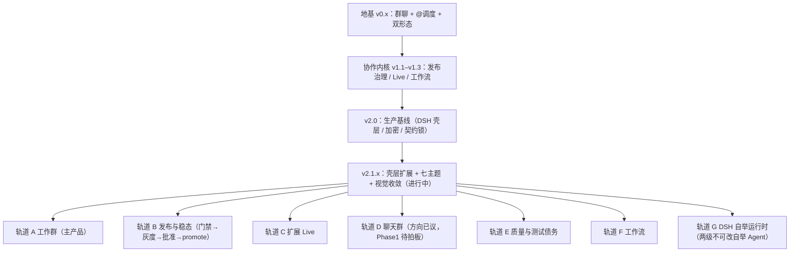

# 4 · 后续演进方向：下一步往哪走

> 总分总：先给"路线图全景"，再按 已交付 / 排期中 / Backlog / 战略方向 四层展开，最后给出建议的优先级。

---

## 总：路线图全景（来自仓库的版本流水线 SSOT）

---

## 分：四层展开

### 已交付（这条路已经走通）

- **v0.x**：群 CRUD、@ 调度（Mock/Codex/Claude）→ OpenCode/Cursor → OCR、Tauri+Web 双模；
- **v1.1.0**：发布治理（approve/promote/watchdog）、邀请链接、未读/在线、PanelLive 扩展 + A2A + 短回复注入、chatbot 默认响应；
- **v1.2.0**：豆包语音「按住说话」、Live 会话一致；
- **v1.3.0**：工作流时代——版本页签/Wave、Ask 模式、通用扩展宿主、Wiki 跨 Agent 记忆注入；
- **v2.0.0**：Cursor 脱敏环境包、DSH 壳层三栏（P0–P2）、CLI 适配器目录、DB 版本化迁移、Key 加密、契约锁；
- **v2.1.x（灰度中）**：七主题、RightDockHost 右栏、微信式聊天体验、壳层视觉一致（v2.1.1）、项目更名 ohMyWorkPanel + MIT 开源。

### 排期中（v2.1.x，2026 Q3）

- 前台壳层扩展的正式发布与灰度验证收敛；
- 七主题与视觉一致性收尾；
- 发布检查清单驱动，灰度 :8081 → root 批准 → promote。

### Backlog（待评估，尚未承诺）

- 本地 Agent 命令沙箱 / 白名单（安全长板，Clowder/OpenClaw 已有类似概念）；
- 任务历史回溯与重放（对比分支，可审计叙事再进一步）；
- 跨群 Agent 引用（群与群之间的协作）；
- 可选云端备份（跨机器同步的轻量版）；
- Agent 角色社区模板（Agent 商城的前置步骤）。

### 战略方向（本文档的推演，非仓库承诺）

1. **从"面板"走向"平台"**：适配器目录 → 供应商化的能力注册与发现；扩展宿主 → 正式的应用市场（页签/右栏/消息动作贡献点已具备雏形）；
2. **从"本地"走向"互通"**：由 workpanelConnecter 提供跨站/跨机的身份、路由与策略（中心化 Host + 站点自治），ohMyWorkPanel 是 Connecter 的第一个一等公民站点；
3. **从"无魂"走向"有魂"**：借鉴 Clowder 猫咖路线，注入可替换的团队人格（MBTI 或 soul 内核），把"情绪价值"变成产品粘性（详见 [06 战略思考](06-strategy-thinking.md)）；
4. **从"自用"走向"开源生态"**：MIT 开源只是起点——去知名仓库做 bugFix/提建设性 issue、把 ohMyWorkPanel 集成进主流 Agent 工具（如 DSH），让生态"长出第三方贡献"（同一个文档的 [06](06-strategy-thinking.md) 有完整拆解）。

---

## 总：建议的优先级

| 优先级 | 做什么 | 为什么 |
|--------|--------|--------|
| P0 | v2.1.x 收尾发版 + 开源仓库整理（README/Release/CI） | 项目门面决定外部第一印象 |
| P1 | 命令沙箱 + 模板 + 回溯（Backlog 前三项） | 安全与可审计是"看得见"叙事的完成体 |
| P2 | Connecter 双向打通（跨站 MVP） | 差异化故事从"本地面板"升级为"本地优先的互通网络" |
| P3 | soul/人格注入实验（MBTI 或可替换 soul） | 情绪价值的杠杆最大，但需要先有用户量承接 |
| P4 | 开源生态动作（issue/bugFix/集成 dsh） | 长期投喂，越早开始复利越大 |