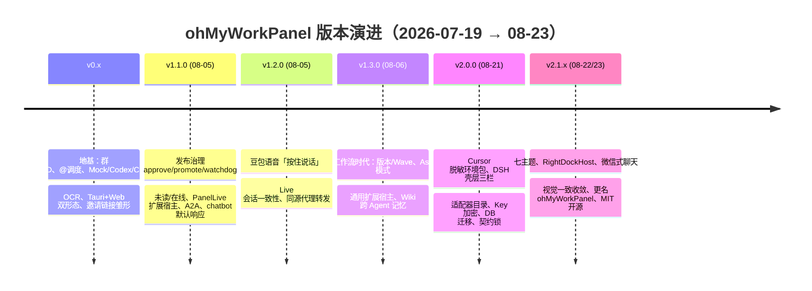

# 5 · 从立项到现在的开发笔记：这 5 周我们都经历了什么

> 总分总：先给"版本时间线总览"，再按里程碑逐个展开（发布说明 + 代表提交），最后总结演进规律。
> 数据来源：仓库 git 历史与版本流水线文档（`docs/version-pipeline.md` 为单一事实源）。

---

## 总：时间线总览

- 项目起点：**2026-07-19**（仓库初始化）
- 当前状态：**v2.1.1**（2026-08-23，灰度为先，未打 tag）
- 累计：**约 127 个提交（非 merge 121）**，正式里程碑 tag 4 个（v1.1.0 / v1.2.0 / v1.3.0 / v2.0.0），约 **5 周**

---

## 分：里程碑逐个看

### 地基期 v0.x（07-19 → 08-04）

**主题：证明"群聊里能跑 Agent"这件事本身成立。**
- 先有小而真的闭环：建群 → 发消息 → `@成员` → 调度本机 CLI（最开始是 Mock/Codex/Claude）→ 结果回流；
- 快速补齐第二、第三适配器（OpenCode、Cursor），验证"适配器可插拔"的架构假设；
- 双形态定型：Tauri 桌面 + Web 服务，从第一天就不是"网页套壳"。

### v1.1.0（08-05，代表提交 `da77599` ~ 43 个提交）

**主题：从"能跑"到"能发布、能拉人"。**
- 发布治理成型：approve/promote 流程 + 生产 watchdog（第一次把"灰度/生产双槽位"写进项目文化）；
- 邀请链接（24h）+ 未读/在线 presence：群开始能"长人"；
- PanelLive 扩展宿主 + A2A + 短回复注入：第一次出现"扩展"与"A2A"这两个未来关键词；
- chatbot 默认响应：群里没人 @ 时也有 AI 兜底聊天。

### v1.2.0（08-05，代表提交 `0750306`）

**主题：语音与 Live 场景。**
- 豆包语音"按住说话"：聊天输入从键盘扩展到语音；
- Live 会话一致性 + 同源代理转发：解决"浏览器直连扩展端口"的架构红线（同源反代成为铁律）。

### v1.3.0（08-06，代表提交 `8e3869d`）

**主题：工作流与平台化，一周一个大版本。**
- 版本页签 + Wave 工作流 + Ask 模式：从"聊一句干一件"进化到"多个 Agent 走流程"；
- **通用扩展宿主（Extension Host）**：ROOTS 自动发现 + 同源反代 + 页签壳，平台化基因落地；
- Wiki 跨 Agent 记忆注入：第一次触碰"记忆/上下文注入"（也是后来知识飞轮方向的伏笔）。

### v2.0.0（08-21，代表提交 `9edba7d` ~ 28 个提交）

**主题：生产基线与"别人能接手"的质量。**
- Cursor 脱敏环境包（bundle.json，不含凭据/二进制）：CLI 集成模板化、可分发；
- **DSH 壳层三栏（P0–P2）**：为"集成到主流 Agent 工具"埋下第一根桩（后来真的跑通了 dsh 插件化）；
- 工程质量批量落地：CLI 适配器 manifests、DB 版本化迁移、API Key AES-256-GCM 本机加密、Rust DTO 契约锁、51+ 发布门禁；
- 发布日也确立了"灰度 :8081 → root 批准 → promote :8080"的铁律。

### v2.1.x（08-22/23，未打 tag，package.json 已对齐 2.1.1）

**主题：门面与品牌。**
- **七主题** UI（同一时期也发生了"作者嫌主题丑"的外部插曲，反证 UI 是门面）;
- RightDockHost 右栏托管、微信式聊天体验（长按菜单/引用/通讯录）；
- 壳层视觉一致收敛（`ui-v2.1-shell.html` 作为对齐基准）；
- **更名 ohMyWorkPanel + MIT 开源**：从内部工具走向公共项目（README 重构、CHANGELOG 起步、CONTRIBUTING/SECURITY 就位）。

---

## 总：五周演进规律（读出来的三条线）

1. **节奏感**：地基 → 治理 → 场景（语音/Live）→ 工作流 → 质量 → 门面，一周一个大版本，每步都有可演示的闭环——"先跑通，再管好，再好看"。
2. **架构一直没背叛早期假设**：适配器可插拔、扩展宿主同源反代、双槽位发布、本地优先——v0.x 的直觉今天依然是代码事实。
3. **两个伏笔正在兑现**：DSH 壳层 → 集成主流 Agent 工具的路线；Wiki 记忆注入 → 团队记忆/知识飞轮方向。当前版本流水线（轨道 A–G）就是对这些伏笔的正式化。

> ▶ 继续看"接下来往哪走"：[04 演进方向](04-evolution-roadmap.md)；以及战略层的讨论（差异化 / soul / 生态 / 开源）：[06 战略思考](06-strategy-thinking.md)。